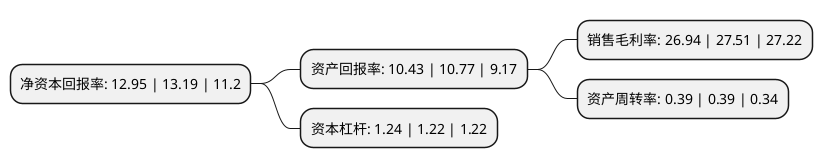

> 本页面由自动化程序生成于 2022年5月20日 01:17
> 内容可能存在错误，如有bug请提交issue至：https://github.com/Eroleice/doc-pi/issues
{.is-warning}

# 上市公司基本情况

## 基本资料

杭州炬华科技股份有限公司（以下简称“炬华科技”）成立于2006年04月06日，杭州市。于2014年01月21日在深交所创业板上市。

炬华科技注册资本50,438.713万元，主要产品:智慧计量与采集系统，智能电力终端及系统，智能流量仪表及系统，智能配用电产品及系统，物联网传感器及配件等。主营业务:专业从事能源物联网设备和服务研发，生产与销售。以下是详细信息：

- 公司名称: 杭州炬华科技股份有限公司
- 股票代码: 300360.SZ
- 所在地: 浙江 - 杭州市
- 成立日期: 2006年04月06日
- 注册资本: 50,438.713万元
- 法定代表人: 杨光
- 主营业务: 主要产品:智慧计量与采集系统，智能电力终端及系统，智能流量仪表及系统，智能配用电产品及系统，物联网传感器及配件等主营业务:专业从事能源物联网设备和服务研发，生产与销售
- 公司官网: www.sunrisemeter.com
- 公司介绍: 公司是一家专业从事能源物联网设备和服务研发、生产与销售的高新技术企业。公司以物联网系统带动智能电表、智能水表、智能电气、物联网传感器等物联网远程终端为核心业务，推动物联网产品和服务在公共能源水、电、气、热领域的应用，进一步构建物联网终端与大数据、云计算的融合应用。公司主要业务分为智慧计量与采集系统、智能电力终端及系统、智能流量仪表及系统、智能配用电产品及系统、物联网传感器及配件等。公司拥有自主研发的先进的MES生产制造执行系统，通过了ISO9001质量管理体系、ISO14001环境管理体系、GB/T28001-2001(覆盖了OHSAS18001标准)职业健康安全管理体系及AAA级测量管理体系认证，具有CMC计量许可证、中国CCC质量认证、荷兰KEMA认证及欧盟MID分供方认证等多项国内外权威认证。

## 股东及高管情况

上市公司第一大股东为杭州炬华集团有限公司，持股109,986,235股，占比21.81%，**疑似为**上市公司实际控制人。

截至2022年03月31日，上市公司的前十大股东中，共有8名自然人股东，1名机构股东，1个产品账户，其中5%以上大股东共有2名。上市公司前十大股东明细如下：

> 未能通过持股比例判定出上市公司实际控制人（持股30%以上）
> 可能存在通过间接持股、联合持股、协议控制等方式拥有实际控制权的主体，具体请参考上市公司定期公告！
{.is-warning}

> 截至2022年03月31日，上市公司前十大股东信息如下：

| 股东名称 | 持股数量（股） | 持股比例 |
| --- | --- | --- |
| 杭州炬华集团有限公司 | 109,986,235 | 21.81% |
| 丁敏华 | 61,327,500 | 12.16% |
| 洪军 | 20,576,548 | 4.08% |
| 郭援越 | 13,487,136 | 2.67% |
| 杨光 | 13,448,140 | 2.67% |
| 王庆华 | 8,247,700 | 1.64% |
| 崔玉晶 | 5,850,000 | 1.16% |
| 余钦 | 5,416,666 | 1.07% |
| 刘峥嵘 | 3,363,375 | 0.67% |
| 上海浦东发展银行股份有限公司-工银瑞信生态环境行业股票型证券投资基金 | 2,952,000 | 0.59% |

## 利润表分析

上市公司2021年总收入为12.1亿元，净利润为3.26亿元，实现盈利。

## 杜邦分析

> 数据列示周期：2021年 | 2020年 | 2019年
{.is-info}

上市公司的净资产收益率在近一年有所下降，下降幅度为-1.82%，其变化情况分解如下：
- 上市公司的销售毛利率在近一年下降了-2.07%，可能是生产效率的下降、商品原材料价格上涨或商品价格的下跌所致。
- 上市公司的资产周转率在近一年下降了0%，可能是源自于更慢的销售回款或库存管理效果下降。
- 上市公司的财务杠杆比率在近一年上升了1.64%，可能是增加负债扩大生产规模。

