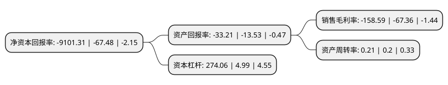

> 本页面由自动化程序生成于 2022年5月20日 01:17
> 内容可能存在错误，如有bug请提交issue至：https://github.com/Eroleice/doc-pi/issues
{.is-warning}

# 上市公司基本情况

## 基本资料

四川安控科技股份有限公司（以下简称“*ST安控”）成立于1998年09月17日，宜宾市。于2014年01月23日在深交所创业板上市。

*ST安控注册资本95,714.634万元，主要产品:自动化业务，油气服务业务，智慧产业业务，RockE50SIS系统，Super32L401气井RTU，EG11气井智能监控装置，物联网RTU Super X300及配套软件，侧钻井业务。主营业务:以自动化，信息化技术为核心，在自动化，油气服务，智慧产业三大业务领域为客户提供具有自主知识产权的产品，技术，行业整体解决方案及服务。以下是详细信息：

- 公司名称: 四川安控科技股份有限公司
- 股票代码: 300370.SZ
- 所在地: 四川 - 宜宾市
- 成立日期: 1998年09月17日
- 注册资本: 95,714.634万元
- 法定代表人: 许永良
- 主营业务: 主要产品:自动化业务，油气服务业务，智慧产业业务，RockE50SIS系统，Super32L401气井RTU，EG11气井智能监控装置，物联网RTU Super X300及配套软件，侧钻井业务主营业务:以自动化，信息化技术为核心，在自动化，油气服务，智慧产业三大业务领域为客户提供具有自主知识产权的产品，技术，行业整体解决方案及服务
- 公司官网: www.etrol.com
- 公司介绍: 公司是专业从事工业级远程控制终端(RTU)产品研发、生产、销售和系统集成业务的高新技术企业。主营业务为RTU产品的研发、生产和销售，以RTU产品为应用核心的远程测控系统整体解决方案的提供与实施，以及相关运维与技术服务。公司产品“SuperE型远程控制终端(RTU)”获国家重点新产品证书；“抽油机控制器”获国家级高新技术项目证书；“ECHO三相计量控制器”获国家火炬计划项目证书。Super32、SuperE50等十项通用RTU产品获得CE认证；数据传输采集仪等三项环保行业专用产品获得CCAEPI认证。

## 股东及高管情况

上市公司第一大股东为俞凌，持股126,570,413股，占比13.22%，**疑似为**上市公司实际控制人。

截至2022年03月31日，上市公司的前十大股东中，共有10名自然人股东，其中5%以上大股东共有1名。上市公司前十大股东明细如下：

> 未能通过持股比例判定出上市公司实际控制人（持股30%以上）
> 可能存在通过间接持股、联合持股、协议控制等方式拥有实际控制权的主体，具体请参考上市公司定期公告！
{.is-warning}

> 截至2022年03月31日，上市公司前十大股东信息如下：

| 股东名称 | 持股数量（股） | 持股比例 |
| --- | --- | --- |
| 俞凌 | 126,570,413 | 13.22% |
| 董爱民 | 31,000,000 | 3.24% |
| 付丽艳 | 12,530,000 | 1.31% |
| 庄贵林 | 8,192,000 | 0.86% |
| 张胜敏 | 4,500,000 | 0.47% |
| 黄建阳 | 4,288,805 | 0.45% |
| 白欣 | 4,224,000 | 0.44% |
| 应富强 | 3,813,000 | 0.4% |
| 吕学功 | 3,465,512 | 0.36% |
| 徐素瑛 | 2,953,100 | 0.31% |

## 利润表分析

上市公司2021年总收入为5.59亿元，净利润为-8.88亿元，**未实现盈利**。

## 杜邦分析

> 数据列示周期：2021年 | 2020年 | 2019年
{.is-info}

上市公司的净资产收益率在近一年有所上升，上升幅度为13387.42%，其变化情况分解如下：
- 上市公司的销售毛利率在近一年上升了135.44%，可能是生产效率的提升、商品原材料价格下跌或商品价格的上涨所致。
- 上市公司的资产周转率在近一年上升了5%，可能是源自于更快的销售回款或库存管理效果提升。
- 上市公司的财务杠杆比率在近一年上升了5392.18%，可能是增加负债扩大生产规模。

