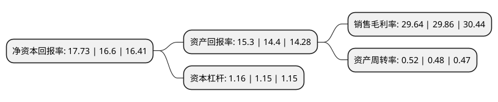

> 本页面由自动化程序生成于 2022年5月20日 01:17
> 内容可能存在错误，如有bug请提交issue至：https://github.com/Eroleice/doc-pi/issues
{.is-warning}

# 上市公司基本情况

## 基本资料

汇中仪表股份有限公司（以下简称“汇中股份”）成立于1998年05月18日，唐山市。于2014年01月23日在深交所创业板上市。

汇中股份注册资本16,768.108万元，主要产品:超声热量表，超声水表和超声流量计三大类以及节能节水综合解决方案。主营业务:从事智能超声测流产品研发，生产，销售，服务。以下是详细信息：

- 公司名称: 汇中仪表股份有限公司
- 股票代码: 300371.SZ
- 所在地: 河北 - 唐山市
- 成立日期: 1998年05月18日
- 注册资本: 16,768.108万元
- 法定代表人: 张力新
- 主营业务: 主要产品:超声热量表，超声水表和超声流量计三大类以及节能节水综合解决方案主营业务:从事智能超声测流产品研发，生产，销售，服务
- 公司官网: www.huizhong.com
- 公司介绍: 公司是目前中国系列超声热量表、超声水表、超声流量计及系统的研发生产基地，是河北省高新技术企业和软件企业。公司是以从事智能超声测流产品研发、生产、销售、服务为一体，致力于为供热计量、供水计量及流量过程控制等领域提供节能节水综合解决方案的专业研发生产制造商。公司产品主要分为超声热量表、超声水表和超声流量计三大类以及节能节水综合解决方案。公司拥有全部产品的自主知识产权并始终走在超声测流领域的前沿，曾先后参与制定《给排水用超声流量计(传播速度差法)》、《热量表》、《超声流量计检定规程》等行业及国家标准。公司已成为目前国内率先实现热计量领域全系列产品及网络技术全覆盖的研发生产制造商之一。

## 股东及高管情况

上市公司第一大股东为张力新，持股63,635,554股，占比37.95%，为上市公司实际控制人。

截至2022年03月31日，上市公司的前十大股东中，共有10名自然人股东，其中5%以上大股东共有2名。上市公司前十大股东明细如下：

> 截至2022年03月31日，上市公司前十大股东信息如下：

| 股东名称 | 持股数量（股） | 持股比例 |
| --- | --- | --- |
| 张力新 | 63,635,554 | 37.95% |
| 王永存 | 18,628,001 | 11.11% |
| 董建国 | 4,604,001 | 2.75% |
| 张继川 | 4,234,839 | 2.53% |
| 许文芝 | 3,994,841 | 2.38% |
| 王健 | 3,871,000 | 2.31% |
| 刘健胤 | 3,606,819 | 2.15% |
| 李志忠 | 3,473,200 | 2.07% |
| 王立臣 | 3,340,201 | 1.99% |
| 刘春华 | 2,822,799 | 1.68% |

## 利润表分析

上市公司2021年总收入为5.23亿元，净利润为1.55亿元，实现盈利。

## 杜邦分析

> 数据列示周期：2021年 | 2020年 | 2019年
{.is-info}

上市公司的净资产收益率在近一年有所上升，上升幅度为6.81%，其变化情况分解如下：
- 上市公司的销售毛利率在近一年下降了-0.74%，可能是生产效率的下降、商品原材料价格上涨或商品价格的下跌所致。
- 上市公司的资产周转率在近一年上升了8.33%，可能是源自于更快的销售回款或库存管理效果提升。
- 上市公司的财务杠杆比率在近一年上升了0.87%，可能是增加负债扩大生产规模。

