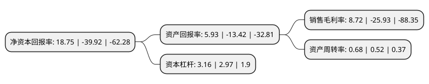

> 本页面由自动化程序生成于 2022年5月20日 01:17
> 内容可能存在错误，如有bug请提交issue至：https://github.com/Eroleice/doc-pi/issues
{.is-warning}

# 上市公司基本情况

## 基本资料

广东正业科技股份有限公司（以下简称“正业科技”）成立于1997年11月14日，东莞市。于2014年12月31日在深交所创业板上市。

正业科技注册资本36,917.206万元，主要从事PCB精密加工检测设备及辅助材料的研发，生产，销售和服务。主要产品为PCB精密加工检测设备及辅助材料两大系列。以下是详细信息：

- 公司名称: 广东正业科技股份有限公司
- 股票代码: 300410.SZ
- 所在地: 广东 - 东莞市
- 成立日期: 1997年11月14日
- 注册资本: 36,917.206万元
- 法定代表人: 邓景扬
- 主营业务: 主要从事PCB精密加工检测设备及辅助材料的研发，生产，销售和服务主要产品为PCB精密加工检测设备及辅助材料两大系列
- 公司官网: www.zhengyee.com
- 公司介绍: 公司是一家专业从事精密仪器设备及高端电子材料的集研发、生产、销售和技术服务于一体的国家火炬计划重点高新技术企业。公司主营业务之一为PCB精密加工检测设备和PCB精密加工辅助材料，如机器视觉系列、实验室仪器系列、半固化片无尘自动裁切机、全自动补强机、字符喷印机、膜系列、过滤系列等产品，广泛应用于PCB行业。子公司集银科技主要研发、生产和销售热压贴合设备，包括液晶模组系列、背光源设备系列、摄像头设备系列等产品。公司主要研发、生产及销售焊接机器人系列、智能制造系列、生产线系列、标准设备等。近年来，公司共承担国家级科技计划项目3项，省级科技计划、技术进步项目10余项，1项产品被列入国家重点新产品、多项产品被列入广东省高新技术产品以及广东省自主创新产品。

## 股东及高管情况

上市公司第一大股东为景德镇合盛产业投资发展有限公司，持股81,230,361股，占比22.02%，**疑似为**上市公司实际控制人。

截至2022年03月31日，上市公司的前十大股东中，共有6名自然人股东，3名机构股东，1个产品账户，其中5%以上大股东共有2名。上市公司前十大股东明细如下：

> 未能通过持股比例判定出上市公司实际控制人（持股30%以上）
> 可能存在通过间接持股、联合持股、协议控制等方式拥有实际控制权的主体，具体请参考上市公司定期公告！
{.is-warning}

> 截至2022年03月31日，上市公司前十大股东信息如下：

| 股东名称 | 持股数量（股） | 持股比例 |
| --- | --- | --- |
| 景德镇合盛产业投资发展有限公司 | 81,230,361 | 22.02% |
| 宿迁楚联科技有限公司 | 81,077,804 | 21.98% |
| 浙江君弘资产管理有限公司-君弘钱江五十七期私募证券投资基金 | 3,480,126 | 0.94% |
| 罗旭东 | 3,367,679 | 0.91% |
| 黄春芳 | 2,091,000 | 0.57% |
| 徐平静 | 1,745,853 | 0.47% |
| 上海战圣股权投资管理有限公司 | 1,682,616 | 0.46% |
| 叶燕桥 | 1,336,800 | 0.36% |
| 彭丽君 | 1,322,000 | 0.36% |
| 李有国 | 1,320,200 | 0.36% |

## 利润表分析

上市公司2021年总收入为14.59亿元，净利润为1.27亿元，实现盈利。

## 杜邦分析

> 数据列示周期：2021年 | 2020年 | 2019年
{.is-info}

上市公司的净资产收益率在近一年有所下降，下降幅度为-146.97%，其变化情况分解如下：
- 上市公司的销售毛利率在近一年下降了-133.63%，可能是生产效率的下降、商品原材料价格上涨或商品价格的下跌所致。
- 上市公司的资产周转率在近一年上升了30.77%，可能是源自于更快的销售回款或库存管理效果提升。
- 上市公司的财务杠杆比率在近一年上升了6.4%，可能是增加负债扩大生产规模。

