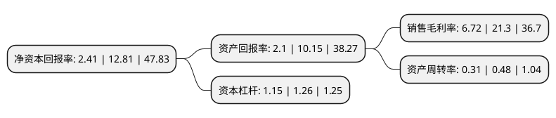

> 本页面由自动化程序生成于 2022年5月20日 01:17
> 内容可能存在错误，如有bug请提交issue至：https://github.com/Eroleice/doc-pi/issues
{.is-warning}

# 上市公司基本情况

## 基本资料

佛山市南华仪器股份有限公司（以下简称“南华仪器”）成立于1996年04月24日，佛山市。于2015年01月23日在深交所创业板上市。

南华仪器注册资本13,700.838万元，主要产品:机动车排放物检测系统，机动车安全检测系统，机动车排放物检测仪器，前照灯检测仪及其它机动车检测设备。主营业务:专业从事机动车环保和安全检测用分析仪器及系统研发，生产和销售。以下是详细信息：

- 公司名称: 佛山市南华仪器股份有限公司
- 股票代码: 300417.SZ
- 所在地: 广东 - 佛山市
- 成立日期: 1996年04月24日
- 注册资本: 13,700.838万元
- 法定代表人: 杨耀光
- 主营业务: 主要产品:机动车排放物检测系统，机动车安全检测系统，机动车排放物检测仪器，前照灯检测仪及其它机动车检测设备主营业务:专业从事机动车环保和安全检测用分析仪器及系统研发，生产和销售
- 公司官网: www.nanhua.com.cn
- 公司介绍: 公司是一家专业从事环保和安全检测用分析仪器及系统研发、生产和销售的高新技术企业，产品包括机动车排放物检测仪器、机动车排放物检测系统、机动车安全检测仪器及机动车安全检测系统。产品已被全国三十一个省、市、自治区及部队的检测/维修机构选用；还广泛出口欧、美、亚等国家。公司是中国汽车保修设备行业协会副会长单位；公司及主导产品均取得国家计量部门相关认证和ISO9001质量认证，是目前国内自主拥有核心技术、制造全部检测线主体设备的专业化企业。凭借在研发、核心技术、产品质量、成本、服务、客户资源与品牌等方面的竞争优势，公司已成为国内机动车排放物检测仪器、工况法系统、机动车安全检测仪器(前照灯检测仪)三大系列产品的主要供应商之一。

## 股东及高管情况

上市公司第一大股东为李源，持股17,887,350股，占比13.06%，**疑似为**上市公司实际控制人。

截至2022年03月31日，上市公司的前十大股东中，共有10名自然人股东，其中5%以上大股东共有4名。上市公司前十大股东明细如下：

> 未能通过持股比例判定出上市公司实际控制人（持股30%以上）
> 可能存在通过间接持股、联合持股、协议控制等方式拥有实际控制权的主体，具体请参考上市公司定期公告！
{.is-warning}

> 截至2022年03月31日，上市公司前十大股东信息如下：

| 股东名称 | 持股数量（股） | 持股比例 |
| --- | --- | --- |
| 李源 | 17,887,350 | 13.06% |
| 杨耀光 | 16,616,000 | 12.13% |
| 邓志溢 | 15,202,500 | 11.1% |
| 杨伟光 | 8,580,940 | 6.26% |
| 叶淑娟 | 5,747,040 | 4.19% |
| 黎亮 | 3,647,100 | 2.66% |
| 苏启源 | 1,721,250 | 1.26% |
| 王光辉 | 873,035 | 0.64% |
| 刘宝珠 | 800,000 | 0.58% |
| 张琍 | 746,485 | 0.54% |

## 利润表分析

上市公司2021年总收入为1.82亿元，净利润为0.12亿元，实现盈利。

## 杜邦分析

> 数据列示周期：2021年 | 2020年 | 2019年
{.is-info}

上市公司的净资产收益率在近一年有所下降，下降幅度为-81.19%，其变化情况分解如下：
- 上市公司的销售毛利率在近一年下降了-68.45%，可能是生产效率的下降、商品原材料价格上涨或商品价格的下跌所致。
- 上市公司的资产周转率在近一年下降了-35.42%，可能是源自于更慢的销售回款或库存管理效果下降。
- 上市公司的财务杠杆比率在近一年下降了-8.73%，可能是减少负债降低财务费用。

