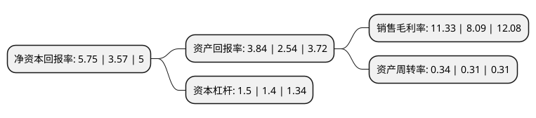

> 本页面由自动化程序生成于 2022年5月20日 01:17
> 内容可能存在错误，如有bug请提交issue至：https://github.com/Eroleice/doc-pi/issues
{.is-warning}

# 上市公司基本情况

## 基本资料

北京诚益通控制工程科技股份有限公司（以下简称“诚益通”）成立于2003年07月22日，北京市。于2015年03月19日在深交所创业板上市。

诚益通注册资本27,290.71万元，主要产品:自动化控制系统，自制关键系统设备及组件，技术服务和其他产品。主营业务:面向大中型制药，生物企业，提供个性化的自动化控制系统产品及整体解决方案。以下是详细信息：

- 公司名称: 北京诚益通控制工程科技股份有限公司
- 股票代码: 300430.SZ
- 所在地: 北京 - 北京市
- 成立日期: 2003年07月22日
- 注册资本: 27,290.71万元
- 法定代表人: 梁凯
- 主营业务: 主要产品:自动化控制系统，自制关键系统设备及组件，技术服务和其他产品主营业务:面向大中型制药，生物企业，提供个性化的自动化控制系统产品及整体解决方案
- 公司官网: www.ctntech.com
- 公司介绍: 公司系医药、生物工业自动化控制系统整体解决方案的提供商，专注于制药、生物制品生产过程中的自动化控制应用，以自主研发的核心技术和自主生产的关键设备及组件为依托，面向大中型制药、生物企业，提供个性化的自动化控制系统产品及整体解决方案。经过多年的发展和积累，公司形成了多项自主研发的专利及非专利核心技术，具备了执行器、控制器等自动化控制系统关键产品的自主设计、研发和加工能力，能够提供发酵/合成、分离纯化、成品制备、辅助工段等四大类自动化控制系统。主要客户包括海正医药、鲁抗医药、健康元、伊品生物、东阳光、广济药业、联邦制药及科伦药业等。公司拥有多项发明专利及实用新型专利、软件著作权等，产品《发酵基础料连续灭菌自动化控制装置》荣获“中国仪器仪表学会年度科技成果奖”。

## 股东及高管情况

上市公司第一大股东为北京立威特投资有限责任公司，持股51,209,771股，占比18.76%，**疑似为**上市公司实际控制人。

截至2022年03月31日，上市公司的前十大股东中，共有6名自然人股东，2名机构股东，2个产品账户，其中5%以上大股东共有3名。上市公司前十大股东明细如下：

> 未能通过持股比例判定出上市公司实际控制人（持股30%以上）
> 可能存在通过间接持股、联合持股、协议控制等方式拥有实际控制权的主体，具体请参考上市公司定期公告！
{.is-warning}

> 截至2022年03月31日，上市公司前十大股东信息如下：

| 股东名称 | 持股数量（股） | 持股比例 |
| --- | --- | --- |
| 北京立威特投资有限责任公司 | 51,209,771 | 18.76% |
| 长沙市信庭至臻医疗投资合伙企业(有限合伙) | 24,376,639 | 8.93% |
| 梁学贤 | 18,455,040 | 6.76% |
| 梁凯 | 10,137,600 | 3.71% |
| 刘棣 | 8,981,360 | 3.29% |
| 罗院龙 | 7,320,016 | 2.68% |
| 中国建设银行股份有限公司-工银瑞信前沿医疗股票型证券投资基金 | 7,000,000 | 2.56% |
| 罗小兵 | 3,660,010 | 1.34% |
| 罗小柱 | 3,111,260 | 1.14% |
| 全国社保基金五零四组合 | 2,967,331 | 1.09% |

## 杜邦分析

> 数据列示周期：2021年 | 2020年 | 2019年
{.is-info}

上市公司的净资产收益率在近一年有所上升，上升幅度为61.06%，其变化情况分解如下：
- 上市公司的销售毛利率在近一年上升了40.05%，可能是生产效率的提升、商品原材料价格下跌或商品价格的上涨所致。
- 上市公司的资产周转率在近一年上升了9.68%，可能是源自于更快的销售回款或库存管理效果提升。
- 上市公司的财务杠杆比率在近一年上升了7.14%，可能是增加负债扩大生产规模。

