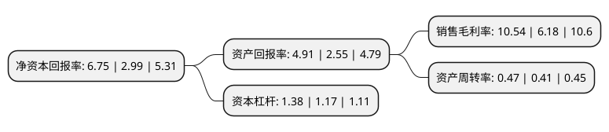

> 本页面由自动化程序生成于 2022年5月20日 01:18
> 内容可能存在错误，如有bug请提交issue至：https://github.com/Eroleice/doc-pi/issues
{.is-warning}

# 上市公司基本情况

## 基本资料

杭州集智机电股份有限公司（以下简称“集智股份”）成立于2004年06月02日，杭州市。于2016年10月21日在深交所创业板上市。

集智股份注册资本4,800万元，主要产品:全自动平衡机。主营业务:全自动平衡机，测试机的研发，设计，生产和销售。以下是详细信息：

- 公司名称: 杭州集智机电股份有限公司
- 股票代码: 300553.SZ
- 所在地: 浙江 - 杭州市
- 成立日期: 2004年06月02日
- 注册资本: 4,800万元
- 法定代表人: 楼荣伟
- 主营业务: 主要产品:全自动平衡机主营业务:全自动平衡机，测试机的研发，设计，生产和销售
- 公司官网: www.zjjizhi.com
- 公司介绍: 公司成立于2004年6月，是国内唯一一家主营全自动平衡机产品的A股上市企业。公司自成立以来便专注于全自动平衡机的研发、设计、生产和销售，致力成为平衡技术全面研发和综合应用的专业型企业。经过多年的研发创新和技术积累，公司掌握了全自动平衡机核心技术，解决了精密速度传感器设计、精确定位、数学模型建立、自动对刀与进刀、动态密度补偿等难题，为客户提供可靠、多样化的产品选择。目前，公司自主生产的全自动平衡机产品已进入博世、法雷奥、万宝至、百得、士林、美的、新宝、东成等国内外知名企业，广泛应用于家用电器、电动工具和汽车等多个行业电器制造领域，同时，公司还不断加大新产品研发和拓展力度，生产的全自动平衡机已成功进入离合器、飞轮、刹车盘、涡轮增压器等汽车回转零部件制造领域。近几年，公司先后荣获浙江省级高新技术企业、浙江省级软件企业、“雏鹰计划”培育企业等荣誉，并得到国家创新基金、种子基金、产学研合作等项目。

## 股东及高管情况

上市公司第一大股东为楼荣伟，持股5,966,728股，占比12.43%，**疑似为**上市公司实际控制人。

截至2022年04月30日，上市公司的前十大股东中，共有7名自然人股东，2名机构股东，1个产品账户，其中5%以上大股东共有5名。上市公司前十大股东明细如下：

> 未能通过持股比例判定出上市公司实际控制人（持股30%以上）
> 可能存在通过间接持股、联合持股、协议控制等方式拥有实际控制权的主体，具体请参考上市公司定期公告！
{.is-warning}

> 截至2022年04月30日，上市公司前十大股东信息如下：

| 股东名称 | 持股数量（股） | 持股比例 |
| --- | --- | --- |
| 楼荣伟 | 5,966,728 | 12.43% |
| 杭州集智投资有限公司 | 4,626,100 | 9.64% |
| 吴殿美 | 2,740,079 | 5.71% |
| 航发基金管理有限公司-北京国发航空发动机产业投资基金中心(有限合伙) | 2,691,262 | 5.61% |
| 石小英 | 2,470,000 | 5.15% |
| 潘伟志 | 2,099,200 | 4.37% |
| 杨全勇 | 2,090,013 | 4.35% |
| 张加庆 | 1,422,947 | 2.96% |
| 赵良梁 | 1,205,747 | 2.51% |
| 杭州士兰创业投资有限公司 | 1,152,435 | 2.4% |

## 利润表分析

上市公司2021年总收入为2.25亿元，净利润为0.23亿元，实现盈利。

## 杜邦分析

> 数据列示周期：2021年 | 2020年 | 2019年
{.is-info}

上市公司的净资产收益率在近一年有所上升，上升幅度为125.75%，其变化情况分解如下：
- 上市公司的销售毛利率在近一年上升了70.55%，可能是生产效率的提升、商品原材料价格下跌或商品价格的上涨所致。
- 上市公司的资产周转率在近一年上升了14.63%，可能是源自于更快的销售回款或库存管理效果提升。
- 上市公司的财务杠杆比率在近一年上升了17.95%，可能是增加负债扩大生产规模。

