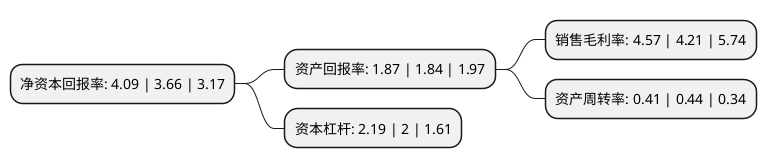

> 本页面由自动化程序生成于 2022年5月20日 01:18
> 内容可能存在错误，如有bug请提交issue至：https://github.com/Eroleice/doc-pi/issues
{.is-warning}

# 上市公司基本情况

## 基本资料

武汉理工光科股份有限公司（以下简称“理工光科”）成立于2000年08月29日，武汉市。于2016年11月01日在深交所创业板上市。

理工光科注册资本5,566.854万元，主要产品:光纤传感器与智能仪器仪表，光纤传感系统，物联网应用。主营业务:光纤传感器与智能仪器仪表，光纤传感系统，物联网应用的研究，开发，生产，销售以及技术服务。以下是详细信息：

- 公司名称: 武汉理工光科股份有限公司
- 股票代码: 300557.SZ
- 所在地: 湖北 - 武汉市
- 成立日期: 2000年08月29日
- 注册资本: 5,566.854万元
- 法定代表人: 何书平
- 主营业务: 主要产品:光纤传感器与智能仪器仪表，光纤传感系统，物联网应用主营业务:光纤传感器与智能仪器仪表，光纤传感系统，物联网应用的研究，开发，生产，销售以及技术服务
- 公司官网: www.wutos.com
- 公司介绍: 公司是烽火科技集团·武汉邮电科学研究院旗下专门从事光纤传感及智能化应用的高新技术企业。作为中国最早从事光纤传感技术的企业之一，公司为石油石化/公路隧道火灾监测、重要场所周界入侵防范、大型桥梁健康监测与综合管养、智能电网、重大装备状态监测与故障诊断等多种不同应用场景提供了一系列完整先进的综合解决方案，是中国最大的光纤传感安全监测设备提供商。公司自成立以来，一直与武汉理工大学姜德生院士领导的光纤传感技术研究开发中心开展密切的“产学研”合作，积极参与国家光纤光栅传感行业标准化工作。公司凭借多年的市场开拓，目前营销和服务网络遍及全国100多个地市，网点覆盖率在同行业中位居榜首；公司掌握光纤光栅传感系统的全部核心技术。

## 股东及高管情况

上市公司第一大股东为武汉光谷烽火科技创业投资有限公司，持股14,210,000股，占比20.32%，**疑似为**上市公司实际控制人。

截至2022年04月15日，上市公司的前十大股东中，共有2名自然人股东，8名机构股东，其中5%以上大股东共有6名。上市公司前十大股东明细如下：

> 未能通过持股比例判定出上市公司实际控制人（持股30%以上）
> 可能存在通过间接持股、联合持股、协议控制等方式拥有实际控制权的主体，具体请参考上市公司定期公告！
{.is-warning}

> 截至2022年04月15日，上市公司前十大股东信息如下：

| 股东名称 | 持股数量（股） | 持股比例 |
| --- | --- | --- |
| 武汉光谷烽火科技创业投资有限公司 | 14,210,000 | 20.32% |
| 武汉光谷烽火科技创业投资有限公司 | 14,210,000 | 25.53% |
| 湖北交投资本投资有限公司 | 7,872,668 | 11.26% |
| 北新集团建材股份有限公司 | 7,535,730 | 10.78% |
| 北新集团建材股份有限公司 | 7,535,730 | 13.54% |
| 中国信息通信科技集团有限公司 | 4,700,000 | 6.72% |
| 湖北省投资公司 | 1,218,548 | 2.19% |
| 李春云 | 1,081,700 | 1.94% |
| 千方捷通科技股份有限公司 | 383,300 | 0.69% |
| 沈顺金 | 350,000 | 0.63% |

## 利润表分析

上市公司2021年总收入为4.43亿元，净利润为0.2亿元，实现盈利。

## 杜邦分析

> 数据列示周期：2021年 | 2020年 | 2019年
{.is-info}

上市公司的净资产收益率在近一年有所上升，上升幅度为11.75%，其变化情况分解如下：
- 上市公司的销售毛利率在近一年上升了8.55%，可能是生产效率的提升、商品原材料价格下跌或商品价格的上涨所致。
- 上市公司的资产周转率在近一年下降了-6.82%，可能是源自于更慢的销售回款或库存管理效果下降。
- 上市公司的财务杠杆比率在近一年上升了9.5%，可能是增加负债扩大生产规模。

