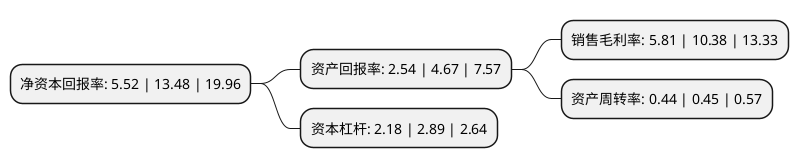

> 本页面由自动化程序生成于 2022年5月20日 01:18
> 内容可能存在错误，如有bug请提交issue至：https://github.com/Eroleice/doc-pi/issues
{.is-warning}

# 上市公司基本情况

## 基本资料

武汉精测电子集团股份有限公司（以下简称“精测电子”）成立于2006年04月20日，武汉市。于2016年11月22日在深交所创业板上市。

精测电子注册资本27,814.425万元，主要产品:模组检测系统，面板检测系统，OLED检测系统，AOI光学检测系统，Touch Panel检测系统和平板显示自动化设备。主营业务:平板显示检测系统的研发，生产与销售。以下是详细信息：

- 公司名称: 武汉精测电子集团股份有限公司
- 股票代码: 300567.SZ
- 所在地: 湖北 - 武汉市
- 成立日期: 2006年04月20日
- 注册资本: 27,814.425万元
- 法定代表人: 彭骞
- 主营业务: 主要产品:模组检测系统，面板检测系统，OLED检测系统，AOI光学检测系统，Touch Panel检测系统和平板显示自动化设备主营业务:平板显示检测系统的研发，生产与销售
- 公司官网: www.wuhanjingce.com
- 公司介绍: 公司是一家从事TFT-LCD(液晶显示器)\PDP(等离子体显示器)\OLED平面显示信号测试技术的研究、开发、生产与销售为一体的高新技术企业，也是目前国内平面显示信号测试领域的龙头企业。公司在国内平板显示测试领域处于绝对领先地位，产品包括模组检测系统、面板检测系统、OLED检测系统、AOI光学检测系统、Touch Panel检测系统和平板显示自动化设备，并通过ISO9000-2008质量管理体系认证、CE欧盟产品认证。产品已在京东方、三星、LG、夏普、松下、中电熊猫、富士康、友达光电等知名企业批量应用，并大量用于苹果公司的IPhone和IPad系列产品显示测试。公司坚持以“自主创新为核心，以联合研发为两翼”的发展战略，围绕光学检测、自动化控制以及信号检测(光、机、电)技术，开展了一系列的技术攻关和创新工作，拳头产品拥有自主知识产权，其整体技术水平达到国际先进水平。

## 股东及高管情况

上市公司第一大股东为彭骞，持股70,112,000股，占比25.21%，**疑似为**上市公司实际控制人。

截至2022年03月31日，上市公司的前十大股东中，共有3名自然人股东，2名机构股东，4个产品账户，1个海外主体，其中5%以上大股东共有2名。上市公司前十大股东明细如下：

> 未能通过持股比例判定出上市公司实际控制人（持股30%以上）
> 可能存在通过间接持股、联合持股、协议控制等方式拥有实际控制权的主体，具体请参考上市公司定期公告！
{.is-warning}

> 截至2022年03月31日，上市公司前十大股东信息如下：

| 股东名称 | 持股数量（股） | 持股比例 |
| --- | --- | --- |
| 彭骞 | 70,112,000 | 25.21% |
| 陈凯 | 22,529,813 | 8.1% |
| 胡隽 | 7,032,108 | 2.53% |
| 中国建设银行股份有限公司-华夏能源革新股票型证券投资基金 | 6,904,070 | 2.48% |
| 济南兴铁投资合伙企业(有限合伙) | 6,529,964 | 2.35% |
| 香港中央结算有限公司(陆股通) | 6,129,075 | 2.2% |
| 汇安基金-华能信托·悦盈13号单一资金信托-汇安基金汇鑫58号单一资产管理计划 | 5,012,050 | 1.8% |
| 中国工商银行股份有限公司-华夏核心制造混合型证券投资基金 | 4,941,490 | 1.78% |
| 武汉精至投资中心(有限合伙) | 4,589,561 | 1.65% |
| 全国社保基金一零三组合 | 4,482,200 | 1.61% |

## 利润表分析

上市公司2021年总收入为24.08亿元，净利润为1.39亿元，实现盈利。

## 杜邦分析

> 数据列示周期：2021年 | 2020年 | 2019年
{.is-info}

上市公司的净资产收益率在近一年有所下降，下降幅度为-59.05%，其变化情况分解如下：
- 上市公司的销售毛利率在近一年下降了-44.03%，可能是生产效率的下降、商品原材料价格上涨或商品价格的下跌所致。
- 上市公司的资产周转率在近一年下降了-2.22%，可能是源自于更慢的销售回款或库存管理效果下降。
- 上市公司的财务杠杆比率在近一年下降了-24.57%，可能是减少负债降低财务费用。

