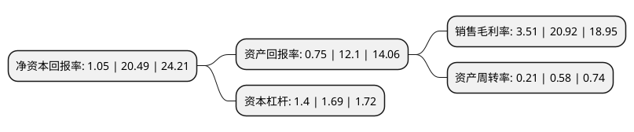

> 本页面由自动化程序生成于 2022年5月20日 01:18
> 内容可能存在错误，如有bug请提交issue至：https://github.com/Eroleice/doc-pi/issues
{.is-warning}

# 上市公司基本情况

## 基本资料

深圳市安车检测股份有限公司（以下简称“安车检测”）成立于2006年08月06日，深圳市。于2016年12月06日在深交所创业板上市。

安车检测注册资本22,898.881万元，主要产品:机动车检测系统和检测行业联网监管系统两大类，其中机动车检测系统包括安检系统，环检系统，综检系统，新车下线检测系统等。主营业务:提供国内机动车检测领域整体解决方案。以下是详细信息：

- 公司名称: 深圳市安车检测股份有限公司
- 股票代码: 300572.SZ
- 所在地: 广东 - 深圳市
- 成立日期: 2006年08月06日
- 注册资本: 22,898.881万元
- 法定代表人: 贺宪宁
- 主营业务: 主要产品:机动车检测系统和检测行业联网监管系统两大类，其中机动车检测系统包括安检系统，环检系统，综检系统，新车下线检测系统等主营业务:提供国内机动车检测领域整体解决方案
- 公司官网: www.anche.cn
- 公司介绍: 公司是国内机动车检测行业、机动车驾驶人考试行业整体解决方案提供者。公司立足汽车后市场，面向智能交通，通过对机电一体化、互联网和多媒体技术的重新演绎，运用“物联网”、“云计算”等新技术，向机动车检验机构提供机动车检测业务解决方案、向政府行业管理部门提供行业监管解决方案、向社会考试、培训机构提供驾驶员考试系统解决方案、向维修行业提供智能的维修行业服务与管理解决方案，为实现智能交通和绿色交通奠定坚实的基础。

## 股东及高管情况

上市公司第一大股东为贺宪宁，持股58,889,686股，占比25.72%，**疑似为**上市公司实际控制人。

截至2022年03月31日，上市公司的前十大股东中，共有5名自然人股东，4个产品账户，1个海外主体，其中5%以上大股东共有1名。上市公司前十大股东明细如下：

> 未能通过持股比例判定出上市公司实际控制人（持股30%以上）
> 可能存在通过间接持股、联合持股、协议控制等方式拥有实际控制权的主体，具体请参考上市公司定期公告！
{.is-warning}

> 截至2022年03月31日，上市公司前十大股东信息如下：

| 股东名称 | 持股数量（股） | 持股比例 |
| --- | --- | --- |
| 贺宪宁 | 58,889,686 | 25.72% |
| 庄立 | 6,356,784 | 2.78% |
| 建信(北京)投资基金管理有限责任公司-嘉兴建信宸玥股权投资合伙企业(有限合伙) | 6,153,846 | 2.69% |
| 徐志英 | 5,562,867 | 2.43% |
| 中意资管-招商银行-中意资产-卓越枫叶13号资产管理产品 | 5,230,769 | 2.28% |
| 香港中央结算有限公司(陆股通) | 3,293,727 | 1.44% |
| 中国银行股份有限公司-招商安华债券型证券投资基金 | 3,077,026 | 1.34% |
| 银华基金-中国人寿保险股份有限公司-分红险-银华基金国寿股份成长股票型组合单一资产管理计划(可供出售) | 2,787,626 | 1.22% |
| 叶燕桥 | 2,401,424 | 1.05% |
| 汪杰宁 | 2,295,800 | 1% |

## 利润表分析

上市公司2021年总收入为4.73亿元，净利润为0.16亿元，实现盈利。

## 杜邦分析

> 数据列示周期：2021年 | 2020年 | 2019年
{.is-info}

上市公司的净资产收益率在近一年有所下降，下降幅度为-94.88%，其变化情况分解如下：
- 上市公司的销售毛利率在近一年下降了-83.22%，可能是生产效率的下降、商品原材料价格上涨或商品价格的下跌所致。
- 上市公司的资产周转率在近一年下降了-63.79%，可能是源自于更慢的销售回款或库存管理效果下降。
- 上市公司的财务杠杆比率在近一年下降了-17.16%，可能是减少负债降低财务费用。

