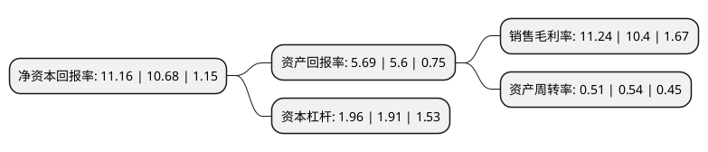

> 本页面由自动化程序生成于 2022年5月20日 01:19
> 内容可能存在错误，如有bug请提交issue至：https://github.com/Eroleice/doc-pi/issues
{.is-warning}

# 上市公司基本情况

## 基本资料

福建星云电子股份有限公司（以下简称“星云股份”）成立于2005年01月24日，福州市。于2017年04月25日在深交所创业板上市。

星云股份注册资本14,778.39万元，主要产品:锂电池保护板检测系统，锂电池成品检测系统，锂电池组BMS检测系统，锂电池组能量回馈式充放电检测系统，锂电池组工况模拟检测系统，锂电池组自动化组装系统六大类;主营业务:锂电池检测系统及相关产品的研发，生产与销售。以下是详细信息：

- 公司名称: 福建星云电子股份有限公司
- 股票代码: 300648.SZ
- 所在地: 福建 - 福州市
- 成立日期: 2005年01月24日
- 注册资本: 14,778.39万元
- 法定代表人: 李有财
- 主营业务: 主要产品:锂电池保护板检测系统，锂电池成品检测系统，锂电池组BMS检测系统，锂电池组能量回馈式充放电检测系统，锂电池组工况模拟检测系统，锂电池组自动化组装系统六大类;主营业务:锂电池检测系统及相关产品的研发，生产与销售
- 公司官网: www.e-nebula.com
- 公司介绍: 公司是国内领先的锂电池检测系统服务商。公司高度融合锂电池检测、电力电子、自动化等行业技术，以高精度的锂电池检测系统为基础，辅以公司自主开发的MES系统，将锂电池组组装制造过程的电芯充放电、电芯分选、电池模组焊接、BMS检测、电池模组检测、电池组成品下线检测等工序设备，整合成锂电池组自动化组装生产线。公司产品广泛应用于3C产品及电动工具、电动自行车、新能源汽车等领域。

## 股东及高管情况

上市公司第一大股东为李有财，持股22,124,190股，占比14.97%，**疑似为**上市公司实际控制人。

截至2022年03月31日，上市公司的前十大股东中，共有5名自然人股东，5个产品账户，其中5%以上大股东共有4名。上市公司前十大股东明细如下：

> 未能通过持股比例判定出上市公司实际控制人（持股30%以上）
> 可能存在通过间接持股、联合持股、协议控制等方式拥有实际控制权的主体，具体请参考上市公司定期公告！
{.is-warning}

> 截至2022年03月31日，上市公司前十大股东信息如下：

| 股东名称 | 持股数量（股） | 持股比例 |
| --- | --- | --- |
| 李有财 | 22,124,190 | 14.97% |
| 刘作斌 | 16,782,152 | 11.36% |
| 江美珠 | 16,552,934 | 11.2% |
| 汤平 | 14,565,459 | 9.86% |
| 银华基金-北京诚通金控投资有限公司-银华基金-诚通金控4号单一资产管理计划 | 1,704,872 | 1.15% |
| 中国建设银行股份有限公司-广发科技创新混合型证券投资基金 | 1,452,788 | 0.98% |
| 银华基金-农业银行-银华基金蓝筹精选1号集合资产管理计划 | 1,448,769 | 0.98% |
| 章志坚 | 1,288,000 | 0.87% |
| 招商银行股份有限公司-工银瑞信圆丰三年持有期混合型证券投资基金 | 1,188,000 | 0.8% |
| 上海贤盛投资管理有限公司-贤盛稳健增强1号私募投资基金 | 1,107,011 | 0.75% |

## 利润表分析

上市公司2021年总收入为8.1亿元，净利润为0.91亿元，实现盈利。

## 杜邦分析

> 数据列示周期：2021年 | 2020年 | 2019年
{.is-info}

上市公司的净资产收益率在近一年有所上升，上升幅度为4.49%，其变化情况分解如下：
- 上市公司的销售毛利率在近一年上升了8.08%，可能是生产效率的提升、商品原材料价格下跌或商品价格的上涨所致。
- 上市公司的资产周转率在近一年下降了-5.56%，可能是源自于更慢的销售回款或库存管理效果下降。
- 上市公司的财务杠杆比率在近一年上升了2.62%，可能是增加负债扩大生产规模。

