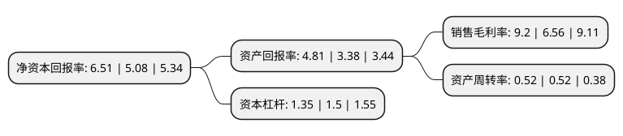

> 本页面由自动化程序生成于 2022年5月20日 01:19
> 内容可能存在错误，如有bug请提交issue至：https://github.com/Eroleice/doc-pi/issues
{.is-warning}

# 上市公司基本情况

## 基本资料

北京必创科技股份有限公司（以下简称“必创科技”）成立于2005年01月13日，北京市。于2017年06月19日在深交所创业板上市。

必创科技注册资本20,084.064万元，主要产品:工业过程无线监测系统解决方案，力学参数无线检测系统解决方案，MEMS压力传感器芯片及模组产品。主营业务:工业过程无线监测系统解决方案，力学参数无线检测系统解决方案，MEMS压力传感器芯片及模组产品的研发，生产和销售。以下是详细信息：

- 公司名称: 北京必创科技股份有限公司
- 股票代码: 300667.SZ
- 所在地: 北京 - 北京市
- 成立日期: 2005年01月13日
- 注册资本: 20,084.064万元
- 法定代表人: 代啸宁
- 主营业务: 主要产品:工业过程无线监测系统解决方案，力学参数无线检测系统解决方案，MEMS压力传感器芯片及模组产品主营业务:工业过程无线监测系统解决方案，力学参数无线检测系统解决方案，MEMS压力传感器芯片及模组产品的研发，生产和销售
- 公司官网: www.beetech.cn
- 公司介绍: 公司是一家无线传感器网络系统解决方案及MEMS传感器芯片提供商，是国内最早基于IEEE802.15.4通讯标准进行无线传感器网络相关产品研发、生产和销售的企业之一，是国内较早实现无线传感器网络产品产业化生产的企业。公司所属行业为仪器仪表制造业，公司的主营业务为工业过程无线监测系统解决方案(监测方案)、力学参数无线检测系统解决方案(检测方案)、MEMS压力传感器芯片及模组产品(MEMS产品)的研发、生产和销售。公司的主要产品为监测方案、检测方案、MEMS产品。公司逐步形成了以高可靠无线传感器网络通讯技术、高精度光栅光纤传感器开发制造技术、高质量的MEMS生产封装技术等为基础，以自研无线射频模块、传感器节点产品、行业应用算法等为纵深的无线传感器网络系统解决方案，从技术层面能更好的发挥产品组合优势及特点，并在客户应用过程逐步彰显。

## 股东及高管情况

上市公司第一大股东为代啸宁，持股40,675,246股，占比20.25%，**疑似为**上市公司实际控制人。

截至2022年03月31日，上市公司的前十大股东中，共有6名自然人股东，2名机构股东，2个产品账户，其中5%以上大股东共有3名。上市公司前十大股东明细如下：

> 未能通过持股比例判定出上市公司实际控制人（持股30%以上）
> 可能存在通过间接持股、联合持股、协议控制等方式拥有实际控制权的主体，具体请参考上市公司定期公告！
{.is-warning}

> 截至2022年03月31日，上市公司前十大股东信息如下：

| 股东名称 | 持股数量（股） | 持股比例 |
| --- | --- | --- |
| 代啸宁 | 40,675,246 | 20.25% |
| 陈发树 | 16,192,557 | 8.06% |
| 丁良成 | 10,872,885 | 5.41% |
| 北京金先锋企业管理有限公司 | 4,692,660 | 2.34% |
| 北京卓益企业管理合伙企业(有限合伙) | 3,611,926 | 1.8% |
| 上海迎水投资管理有限公司-迎水合力15号私募证券投资基金 | 3,496,850 | 1.74% |
| 上海迎水投资管理有限公司-迎水巡洋7号私募证券投资基金 | 3,122,200 | 1.55% |
| 朱怀明 | 1,807,602 | 0.9% |
| 唐智斌 | 1,796,429 | 0.89% |
| 何蕾 | 1,773,513 | 0.88% |

## 利润表分析

上市公司2021年总收入为8.45亿元，净利润为0.77亿元，实现盈利。

## 杜邦分析

> 数据列示周期：2021年 | 2020年 | 2019年
{.is-info}

上市公司的净资产收益率在近一年有所上升，上升幅度为28.15%，其变化情况分解如下：
- 上市公司的销售毛利率在近一年上升了40.24%，可能是生产效率的提升、商品原材料价格下跌或商品价格的上涨所致。
- 上市公司的资产周转率在近一年下降了0%，可能是源自于更慢的销售回款或库存管理效果下降。
- 上市公司的财务杠杆比率在近一年下降了-10%，可能是减少负债降低财务费用。

