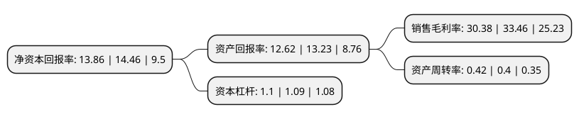

> 本页面由自动化程序生成于 2022年5月20日 01:20
> 内容可能存在错误，如有bug请提交issue至：https://github.com/Eroleice/doc-pi/issues
{.is-warning}

# 上市公司基本情况

## 基本资料

广东海川智能机器股份有限公司（以下简称“海川智能”）成立于2004年08月26日，佛山市。于2017年11月06日在深交所创业板上市。

海川智能注册资本19,440万元，主营业务:从事自动衡器的研发，生产和销售，产品主要包括智能组合秤，失重秤及其配套设备等，广泛用于食品，塑料，化工行业的称重，供料，配料等工序的动态计量。主要产品:智能组合秤。以下是详细信息：

- 公司名称: 广东海川智能机器股份有限公司
- 股票代码: 300720.SZ
- 所在地: 广东 - 佛山市
- 成立日期: 2004年08月26日
- 注册资本: 19,440万元
- 法定代表人: 郑颖
- 主营业务: 主营业务:从事自动衡器的研发，生产和销售，产品主要包括智能组合秤，失重秤及其配套设备等，广泛用于食品，塑料，化工行业的称重，供料，配料等工序的动态计量主要产品:智能组合秤
- 公司官网: www.highdream.cn
- 公司介绍: 公司主要从事自动衡器的研发、生产和销售，产品主要包括智能组合秤、失重秤及其配套设备等，广泛用于食品、塑料、化工行业的称重、供料、配料等工序的动态计量。公司是我国较早专注于重力式称重技术研究的公司之一，经过多年的技术研发与市场开拓，公司在国内自动衡器行业已具有较高知名度，能够为客户提供散装物料动态组合秤重和连续自动计量混合供配料综合解决方案，得到客户的广泛认可，产品远销美洲、欧洲、东南亚、中东、非洲等多个国家和地区。

## 股东及高管情况

上市公司第一大股东为郑锦康，持股80,610,340股，占比41.36%，为上市公司实际控制人。

截至2022年03月31日，上市公司的前十大股东中，共有9名自然人股东，1个产品账户，其中5%以上大股东共有3名。上市公司前十大股东明细如下：

> 截至2022年03月31日，上市公司前十大股东信息如下：

| 股东名称 | 持股数量（股） | 持股比例 |
| --- | --- | --- |
| 郑锦康 | 80,610,340 | 41.36% |
| 郑贻端 | 16,109,300 | 8.27% |
| 梁俊 | 12,657,640 | 6.5% |
| 吴桂芳 | 8,675,260 | 4.45% |
| 郑雪芬 | 8,468,760 | 4.35% |
| 上海一村投资管理有限公司-一村繁星6A号私募证券投资基金 | 4,871,600 | 2.5% |
| 何文钜 | 2,130,000 | 1.09% |
| 方映雪 | 1,267,840 | 0.65% |
| 于士彬 | 895,570 | 0.46% |
| 卜军 | 597,700 | 0.31% |

## 利润表分析

上市公司2021年总收入为2.52亿元，净利润为0.76亿元，实现盈利。

## 杜邦分析

> 数据列示周期：2021年 | 2020年 | 2019年
{.is-info}

上市公司的净资产收益率在近一年有所下降，下降幅度为-4.15%，其变化情况分解如下：
- 上市公司的销售毛利率在近一年下降了-9.21%，可能是生产效率的下降、商品原材料价格上涨或商品价格的下跌所致。
- 上市公司的资产周转率在近一年上升了5%，可能是源自于更快的销售回款或库存管理效果提升。
- 上市公司的财务杠杆比率在近一年上升了0.92%，可能是增加负债扩大生产规模。

