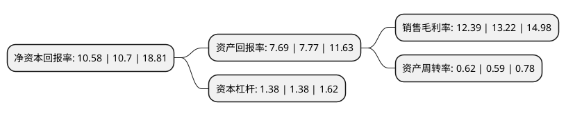

> 本页面由自动化程序生成于 2022年5月20日 01:20
> 内容可能存在错误，如有bug请提交issue至：https://github.com/Eroleice/doc-pi/issues
{.is-warning}

# 上市公司基本情况

## 基本资料

浙江力诺流体控制科技股份有限公司（以下简称“浙江力诺”）成立于2003年01月09日，温州市。于2020年06月08日在深交所创业板上市。

浙江力诺注册资本13,634万元，主营业务是从事工业控制阀的研发，生产和销售以下是详细信息：

- 公司名称: 浙江力诺流体控制科技股份有限公司
- 股票代码: 300838.SZ
- 所在地: 浙江 - 温州市
- 成立日期: 2003年01月09日
- 注册资本: 13,634万元
- 法定代表人: 陈晓宇
- 主营业务: 主营业务是从事工业控制阀的研发，生产和销售
- 公司官网: www.linuovalve.com
- 公司介绍: 公司是控制阀系统解决方案提供商，主营业务是从事工业控制阀的研发、生产和销售，能够设计和生产出适用于不同行业、不同市场需求的控制阀产品，为客户提供个性化、多样化、系统化的控制阀解决方案。公司为国家高新技术企业。2011年公司被浙江省科学技术厅认定为“省级高新技术企业研究开发中心”，2012年被科技部火炬高新技术产业开发中心认定为“国家火炬计划重点高新技术企业”，2012年公司控制阀被浙江省质量技术监督局认定为“浙江名牌产品”。公司自成立以来，坚持以市场和客户需求为导向，巩固制浆造纸控制阀领先地位，加大化工、石化、生化、环保、能源、冶金、轻工、矿山等领域技术研发和创新投入，完成了迷宫式低噪音套筒调节阀、V型调节三通球阀、大口径大压差高温高压套筒调节阀、大口径高压低噪音套筒调节阀、大扭双缸执行器、锻钢活塞式双向密封球阀、防逸散磁力传动阀、锅盖阀、釜顶阀、矿浆阀等多项科研项目。截至招股说明书签署日，公司已获得多项专利，掌握了包括球阀、蝶阀、刀闸阀及调节阀等多个系列产品的核心技术。

## 股东及高管情况

上市公司第一大股东为陈晓宇，持股28,550,000股，占比20.94%，**疑似为**上市公司实际控制人。

截至2022年03月31日，上市公司的前十大股东中，共有8名自然人股东，2名机构股东，其中5%以上大股东共有6名。上市公司前十大股东明细如下：

> 未能通过持股比例判定出上市公司实际控制人（持股30%以上）
> 可能存在通过间接持股、联合持股、协议控制等方式拥有实际控制权的主体，具体请参考上市公司定期公告！
{.is-warning}

> 截至2022年03月31日，上市公司前十大股东信息如下：

| 股东名称 | 持股数量（股） | 持股比例 |
| --- | --- | --- |
| 陈晓宇 | 28,550,000 | 20.94% |
| 任翔 | 12,867,000 | 9.44% |
| 王秀国 | 10,892,000 | 7.99% |
| 戴美春 | 10,768,000 | 7.9% |
| 吴平 | 8,126,000 | 5.96% |
| 余建平 | 7,900,000 | 5.79% |
| 瑞安市诺德投资合伙企业(有限合伙) | 2,979,000 | 2.18% |
| 瑞安市润诺投资合伙企业(有限合伙) | 1,574,000 | 1.15% |
| 伍荣 | 1,300,000 | 0.95% |
| 陈凡 | 639,200 | 0.47% |

## 利润表分析

上市公司2021年总收入为6.88亿元，净利润为0.85亿元，实现盈利。

## 杜邦分析

> 数据列示周期：2021年 | 2020年 | 2019年
{.is-info}

上市公司的净资产收益率在近一年有所下降，下降幅度为-1.12%，其变化情况分解如下：
- 上市公司的销售毛利率在近一年下降了-6.28%，可能是生产效率的下降、商品原材料价格上涨或商品价格的下跌所致。
- 上市公司的资产周转率在近一年上升了5.08%，可能是源自于更快的销售回款或库存管理效果提升。
- 上市公司的财务杠杆比率在近一年下降了0%，可能是减少负债降低财务费用。

