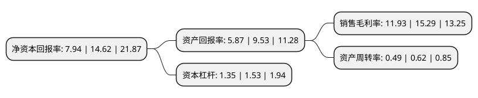

> 本页面由自动化程序生成于 2022年5月20日 01:21
> 内容可能存在错误，如有bug请提交issue至：https://github.com/Eroleice/doc-pi/issues
{.is-warning}

# 上市公司基本情况

## 基本资料

浙江万胜智能科技股份有限公司（以下简称“万胜智能”）成立于1997年07月21日，台州市。于2020年09月10日在深交所创业板上市。

万胜智能注册资本20,442.942万元，产品主要为包括单相智能表，三相智能表在内的智能电表以及包括集中器，采集器，专变采集终端等在内的用电信息采集系统产品，主要从事智能电表，用电信息采集系统等产品的研发，生产和销售。以下是详细信息：

- 公司名称: 浙江万胜智能科技股份有限公司
- 股票代码: 300882.SZ
- 所在地: 浙江 - 台州市
- 成立日期: 1997年07月21日
- 注册资本: 20,442.942万元
- 法定代表人: 邬永强
- 主营业务: 产品主要为包括单相智能表，三相智能表在内的智能电表以及包括集中器，采集器，专变采集终端等在内的用电信息采集系统产品，主要从事智能电表，用电信息采集系统等产品的研发，生产和销售
- 公司官网: www.wellsun.com
- 公司介绍: 公司是国家高新技术企业，主要从事智能电表、用电信息采集系统等产品的研发、生产和销售，致力于为国内外电力等行业客户提供专业化的计量产品，是国内电能仪表计量领域的领先企业之一，并积极进行智能水表、多表合一类产品的研发及应用。公司目前产品主要为包括单相智能表、三相智能表在内的智能电表以及包括集中器、采集器、专变采集终端等在内的用电信息采集系统产品，广泛应用于智能电网建设中的智能用电环节。智能电表是智能电网终端的重要组成部分，除具备传统电能表基本用电量的计量功能外，智能电表还具有多费率计量、用户端控制、预付费、防窃电、负荷记录、多种双向通讯方式等多项功能，实现智能电网和用户之间的双向沟通，并积极助力于国家智能电网实现“全覆盖、全采集、全费控”目标。2018年，公司在国家电网智能电表类产品的中标量总排名进入前五，其中，单相智能表中标量排名第四位。公司自2016年起，持续入围南方电网智能电表招标。发行人经过长期发展，凭借优秀的产品质量、先进的技术实力、良好的服务能力，成为国内智能电表和用电信息采集系统的重要供应商之一，并积极拓展国际市场。

## 股东及高管情况

上市公司第一大股东为浙江万胜控股有限公司，持股108,970,589股，占比53.3%，为上市公司实际控制人。

截至2022年03月31日，上市公司的前十大股东中，共有8名自然人股东，2名机构股东，其中5%以上大股东共有2名。上市公司前十大股东明细如下：

> 截至2022年03月31日，上市公司前十大股东信息如下：

| 股东名称 | 持股数量（股） | 持股比例 |
| --- | --- | --- |
| 浙江万胜控股有限公司 | 108,970,589 | 53.3% |
| 天台县万胜智和投资合伙企业(有限合伙) | 16,822,000 | 8.23% |
| 邬永强 | 8,411,765 | 4.11% |
| 周华 | 8,411,764 | 4.11% |
| 张建光 | 6,502,000 | 3.18% |
| 陈金香 | 2,102,941 | 1.03% |
| 周宇飞 | 2,102,941 | 1.03% |
| 马午龙 | 600,719 | 0.29% |
| 梁建军 | 422,801 | 0.21% |
| 王之田 | 336,700 | 0.16% |

## 利润表分析

上市公司2021年总收入为5.46亿元，净利润为0.65亿元，实现盈利。

## 杜邦分析

> 数据列示周期：2021年 | 2020年 | 2019年
{.is-info}

上市公司的净资产收益率在近一年有所下降，下降幅度为-45.69%，其变化情况分解如下：
- 上市公司的销售毛利率在近一年下降了-21.98%，可能是生产效率的下降、商品原材料价格上涨或商品价格的下跌所致。
- 上市公司的资产周转率在近一年下降了-20.97%，可能是源自于更慢的销售回款或库存管理效果下降。
- 上市公司的财务杠杆比率在近一年下降了-11.76%，可能是减少负债降低财务费用。

