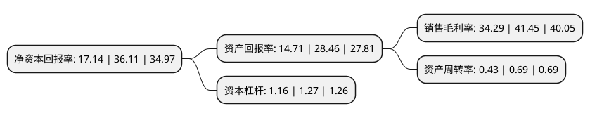

> 本页面由自动化程序生成于 2022年5月20日 01:22
> 内容可能存在错误，如有bug请提交issue至：https://github.com/Eroleice/doc-pi/issues
{.is-warning}

# 上市公司基本情况

## 基本资料

迈拓仪表股份有限公司（以下简称“迈拓股份”）成立于2006年12月14日，南京市。于2021年06月07日在深交所创业板上市。

迈拓股份注册资本13,928万元，主营业务为智能水表，智能热量表产品的研发，生产与销售，主营产品包括超声水表，超声波热量表，智能控制阀，衡流阀，超声流量计，智能消火栓等。以下是详细信息：

- 公司名称: 迈拓仪表股份有限公司
- 股票代码: 301006.SZ
- 所在地: 江苏 - 南京市
- 成立日期: 2006年12月14日
- 注册资本: 13,928万元
- 法定代表人: 孙卫国
- 主营业务: 主营业务为智能水表，智能热量表产品的研发，生产与销售，主营产品包括超声水表，超声波热量表，智能控制阀，衡流阀，超声流量计，智能消火栓等
- 公司官网: www.metter.cn
- 公司介绍: 公司是国内综合优势领先的智能计量仪表供应商。自成立以来，公司专注于超声波流体测量技术的研发和应用。公司是江苏省科技厅、江苏省财政厅、江苏省国税局和江苏省地税局联合认定的高新技术企业，并荣获江苏省软件企业、江苏省民营科技企业、江苏省科技型中小企业、南京市知识产权示范企业、南京市“专精特新”中小企业等多项荣誉称号。公司建有南京市工程技术中心，积极开展水计量、热计量领域超声智能计量仪表产品的基础研发和应用创新工作。公司依托在超声波流体测量领域多年技术研发积累以及城市供水及供热智能管理平台的开发建设，在产品技术研发和应用管理方面取得了多项成果，并形成了多项技术转化成果及专利技术。公司参与国家计量技术规范《热量表(热能表)制造计量器具许可考核必备条件》(JJF1434-2013)、工信部发布的电子行业标准《集中空调电子计费信息系统工程技术规范》(SJ/T11449-2013)、《风机盘管空调能耗监控系统技术规范》(SJ/T11436-2015)等制定工作。截至2018年12月31日，公司拥有已授权专利34项，其中发明专利2项；公司拥有软件产品登记证书12项，软件著作权30项。

## 股东及高管情况

上市公司第一大股东为孙卫国，持股50,814,800股，占比36.48%，为上市公司实际控制人。

截至2022年03月31日，上市公司的前十大股东中，共有8名自然人股东，2名机构股东，其中5%以上大股东共有3名。上市公司前十大股东明细如下：

> 截至2022年03月31日，上市公司前十大股东信息如下：

| 股东名称 | 持股数量（股） | 持股比例 |
| --- | --- | --- |
| 孙卫国 | 50,814,800 | 36.48% |
| 辉金鹏 | 9,000,000 | 6.46% |
| 杨荣福 | 7,156,800 | 5.14% |
| 南京旺凯企业管理中心(有限合伙) | 6,100,000 | 4.38% |
| 沈激 | 5,461,600 | 3.92% |
| 唐绪锦 | 4,593,600 | 3.3% |
| 南京动平衡投资管理有限公司-南京江宁开发区锋霖创业投资合伙企业(有限合伙) | 4,460,000 | 3.2% |
| 路兵 | 4,200,000 | 3.02% |
| 张美萍 | 2,700,000 | 1.94% |
| 曹凯强 | 2,700,000 | 1.94% |

## 利润表分析

上市公司2021年总收入为4.08亿元，净利润为1.4亿元，实现盈利。

## 杜邦分析

> 数据列示周期：2021年 | 2020年 | 2019年
{.is-info}

上市公司的净资产收益率在近一年有所下降，下降幅度为-52.53%，其变化情况分解如下：
- 上市公司的销售毛利率在近一年下降了-17.27%，可能是生产效率的下降、商品原材料价格上涨或商品价格的下跌所致。
- 上市公司的资产周转率在近一年下降了-37.68%，可能是源自于更慢的销售回款或库存管理效果下降。
- 上市公司的财务杠杆比率在近一年下降了-8.66%，可能是减少负债降低财务费用。

