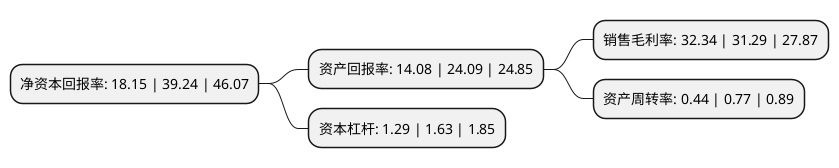

> 本页面由自动化程序生成于 2022年5月20日 01:23
> 内容可能存在错误，如有bug请提交issue至：https://github.com/Eroleice/doc-pi/issues
{.is-warning}

# 上市公司基本情况

## 基本资料

瑞纳智能设备股份有限公司（以下简称“瑞纳智能”）成立于2008年04月09日，合肥市。于2021年11月02日在深交所创业板上市。

瑞纳智能注册资本7,366万元，公司专业从事供热节能产品研发与生产，供热节能方案设计与实施。以下是详细信息：

- 公司名称: 瑞纳智能设备股份有限公司
- 股票代码: 301129.SZ
- 所在地: 安徽 - 合肥市
- 成立日期: 2008年04月09日
- 注册资本: 7,366万元
- 法定代表人: 于大永
- 主营业务: 公司专业从事供热节能产品研发与生产，供热节能方案设计与实施
- 公司官网: www.runachina.com
- 公司介绍: 公司专业从事供热节能产品研发与生产、供热节能方案设计与实施，能为热力客户提供涵盖“能源计量与数据采集、能源智能控制、数据交互与分析管理、节能服务”的完整产业链服务，是集“产品+方案+服务”为一体的智慧供热整体解决方案提供商。产品应用：公司依托自主核心技术，围绕热力客户需求，打造了涵盖供热系统核心环节的智能硬件产品线和智慧供热软件管理平台。解决方案：公司依托上述自主核心产品和技术，并基于对客户需求和行业发展的深刻理解，构建了管网安全监测、热力站智能控制、二网智能平衡、计量管控、室温监测等涵盖源、网、站、楼、户的智慧供热整体解决方案。节能服务：公司依托健全的产品技术方案体系和高效的服务能力，可以为客户提供合同能源管理、供热节能运营等供热节能服务。公司通过为热力企业客户提供产品、解决方案和节能服务，帮助客户提高能源利用效率和管理效率，降低生产成本、管理成本和安全隐患，从而帮助客户实现可持续发展。

## 股东及高管情况

上市公司第一大股东为于大永，持股44,500,000股，占比60.41%，为上市公司实际控制人。

截至2022年03月31日，上市公司的前十大股东中，共有3名自然人股东，2名机构股东，5个产品账户，其中5%以上大股东共有1名。上市公司前十大股东明细如下：

> 截至2022年03月31日，上市公司前十大股东信息如下：

| 股东名称 | 持股数量（股） | 持股比例 |
| --- | --- | --- |
| 于大永 | 44,500,000 | 60.41% |
| 王兆杰 | 3,300,000 | 4.48% |
| 宁波梅山保税港区瑞瀚远投资管理合伙企业(有限合伙) | 2,500,000 | 3.39% |
| 宁波梅山保税港区长风盈泰投资管理合伙企业(有限合伙) | 2,440,000 | 3.31% |
| 董君永 | 2,200,000 | 2.99% |
| 嘉实基金-国新投资有限公司-嘉实基金-国新2号单一资产管理计划 | 659,625 | 0.9% |
| 中国农业银行-华夏平稳增长混合型证券投资基金 | 491,163 | 0.67% |
| 海南谦信私募基金管理有限公司-谦信国智1号私募证券投资基金 | 454,332 | 0.62% |
| 中国建设银行股份有限公司-南方科技创新混合型证券投资基金 | 383,684 | 0.52% |
| 海南谦信私募基金管理有限公司-谦信辉煌1号私募证券投资基金 | 344,600 | 0.47% |

## 利润表分析

上市公司2021年总收入为5.29亿元，净利润为1.71亿元，实现盈利。

## 杜邦分析

> 数据列示周期：2021年 | 2020年 | 2019年
{.is-info}

上市公司的净资产收益率在近一年有所下降，下降幅度为-53.75%，其变化情况分解如下：
- 上市公司的销售毛利率在近一年上升了3.36%，可能是生产效率的提升、商品原材料价格下跌或商品价格的上涨所致。
- 上市公司的资产周转率在近一年下降了-42.86%，可能是源自于更慢的销售回款或库存管理效果下降。
- 上市公司的财务杠杆比率在近一年下降了-20.86%，可能是减少负债降低财务费用。

