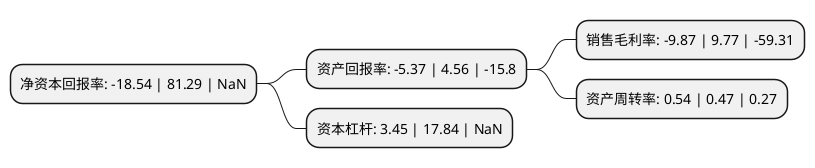

> 本页面由自动化程序生成于 2022年5月20日 01:28
> 内容可能存在错误，如有bug请提交issue至：https://github.com/Eroleice/doc-pi/issues
{.is-warning}

# 上市公司基本情况

## 基本资料

上海飞乐音响股份有限公司（以下简称“飞乐音响”）成立于1989年06月09日，上海市。于1990年12月19日在上交所主板上市。

飞乐音响注册资本250,702.802万元，灯泡，灯具及光源类产品生产及销售，电子类产品的生产及销售，IC卡及相关软件开发和系统集成，音响类产品的销售及工程服务。以下是详细信息：

- 公司名称: 上海飞乐音响股份有限公司
- 股票代码: 600651.SH
- 所在地: 上海 - 上海市
- 成立日期: 1989年06月09日
- 注册资本: 250,702.802万元
- 法定代表人: 李鑫
- 主营业务: 灯泡，灯具及光源类产品生产及销售，电子类产品的生产及销售，IC卡及相关软件开发和系统集成，音响类产品的销售及工程服务
- 公司官网: www.facs.com.cn
- 公司介绍: 公司集绿色照明产业、IC卡产业、电子部件产业、计算机系统集成与软件开发于一体的多元化产业公司，产品远销世界四十多个国家和地区。作为一家全球化跨国照明企业，公司拥有“亚”牌、“Sylvania”两大百年品牌，国内拥有一个国家级技术中心和一个全球产品检测中心以及九大研发生产基地。公司目前在中国主要以北方、华北、华中、华东、华南、西北和西南七大区域为销售平台，以渠道业务和工程业务为公司发展双引擎。渠道方面，通过遍布全国乃至全球的渠道销售高端差异化的照明产品和场景化的专业产品解决方案；工程方面，将以照明系统解决方案为业务抓手，从照明到智慧照明再到智慧灯网，逐步向平台化运营转型。

## 股东及高管情况

上市公司第一大股东为上海仪电电子(集团)有限公司，持股832,892,472股，占比33.22%，为上市公司实际控制人。

截至2022年03月31日，上市公司的前十大股东中，共有3名自然人股东，6名机构股东，1个产品账户，其中5%以上大股东共有3名。上市公司前十大股东明细如下：

> 截至2022年03月31日，上市公司前十大股东信息如下：

| 股东名称 | 持股数量（股） | 持股比例 |
| --- | --- | --- |
| 上海仪电电子(集团)有限公司 | 832,892,472 | 33.22% |
| 上海仪电(集团)有限公司 | 650,636,181 | 25.95% |
| 上海临港经济发展集团科技投资有限公司 | 154,991,178 | 6.18% |
| 上海华谊(集团)公司 | 62,015,692 | 2.47% |
| 上海联和资产管理有限公司 | 28,196,314 | 1.12% |
| 中国工商银行股份有限公司-中证上海国企交易型开放式指数证券投资基金 | 10,376,200 | 0.41% |
| 吴春燕 | 10,087,400 | 0.4% |
| 杨琪 | 8,455,000 | 0.34% |
| 卞翠虹 | 6,102,201 | 0.24% |
| 上海埃森化工有限公司 | 5,041,574 | 0.2% |

## 利润表分析

上市公司2021年总收入为45.71亿元，净利润为-4.52亿元，**未实现盈利**。

## 杜邦分析

> 数据列示周期：2021年 | 2020年 | 2019年
{.is-info}

上市公司的净资产收益率在近一年有所下降，下降幅度为-122.81%，其变化情况分解如下：
- 上市公司的销售毛利率在近一年下降了-201.02%，可能是生产效率的下降、商品原材料价格上涨或商品价格的下跌所致。
- 上市公司的资产周转率在近一年上升了14.89%，可能是源自于更快的销售回款或库存管理效果提升。
- 上市公司的财务杠杆比率在近一年下降了-80.66%，可能是减少负债降低财务费用。

