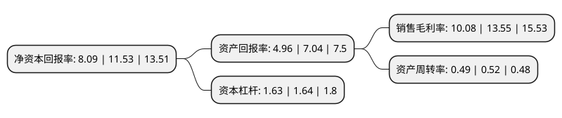

> 本页面由自动化程序生成于 2022年5月20日 01:31
> 内容可能存在错误，如有bug请提交issue至：https://github.com/Eroleice/doc-pi/issues
{.is-warning}

# 上市公司基本情况

## 基本资料

宁波三星医疗电气股份有限公司（以下简称“三星医疗”）成立于2007年02月01日，宁波市。于2011年06月15日在上交所主板上市。

三星医疗注册资本140,103.255万元，主要产品:智能配用电板块:主营产品覆盖智能计量，智能开关，智能配电系统，电力箱，配网自动化，智能充电桩设备，医疗服务板块:主要业务为医院的建设，运营，投资并购，以及融资租赁等业务。主营业务:智能配用电，医疗服务两个板块业务。以下是详细信息：

- 公司名称: 宁波三星医疗电气股份有限公司
- 股票代码: 601567.SH
- 所在地: 浙江 - 宁波市
- 成立日期: 2007年02月01日
- 注册资本: 140,103.255万元
- 法定代表人: 沈国英
- 主营业务: 主要产品:智能配用电板块:主营产品覆盖智能计量，智能开关，智能配电系统，电力箱，配网自动化，智能充电桩设备，医疗服务板块:主要业务为医院的建设，运营，投资并购，以及融资租赁等业务主营业务:智能配用电，医疗服务两个板块业务
- 公司官网: www.sanxing.com
- 公司介绍: 公司主要从事智能配用电相关设备的生产、研发与销售，包括智能电能表、终端、电力计量箱、变压器、开关、配网自动化等产品。公司已掌握了计量、通信、能效管理等方面多项核心技术，并不断持续创新，公司通过持续的研发投入，依托强大的研发团队和完备的科研设施，突破了智能化多项技术，取得了良好的业绩。同时公司拥有行业最全、国际认可的CNAS认证三大实验室：EMC实验室、通信实验室、可靠性实验室；持续的创新为公司带来显著的研究成果。公司拥有一流的制造设备和先进的信息化管理系统：硬件上具有目前全程无人工干预的智能化电表生产线及业内领先的全自动立体仓库，软件上具有国内领先自主知识产权的工厂信息化管理系统。公司的三星牌电能表、奥克斯牌变压器、计量箱在国家电网公司、南方电网公司以及其他电力用户中形成了良好的品牌效应，得到了客户的认可，并在行业内具有较高的知名度和美誉度。

## 股东及高管情况

上市公司第一大股东为奥克斯集团有限公司，持股457,719,653股，占比32.49%，为上市公司实际控制人。

截至2022年03月31日，上市公司的前十大股东中，共有7名自然人股东，1名机构股东，2个产品账户，其中5%以上大股东共有2名。上市公司前十大股东明细如下：

> 截至2022年03月31日，上市公司前十大股东信息如下：

| 股东名称 | 持股数量（股） | 持股比例 |
| --- | --- | --- |
| 奥克斯集团有限公司 | 457,719,653 | 32.49% |
| 郑坚江 | 179,306,730 | 12.73% |
| 郑江 | 58,895,000 | 4.18% |
| 何锡万 | 35,420,000 | 2.51% |
| 陆安君 | 31,760,250 | 2.25% |
| 陈光辉 | 28,948,400 | 2.06% |
| 徐信根 | 27,700,000 | 1.97% |
| 金鹰基金-浦发银行-金鹰穗通定增136号资产管理计划 | 21,088,410 | 1.5% |
| 竺琪君 | 20,176,943 | 1.43% |
| 上海雷根资产管理有限公司-雷根CTA复合策略3号私募基金 | 18,000,000 | 1.28% |

## 利润表分析

上市公司2021年总收入为70.22亿元，净利润为7.07亿元，实现盈利。

## 杜邦分析

> 数据列示周期：2021年 | 2020年 | 2019年
{.is-info}

上市公司的净资产收益率在近一年有所下降，下降幅度为-29.84%，其变化情况分解如下：
- 上市公司的销售毛利率在近一年下降了-25.61%，可能是生产效率的下降、商品原材料价格上涨或商品价格的下跌所致。
- 上市公司的资产周转率在近一年下降了-5.77%，可能是源自于更慢的销售回款或库存管理效果下降。
- 上市公司的财务杠杆比率在近一年下降了-0.61%，可能是减少负债降低财务费用。

