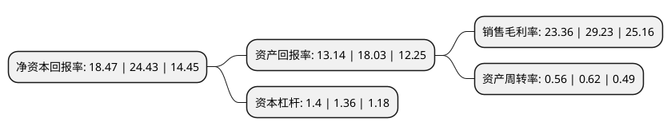

> 本页面由自动化程序生成于 2022年5月20日 01:34
> 内容可能存在错误，如有bug请提交issue至：https://github.com/Eroleice/doc-pi/issues
{.is-warning}

# 上市公司基本情况

## 基本资料

无锡信捷电气股份有限公司（以下简称“信捷电气”）成立于2008年04月22日，无锡市。于2016年12月21日在上交所主板上市。

信捷电气注册资本14,056万元，主营业务:主营工业自动化控制产品的研发，生产和销售，为OEM自动化行业提供智能控制系统解决方案。主要产品:包括可编程控制器(PLC)，人机界面(HMI)，变频器，伺服系统，机器视觉。公司在小型PLC领域为市场份额排名靠前的内资企业，同时具备为工厂自动化(FA)领域客户提供“整体工控自动化解决方案”的能力。以下是详细信息：

- 公司名称: 无锡信捷电气股份有限公司
- 股票代码: 603416.SH
- 所在地: 江苏 - 无锡市
- 成立日期: 2008年04月22日
- 注册资本: 14,056万元
- 法定代表人: 李新
- 主营业务: 主营业务:主营工业自动化控制产品的研发，生产和销售，为OEM自动化行业提供智能控制系统解决方案主要产品:包括可编程控制器(PLC)，人机界面(HMI)，变频器，伺服系统，机器视觉公司在小型PLC领域为市场份额排名靠前的内资企业，同时具备为工厂自动化(FA)领域客户提供“整体工控自动化解决方案”的能力
- 公司官网: www.xinje.com
- 公司介绍: 公司作为中国工控市场最早的参与者之一，长期专注于机械设备制造行业自动化水平的提高。主要产品有可编程控制器(PLC)、人机界面(HMI)、伺服控制系统、变频驱动、智能机器视觉系统、工业机器人等产品系列及整套自动化装备。产品广泛应用于各种自动化领域，包括航空航天、太阳能、风电、核电、隧道工程、纺织机械、数控机床、动力设备、煤矿设备、中央空调、环保工程等控制相关的行业和领域。公司致力于工控产品的研发、生产和销售，为工控领域和自动化行业的高新技术企业。公司是江苏省高新技术企业，先后被评为江苏省民营科技企业、无锡市领军型创新企业、“2012年度无锡市十佳物联网企业”。公司“无锡信捷电气股份有限公司工业自动化智能控制技术研究院”，获得了“江苏省工程技术研究中心”、“江苏省企业技术中心”的资质认定。

## 股东及高管情况

上市公司第一大股东为李新，持股32,467,960股，占比23.1%，**疑似为**上市公司实际控制人。

截至2022年03月31日，上市公司的前十大股东中，共有5名自然人股东，3个产品账户，2个海外主体，其中5%以上大股东共有3名。上市公司前十大股东明细如下：

> 未能通过持股比例判定出上市公司实际控制人（持股30%以上）
> 可能存在通过间接持股、联合持股、协议控制等方式拥有实际控制权的主体，具体请参考上市公司定期公告！
{.is-warning}

> 截至2022年03月31日，上市公司前十大股东信息如下：

| 股东名称 | 持股数量（股） | 持股比例 |
| --- | --- | --- |
| 李新 | 32,467,960 | 23.1% |
| 邹骏宇 | 17,730,900 | 12.61% |
| 刘婷莉 | 16,867,200 | 12% |
| 吉峰 | 6,451,375 | 4.59% |
| UBS   AG | 4,123,885 | 2.93% |
| 香港中央结算有限公司(陆股通) | 3,496,811 | 2.49% |
| 施罗德投资管理(香港)有限公司-施罗德环球基金系列大中华(交易所) | 3,100,584 | 2.21% |
| 上海宽投资产管理有限公司-宽投天王星11号私募证券投资基金 | 2,751,300 | 1.96% |
| 过志强 | 2,552,600 | 1.82% |
| 北京卓识私募基金管理有限公司-卓识利民十一号私募证券投资基金 | 2,323,500 | 1.65% |

## 利润表分析

上市公司2021年总收入为12.99亿元，净利润为3.03亿元，实现盈利。

## 杜邦分析

> 数据列示周期：2021年 | 2020年 | 2019年
{.is-info}

上市公司的净资产收益率在近一年有所下降，下降幅度为-24.4%，其变化情况分解如下：
- 上市公司的销售毛利率在近一年下降了-20.08%，可能是生产效率的下降、商品原材料价格上涨或商品价格的下跌所致。
- 上市公司的资产周转率在近一年下降了-9.68%，可能是源自于更慢的销售回款或库存管理效果下降。
- 上市公司的财务杠杆比率在近一年上升了2.94%，可能是增加负债扩大生产规模。

