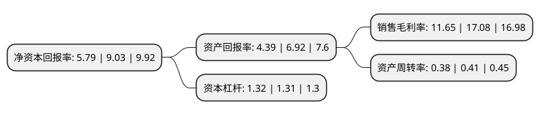

> 本页面由自动化程序生成于 2022年5月20日 01:34
> 内容可能存在错误，如有bug请提交issue至：https://github.com/Eroleice/doc-pi/issues
{.is-warning}

# 上市公司基本情况

## 基本资料

杭州海兴电力科技股份有限公司（以下简称“海兴电力”）成立于2001年07月06日，杭州市。于2016年11月10日在上交所主板上市。

海兴电力注册资本48,868.404万元，主要产品:表计产品，智能用电系统产品，智能配网系统产品等。主营业务:智能电网配用电系统产品的研发，生产和销售。以下是详细信息：

- 公司名称: 杭州海兴电力科技股份有限公司
- 股票代码: 603556.SH
- 所在地: 浙江 - 杭州市
- 成立日期: 2001年07月06日
- 注册资本: 48,868.404万元
- 法定代表人: 周良璋
- 主营业务: 主要产品:表计产品，智能用电系统产品，智能配网系统产品等主营业务:智能电网配用电系统产品的研发，生产和销售
- 公司官网: www.hxgroup.cn
- 公司介绍: 公司是国家火炬计划重点高新技术企业，是全球领先的能源计量、管理整体解决方案的提供商，业务涵盖电力系统发电、变电、配电、用电各个环节，是全球能源计量和管理相关产品的领航者。公司拥有在国际能源计量和管理市场领域的领先技术和解决方案，针对不同国家和区域的国际市场，针对性地推出了防窃电表箱系统方案、网络预付费系统方案、本地无线抄表系统方案和AMI系统方案等解决方案，是国际市场上能源计量和管理领域最具竞争力企业之一。公司产品率先通过了STS和DLMS认证，填补了国内的技术空白，并且先后通过了PTB、KEMA、Euridis、MID、UL和SABS等国际认证，是目前业内国际市场资质最完整，业绩最优良的企业。公司引入先进的研发管理体系、供应链管理体系、生产质量控制管理体系及信息化管理系统；设立了符合国家ISO17025认证标准的现代化实验室，检测手段齐全、设备先进，形成了工艺先进、技术成熟的现代化生产线。

## 股东及高管情况

上市公司第一大股东为浙江海兴控股集团有限公司，持股239,713,292股，占比49.05%，为上市公司实际控制人。

截至2022年04月11日，上市公司的前十大股东中，共有4名自然人股东，4名机构股东，1个产品账户，1个海外主体，其中5%以上大股东共有4名。上市公司前十大股东明细如下：

> 截至2022年04月11日，上市公司前十大股东信息如下：

| 股东名称 | 持股数量（股） | 持股比例 |
| --- | --- | --- |
| 浙江海兴控股集团有限公司 | 239,713,292 | 49.05% |
| 浙江海兴控股集团有限公司 | 239,713,292 | 49.05% |
| 李小青 | 42,964,103 | 8.79% |
| 丽水海聚股权投资有限公司 | 33,821,701 | 6.92% |
| 李小青 | 16,243,500 | 3.32% |
| 奥普家居股份有限公司 | 3,937,752 | 0.81% |
| 梁润权 | 2,811,075 | 0.58% |
| 香港中央结算有限公司(陆股通) | 2,790,450 | 0.57% |
| 基本养老保险基金一零零六组合 | 2,463,070 | 0.5% |
| 马杰 | 2,380,473 | 0.49% |

## 利润表分析

上市公司2021年总收入为26.91亿元，净利润为3.13亿元，实现盈利。

## 杜邦分析

> 数据列示周期：2021年 | 2020年 | 2019年
{.is-info}

上市公司的净资产收益率在近一年有所下降，下降幅度为-35.88%，其变化情况分解如下：
- 上市公司的销售毛利率在近一年下降了-31.79%，可能是生产效率的下降、商品原材料价格上涨或商品价格的下跌所致。
- 上市公司的资产周转率在近一年下降了-7.32%，可能是源自于更慢的销售回款或库存管理效果下降。
- 上市公司的财务杠杆比率在近一年上升了0.76%，可能是增加负债扩大生产规模。

