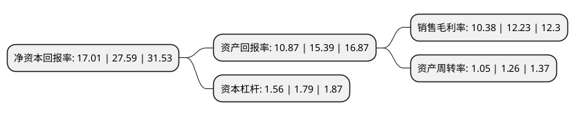

> 本页面由自动化程序生成于 2022年5月20日 01:36
> 内容可能存在错误，如有bug请提交issue至：https://github.com/Eroleice/doc-pi/issues
{.is-warning}

# 上市公司基本情况

## 基本资料

咸亨国际科技股份有限公司（以下简称“咸亨国际”）成立于2008年04月11日，杭州市。于2021年07月20日在上交所主板上市。

咸亨国际注册资本40,001万元，从事工器具，仪器仪表等类产品的MRO的研发，生产，销售及相关技术服务以下是详细信息：

- 公司名称: 咸亨国际科技股份有限公司
- 股票代码: 605056.SH
- 所在地: 浙江 - 杭州市
- 成立日期: 2008年04月11日
- 注册资本: 40,001万元
- 法定代表人: 王来兴
- 主营业务: 从事工器具，仪器仪表等类产品的MRO的研发，生产，销售及相关技术服务
- 公司官网: www.xianhengguoji.com
- 公司介绍: 公司为工器具、仪器仪表等类产品的MRO集约化供应商，并从事上述产品的研发、生产、销售及相关技术服务，目前业务主要服务于电力行业，并涉及铁路、城市轨道交通等领域。公司拥有中国合格评定国家认可委员会核发的实验室认可证书(CNAS)、检验检测机构资质认定证书(CMA)；参与全国高电压试验技术标准化分技术委员会标准编制工作，牵头编制《电力电缆测试设备通用技术条件第5部分：电缆故障探测用高压脉冲源装置》1项行业标准，参与修订国家标准2项、电力行业标准5项；是全国公共安全基础标准化技术委员会《公共安全业务连续性管理体系供应链连续性指南》、《公共安全建立合作约定指南》、《中小学生安全教育服务规范》的起草单位；是中国城市规划协会地下管线专业委员会副主任单位、中国核能行业协会会员单位、中国消防协会单位会员；公司下属子公司杭州贝特设备、杭州科研中心、杭州艾普莱、咸亨电子商务、北京应急科技和上海中科光绘为国家级高新技术企业,曾获得首批应急产业重点联系企业,国网商城2018年度工器具大类销量冠军,国网商城2018年度仪器仪表大类销量冠军,2019全国公共采购年度评选“优秀供应商”等多项荣誉。

## 股东及高管情况

上市公司第一大股东为杭州兴润投资有限公司，持股64,827,692股，占比16.21%，**疑似为**上市公司实际控制人。

截至2022年03月31日，上市公司的前十大股东中，共有2名自然人股东，7名机构股东，1个海外主体，其中5%以上大股东共有7名。上市公司前十大股东明细如下：

> 未能通过持股比例判定出上市公司实际控制人（持股30%以上）
> 可能存在通过间接持股、联合持股、协议控制等方式拥有实际控制权的主体，具体请参考上市公司定期公告！
{.is-warning}

> 截至2022年03月31日，上市公司前十大股东信息如下：

| 股东名称 | 持股数量（股） | 持股比例 |
| --- | --- | --- |
| 杭州兴润投资有限公司 | 64,827,692 | 16.21% |
| 杭州咸宁投资合伙企业(有限合伙) | 61,854,546 | 15.46% |
| 绍兴咸亨集团股份有限公司 | 53,471,329 | 13.37% |
| Goldman Sachs Asia Strategic Pte. Ltd. | 40,279,720 | 10.07% |
| 杭州万宁投资合伙企业(有限合伙) | 33,986,014 | 8.5% |
| 杭州弘宁投资合伙企业(有限合伙) | 25,174,825 | 6.29% |
| 杭州德宁投资合伙企业(有限合伙) | 25,174,825 | 6.29% |
| 王来兴 | 17,622,378 | 4.41% |
| 杭州易宁投资合伙企业(有限合伙) | 15,104,895 | 3.78% |
| 李灯东 | 7,680,839 | 1.92% |

## 利润表分析

上市公司2021年总收入为19.92亿元，净利润为2.06亿元，实现盈利。

## 杜邦分析

> 数据列示周期：2021年 | 2020年 | 2019年
{.is-info}

上市公司的净资产收益率在近一年有所下降，下降幅度为-38.35%，其变化情况分解如下：
- 上市公司的销售毛利率在近一年下降了-15.13%，可能是生产效率的下降、商品原材料价格上涨或商品价格的下跌所致。
- 上市公司的资产周转率在近一年下降了-16.67%，可能是源自于更慢的销售回款或库存管理效果下降。
- 上市公司的财务杠杆比率在近一年下降了-12.85%，可能是减少负债降低财务费用。

