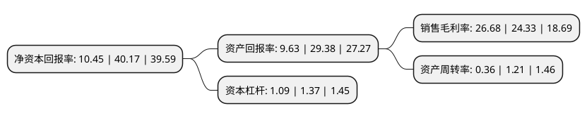

> 本页面由自动化程序生成于 2022年5月20日 01:38
> 内容可能存在错误，如有bug请提交issue至：https://github.com/Eroleice/doc-pi/issues
{.is-warning}

# 上市公司基本情况

## 基本资料

深圳市鼎阳科技股份有限公司（以下简称“鼎阳科技”）成立于2007年06月13日，深圳市。于2021年12月01日在上交所科创板上市。

鼎阳科技注册资本10,666.67万元，专注于通用电子测试测量仪器的开发和技术创新。以下是详细信息：

- 公司名称: 深圳市鼎阳科技股份有限公司
- 股票代码: 688112.SH
- 所在地: 广东 - 深圳市
- 成立日期: 2007年06月13日
- 注册资本: 10,666.67万元
- 法定代表人: 秦轲
- 主营业务: 专注于通用电子测试测量仪器的开发和技术创新
- 公司官网: www.siglent.com
- 公司介绍: 公司是一家研发驱动型的高新技术企业，设立以来一直专注于通用电子测试测量仪器的开发和技术创新，紧紧抓住电子工业的发展和需求变化，研发出具有自主核心技术的数字示波器、波形与信号发生器、频谱分析仪、矢量网络分析仪等产品，具备国内先进通用电子测试测量仪器研发、生产和销售能力，为国内通用电子测试测量仪器中高端产品实现国产化和进口替代提供支持力量。公司依托良好的产品创新能力、稳定的产品品质和产品性价比优势，与示波器领域国际领导企业之一力科和全球电商平台亚马逊建立了稳定的业务合作关系。公司自主品牌“SIGLENT”已经成为全球知名的通用电子测试测量仪器品牌，建立了稳定的全球销售体系，产品主要销售区域为北美、欧洲和亚洲电子相关产业发达的地区。公司将创新研发作为发展的核心驱动力，十分注重技术研发和产品创新，通过持续的研发投入和技术团队建设，打造了具有持续创新能力的研发平台，实现了技术的自主研发和产品创新。公司先后承担国家部委、深圳市和宝安区研发及产业化项目,公司曾连续两年被评为深圳市宝安区创新百强企业。

## 股东及高管情况

上市公司第一大股东为秦轲，持股23,832,000股，占比22.34%，**疑似为**上市公司实际控制人。

截至2022年03月31日，上市公司的前十大股东中，共有4名自然人股东，5名机构股东，1个产品账户，其中5%以上大股东共有5名。上市公司前十大股东明细如下：

> 未能通过持股比例判定出上市公司实际控制人（持股30%以上）
> 可能存在通过间接持股、联合持股、协议控制等方式拥有实际控制权的主体，具体请参考上市公司定期公告！
{.is-warning}

> 截至2022年03月31日，上市公司前十大股东信息如下：

| 股东名称 | 持股数量（股） | 持股比例 |
| --- | --- | --- |
| 秦轲 | 23,832,000 | 22.34% |
| 邵海涛 | 20,760,000 | 19.46% |
| 赵亚锋 | 16,912,000 | 15.85% |
| 深圳市鼎力向阳投资合伙企业(有限合伙) | 7,040,000 | 6.6% |
| 深圳市众力扛鼎企业管理咨询合伙企业(有限合伙) | 5,600,000 | 5.25% |
| 汤勇军 | 3,992,000 | 3.74% |
| 深圳市博时同裕投资合伙企业(有限合伙) | 1,864,000 | 1.75% |
| 国信证券-招商银行-国信证券鼎信13号员工参与战略配售集合资产管理计划 | 1,231,147 | 1.15% |
| 国信资本有限责任公司 | 959,168 | 0.9% |
| 上海显实投资合伙企业(有限合伙) | 920,859 | 0.86% |

## 利润表分析

上市公司2021年总收入为3.03亿元，净利润为0.81亿元，实现盈利。

## 杜邦分析

> 数据列示周期：2021年 | 2020年 | 2019年
{.is-info}

上市公司的净资产收益率在近一年有所下降，下降幅度为-73.99%，其变化情况分解如下：
- 上市公司的销售毛利率在近一年上升了9.66%，可能是生产效率的提升、商品原材料价格下跌或商品价格的上涨所致。
- 上市公司的资产周转率在近一年下降了-70.25%，可能是源自于更慢的销售回款或库存管理效果下降。
- 上市公司的财务杠杆比率在近一年下降了-20.44%，可能是减少负债降低财务费用。

