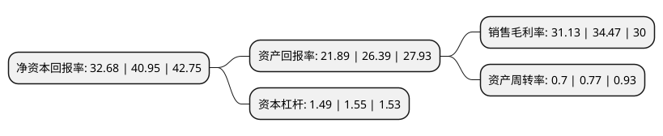

> 本页面由自动化程序生成于 2022年5月20日 01:39
> 内容可能存在错误，如有bug请提交issue至：https://github.com/Eroleice/doc-pi/issues
{.is-warning}

# 上市公司基本情况

## 基本资料

成都坤恒顺维科技股份有限公司（以下简称“坤恒顺维”）成立于2010年07月14日，成都市。于2022年02月15日在上交所科创板上市。

坤恒顺维注册资本8,400万元，无线信道仿真仪，射频微波信号发生器，定制化开发产品及系统解决方案，模块化组件以下是详细信息：

- 公司名称: 成都坤恒顺维科技股份有限公司
- 股票代码: 688283.SH
- 所在地: 四川 - 成都市
- 成立日期: 2010年07月14日
- 注册资本: 8,400万元
- 法定代表人: 张吉林
- 主营业务: 无线信道仿真仪，射频微波信号发生器，定制化开发产品及系统解决方案，模块化组件
- 公司官网: www.ksw-tech.com
- 公司介绍: 公司主要从事高端无线电测试仿真仪器仪表研发、生产和销售，重点面向移动通信、无线组网、雷达、电子对抗、车联网、导航等领域，提供用于无线电设备性能、功能检测的高端测试仿真仪器仪表及系统解决方案。公司产品定位于高端无线电测试仿真领域，经过多年积累，公司掌握了高端射频微波技术、数字电路技术、无线电测试仿真算法实时信号处理技术和非实时信号处理技术。公司与中国移动、华为、中兴、爱立信、大唐等移动通信运营商和设备制造商建立了稳定的业务合作关系，为其提供网络、终端及系统测试仿真所需的核心测试仿真设备；同时，公司依托雄厚的技术研发及产品开发能力，为中电科、航天科工、航天科技等集团下属通信研究院所以及中科院等相关科研单位提供无线电测试仿真产品及服务，为车联网检测中心及各大科研院所提供自组网通信设备检测系统，并为嫦娥登月着陆雷达及火星探测器等提供雷达回波仿真器，公司产品和技术在国内无线电测试仿真领域获得了客户的广泛认可。公司被中国移动研究院评为2019年度“优秀供应商”，2020年公司产品无线信道仿真仪被列入“四川省名优产品目录”。

## 股东及高管情况

上市公司第一大股东为张吉林，持股25,040,296股，占比29.81%，**疑似为**上市公司实际控制人。

截至2022年03月31日，上市公司的前十大股东中，共有7名自然人股东，1名机构股东，2个产品账户，其中5%以上大股东共有3名。上市公司前十大股东明细如下：

> 未能通过持股比例判定出上市公司实际控制人（持股30%以上）
> 可能存在通过间接持股、联合持股、协议控制等方式拥有实际控制权的主体，具体请参考上市公司定期公告！
{.is-warning}

> 截至2022年03月31日，上市公司前十大股东信息如下：

| 股东名称 | 持股数量（股） | 持股比例 |
| --- | --- | --- |
| 张吉林 | 25,040,296 | 29.81% |
| 伍江念 | 17,335,590 | 20.64% |
| 黄永刚 | 5,089,632 | 6.06% |
| 周天赤 | 3,852,355 | 4.59% |
| 夏琼 | 3,066,204 | 3.65% |
| 王超 | 1,737,526 | 2.07% |
| 李文军 | 1,533,120 | 1.83% |
| 民生证券-中信证券-民生证券坤恒顺维战略配售1号集合资产管理计划 | 1,452,838 | 1.73% |
| 民生证券投资有限公司 | 990,200 | 1.18% |
| 申万菱信基金-平安银行-申万菱信新力量集合资产管理计划 | 702,808 | 0.84% |

## 利润表分析

上市公司2021年总收入为1.62亿元，净利润为0.5亿元，实现盈利。

## 杜邦分析

> 数据列示周期：2021年 | 2020年 | 2019年
{.is-info}

上市公司的净资产收益率在近一年有所下降，下降幅度为-20.2%，其变化情况分解如下：
- 上市公司的销售毛利率在近一年下降了-9.69%，可能是生产效率的下降、商品原材料价格上涨或商品价格的下跌所致。
- 上市公司的资产周转率在近一年下降了-9.09%，可能是源自于更慢的销售回款或库存管理效果下降。
- 上市公司的财务杠杆比率在近一年下降了-3.87%，可能是减少负债降低财务费用。

