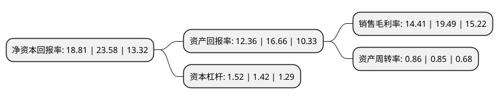

> 本页面由自动化程序生成于 2022年5月20日 01:39
> 内容可能存在错误，如有bug请提交issue至：https://github.com/Eroleice/doc-pi/issues
{.is-warning}

## 股东及高管情况

上市公司第一大股东为王项彬，持股22,380,658股，占比14.82%，**疑似为**上市公司实际控制人。

截至2022年04月28日，上市公司的前十大股东中，共有4名自然人股东，3名机构股东，2个产品账户，1个海外主体，其中5%以上大股东共有5名。上市公司前十大股东明细如下：

> 未能通过持股比例判定出上市公司实际控制人（持股30%以上）
> 可能存在通过间接持股、联合持股、协议控制等方式拥有实际控制权的主体，具体请参考上市公司定期公告！
{.is-warning}

> 截至2022年04月28日，上市公司前十大股东信息如下：

| 股东名称 | 持股数量（股） | 持股比例 |
| --- | --- | --- |
| 王项彬 | 22,380,658 | 14.82% |
| Alpha Achieve Limited | 15,363,793 | 10.17% |
| 衢州禾川投资管理中心(有限合伙) | 13,919,927 | 9.22% |
| 项亨会 | 10,915,688 | 7.23% |
| 龙游联龙股权投资基金合伙企业(有限合伙) | 7,826,087 | 5.18% |
| 魏中浩 | 6,697,618 | 4.44% |
| 深圳市达晨晨鹰二号股权投资企业(有限合伙) | 6,454,429 | 4.27% |
| 徐晓杰 | 4,585,987 | 3.04% |
| 中金禾川1号资产管理计划 | 3,776,000 | 2.5% |
| 张家港国弘智能制造投资企业(有限合伙) | 3,442,156 | 2.28% |

## 利润表分析

上市公司2021年总收入为7.51亿元，净利润为1.08亿元，实现盈利。

## 杜邦分析

> 数据列示周期：2021年 | 2020年 | 2019年
{.is-info}

上市公司的净资产收益率在近一年有所下降，下降幅度为-20.23%，其变化情况分解如下：
- 上市公司的销售毛利率在近一年下降了-26.06%，可能是生产效率的下降、商品原材料价格上涨或商品价格的下跌所致。
- 上市公司的资产周转率在近一年上升了1.18%，可能是源自于更快的销售回款或库存管理效果提升。
- 上市公司的财务杠杆比率在近一年上升了7.04%，可能是增加负债扩大生产规模。

