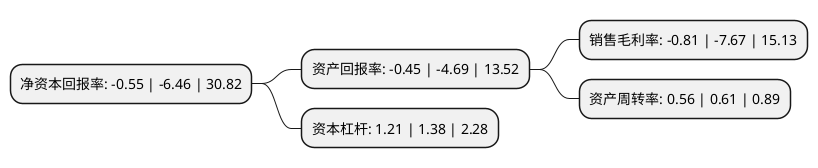

> 本页面由自动化程序生成于 2022年5月20日 01:39
> 内容可能存在错误，如有bug请提交issue至：https://github.com/Eroleice/doc-pi/issues
{.is-warning}

# 上市公司基本情况

## 基本资料

普源精电科技股份有限公司（以下简称“普源精电-U”）成立于2009年04月27日，苏州市。于2022年04月08日在上交所科创板上市。

普源精电-U注册资本9,098.22万元，主要产品包括数字示波器，射频类仪器，波形发生器，电源及电子负载，万用表及数据采集器等产品，专注于通用电子测量仪器研发，生产及销售。以下是详细信息：

- 公司名称: 普源精电科技股份有限公司
- 股票代码: 688337.SH
- 所在地: 江苏 - 苏州市
- 成立日期: 2009年04月27日
- 注册资本: 9,098.22万元
- 法定代表人: 王悦
- 主营业务: 主要产品包括数字示波器，射频类仪器，波形发生器，电源及电子负载，万用表及数据采集器等产品，专注于通用电子测量仪器研发，生产及销售
- 公司官网: www.rigol.com
- 公司介绍: 公司自成立以来，专注于通用电子测量仪器领域的前沿技术开发与突破，以“成就科技探索，助您无限可能”为使命，已成为业界知名的通用电子测量仪器研发、生产及销售的高新技术企业，公司产品以通用电子测量仪器及其解决方案为核心，在时域和频域测试测量应用方向实现多元化行业覆盖，为教育与科研、工业生产、通信行业、航空航天、交通与能源、消费电子等各行业提供科学研究、产品研发与生产制造的测试测量保障，并在前沿科学技术、新一代信息技术和新型基础设施建设的发展中助力实现国产化替代。公司及其产品曾荣获“北京市专利示范单位”、“江苏省民营科技企业”、“江苏省企业技术中心”、“苏州市科技技术奖”、“R&D100Awards”、“新时代中国经济创新企业”、“中国IoT技术创新奖”等多项荣誉。

## 股东及高管情况

上市公司第一大股东为苏州普源精电投资有限公司，持股43,200,000股，占比35.61%，为上市公司实际控制人。

截至2022年04月08日，上市公司的前十大股东中，共有3名自然人股东，4名机构股东，3个产品账户，其中5%以上大股东共有4名。上市公司前十大股东明细如下：

> 截至2022年04月08日，上市公司前十大股东信息如下：

| 股东名称 | 持股数量（股） | 持股比例 |
| --- | --- | --- |
| 苏州普源精电投资有限公司 | 43,200,000 | 35.61% |
| 李维森 | 10,512,000 | 8.67% |
| 王铁军 | 10,512,000 | 8.67% |
| 王悦 | 7,776,000 | 6.41% |
| 苏州锐格合众管理咨询合伙企业(有限合伙) | 4,000,000 | 3.3% |
| 苏州锐进合众管理咨询合伙企业(有限合伙) | 4,000,000 | 3.3% |
| 国泰君安君享科创板普源精电1号战略配售集合资产管理计划 | 2,672,249 | 2.2% |
| 苏州工业园区元禾重元贰号股权投资基金合伙企业(有限合伙) | 2,484,473 | 2.05% |
| 上海檀英投资合伙企业(有限合伙) | 2,360,000 | 1.95% |
| 江苏招银现代产业股权投资基金一期(有限合伙) | 2,332,919 | 1.92% |

## 利润表分析

上市公司2021年总收入为4.83亿元，净利润为-0.04亿元，**未实现盈利**。

## 杜邦分析

> 数据列示周期：2021年 | 2020年 | 2019年
{.is-info}

上市公司的净资产收益率在近一年有所下降，下降幅度为-91.49%，其变化情况分解如下：
- 上市公司的销售毛利率在近一年下降了-89.44%，可能是生产效率的下降、商品原材料价格上涨或商品价格的下跌所致。
- 上市公司的资产周转率在近一年下降了-8.2%，可能是源自于更慢的销售回款或库存管理效果下降。
- 上市公司的财务杠杆比率在近一年下降了-12.32%，可能是减少负债降低财务费用。

