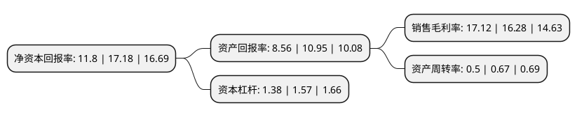

> 本页面由自动化程序生成于 2022年5月20日 01:40
> 内容可能存在错误，如有bug请提交issue至：https://github.com/Eroleice/doc-pi/issues
{.is-warning}

# 上市公司基本情况

## 基本资料

杭州西力智能科技股份有限公司（以下简称“西力科技”）成立于1999年12月30日，杭州市。于2021年03月18日在上交所科创板上市。

西力科技注册资本15,000万元，专业从事智能电表，用电信息采集终端，电能计量箱等电能计量产品的研发，生产和销售，主要产品为包括单相智能表，三相智能表在内的智能电表，以及包括集中器，采集器，专变采集终端在内的用电信息采集终端和电能计量箱产品。以下是详细信息：

- 公司名称: 杭州西力智能科技股份有限公司
- 股票代码: 688616.SH
- 所在地: 浙江 - 杭州市
- 成立日期: 1999年12月30日
- 注册资本: 15,000万元
- 法定代表人: 宋毅然
- 主营业务: 专业从事智能电表，用电信息采集终端，电能计量箱等电能计量产品的研发，生产和销售，主要产品为包括单相智能表，三相智能表在内的智能电表，以及包括集中器，采集器，专变采集终端在内的用电信息采集终端和电能计量箱产品
- 公司官网: www.cnxili.com
- 公司介绍: 公司是国内仅有的6家连续35批次均中标的电能表企业之一，专业从事智能电表、用电信息采集终端、电能计量箱等电能计量产品的研发、生产和销售，公司将高精度计量、软件模块化、数据库、控制电路设计、通信、数据安全等核心技术与精密仪表制造相融合，为下游客户提供高精度、低功耗、多功能的电能计量产品,并通过了ISO9001质量管理体系、ISO14001环境管理体系、GB/T28001职业健康安全管理体系认证，相关产品具有完备的CPA计量器具型式批准证书、中国CCC质量认证、荷兰KEMA认证及欧盟MID分供方认证等多项国内外权威认证。凭借出色的技术研发实力，发行人先后被评定为“高新技术企业”、“浙江省优秀创新型单位”、“浙江省仪器仪表行业重点骨干企业”、“浙江省创新型示范中小企业”、“杭州市创新型试点企业”、“杭州市信息化应用示范企业”。

## 股东及高管情况

上市公司第一大股东为宋毅然，持股49,830,000股，占比33.22%，为上市公司实际控制人。

截至2022年03月31日，上市公司的前十大股东中，共有5名自然人股东，4名机构股东，1个产品账户，其中5%以上大股东共有2名。上市公司前十大股东明细如下：

> 截至2022年03月31日，上市公司前十大股东信息如下：

| 股东名称 | 持股数量（股） | 持股比例 |
| --- | --- | --- |
| 宋毅然 | 49,830,000 | 33.22% |
| 周小蕾 | 21,600,000 | 14.4% |
| 德清西力科技信息咨询合伙企业(有限合伙) | 6,510,000 | 4.34% |
| 德清聚源科技信息咨询合伙企业(有限合伙) | 4,740,000 | 3.16% |
| 上海金浦创新消费股权投资基金(有限合伙) | 4,218,750 | 2.81% |
| 杭州瑞投科技有限公司 | 4,200,000 | 2.8% |
| 杭州通元优科创业投资合伙企业(有限合伙) | 4,050,000 | 2.7% |
| 陈龙 | 2,700,000 | 1.8% |
| 朱永丰 | 2,250,000 | 1.5% |
| 胡余生 | 2,250,000 | 1.5% |

## 利润表分析

上市公司2021年总收入为4.1亿元，净利润为0.7亿元，实现盈利。

## 杜邦分析

> 数据列示周期：2021年 | 2020年 | 2019年
{.is-info}

上市公司的净资产收益率在近一年有所下降，下降幅度为-31.32%，其变化情况分解如下：
- 上市公司的销售毛利率在近一年上升了5.16%，可能是生产效率的提升、商品原材料价格下跌或商品价格的上涨所致。
- 上市公司的资产周转率在近一年下降了-25.37%，可能是源自于更慢的销售回款或库存管理效果下降。
- 上市公司的财务杠杆比率在近一年下降了-12.1%，可能是减少负债降低财务费用。

