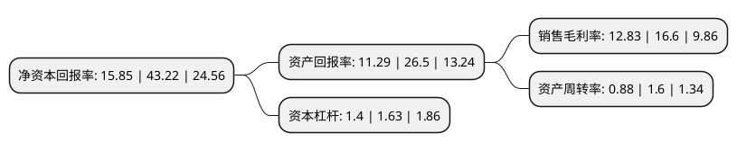

> 本页面由自动化程序生成于 2022年5月20日 01:40
> 内容可能存在错误，如有bug请提交issue至：https://github.com/Eroleice/doc-pi/issues
{.is-warning}

# 上市公司基本情况

## 基本资料

优利德科技(中国)股份有限公司（以下简称“优利德”）成立于2003年12月05日，东莞市。于2021年02月01日在上交所科创板上市。

优利德注册资本11,042.4万元，致力于测试测量仪器仪表的研发，生产和销售，主要产品包括电子电工测试仪表，温度及环境测试仪表，电力及高压测试仪表，测绘测量仪表和测试仪器等。以下是详细信息：

- 公司名称: 优利德科技(中国)股份有限公司
- 股票代码: 688628.SH
- 所在地: 广东 - 东莞市
- 成立日期: 2003年12月05日
- 注册资本: 11,042.4万元
- 法定代表人: 洪少俊
- 主营业务: 致力于测试测量仪器仪表的研发，生产和销售，主要产品包括电子电工测试仪表，温度及环境测试仪表，电力及高压测试仪表，测绘测量仪表和测试仪器等
- 公司官网: www.uni-trend.com.cn
- 公司介绍: 公司是亚洲知名且规模较大的仪器仪表公司之一,致力于测试测量仪器仪表的研发、生产和销售，主要产品包括电子电工测试仪表、温度及环境测试仪表、电力及高压测试仪表、测绘测量仪表和测试仪器等，公司产品广泛应用于电子、家用电器、机电设备、节能环保、轨道交通、汽车制造、冷暖通、建筑工程、电力建设及维护、高等教育和科学研究等应用场景,公司通过自主品牌经营与为欧美知名品牌客户提供ODM相结合的方式开展业务,公司为中国仪器仪表行业协会第五届至第八届理事会(2007年-2023年)理事单位，自2007年取得高新技术企业认证。凭借较强的研发实力，公司先后参与了“直流数字电压表及直流模数转换器(GB/T14913-2008)”、“数字仪表基本参数术语(GB/T13970-2008)”、“数字多用表(GB/T13978-2008)”、“电击防护装置和设备的通用部分(GB/T17045-2020)”四项国家标准的起草。

## 股东及高管情况

上市公司第一大股东为优利德集团有限公司，持股60,222,200股，占比54.54%，为上市公司实际控制人。

截至2022年03月31日，上市公司的前十大股东中，共有1名自然人股东，7名机构股东，2个产品账户，其中5%以上大股东共有1名。上市公司前十大股东明细如下：

> 截至2022年03月31日，上市公司前十大股东信息如下：

| 股东名称 | 持股数量（股） | 持股比例 |
| --- | --- | --- |
| 优利德集团有限公司 | 60,222,200 | 54.54% |
| 深圳纵联合创投资管理有限公司-南京纵联优选一号私募投资基金合伙企业(有限合伙) | 4,440,000 | 4.02% |
| 广东嘉宏股权投资管理有限公司 | 2,840,000 | 2.57% |
| 广东毅达创新创业投资合伙企业(有限合伙) | 2,500,000 | 2.26% |
| 珠海横琴拓利亚二期企业管理中心(有限合伙) | 2,286,200 | 2.07% |
| 盈科锐思(北京)投资有限公司 | 2,200,000 | 1.99% |
| 黄雪林 | 1,532,859 | 1.39% |
| 广东莞商清大股权投资合伙企业(有限合伙) | 1,420,000 | 1.29% |
| 北京善汇国际投资管理有限公司-常熟苏虞海创创业投资合伙企业(有限合伙) | 1,420,000 | 1.29% |
| 中国农业银行-华夏平稳增长混合型证券投资基金 | 1,380,903 | 1.25% |

## 利润表分析

上市公司2021年总收入为8.42亿元，净利润为1.08亿元，实现盈利。

## 杜邦分析

> 数据列示周期：2021年 | 2020年 | 2019年
{.is-info}

上市公司的净资产收益率在近一年有所下降，下降幅度为-63.33%，其变化情况分解如下：
- 上市公司的销售毛利率在近一年下降了-22.71%，可能是生产效率的下降、商品原材料价格上涨或商品价格的下跌所致。
- 上市公司的资产周转率在近一年下降了-45%，可能是源自于更慢的销售回款或库存管理效果下降。
- 上市公司的财务杠杆比率在近一年下降了-14.11%，可能是减少负债降低财务费用。

