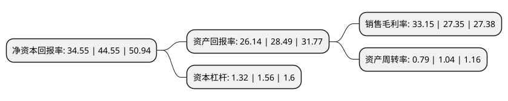

> 本页面由自动化程序生成于 2022年5月20日 01:40
> 内容可能存在错误，如有bug请提交issue至：https://github.com/Eroleice/doc-pi/issues
{.is-warning}

# 上市公司基本情况

## 基本资料

四方光电股份有限公司（以下简称“四方光电”）成立于2003年05月22日，武汉市。于2021年02月09日在上交所科创板上市。

四方光电注册资本7,000万元，专业从事气体传感器，气体分析仪器的研发，生产和销售。以下是详细信息：

- 公司名称: 四方光电股份有限公司
- 股票代码: 688665.SH
- 所在地: 湖北 - 武汉市
- 成立日期: 2003年05月22日
- 注册资本: 7,000万元
- 法定代表人: 熊友辉
- 主营业务: 专业从事气体传感器，气体分析仪器的研发，生产和销售
- 公司官网: www.gassensor.com.cn
- 公司介绍: 公司是一家专业从事气体传感器、气体分析仪器研发、生产和销售的高新技术企业。公司开发了基于非分光红外(NDIR)、光散射探测(LSD)、超声波(Ultrasonic)、紫外差分吸收光谱(UV-DOAS)、热导(TCD)、激光拉曼(LRD)等原理的气体传感技术平台，形成了气体传感器、气体分析仪器两大类产业生态、几十款不同产品，广泛应用于国内外的家电、汽车、医疗、环保、工业、能源计量等领域，公司专注于气体传感核心技术的研发与创新，为湖北省首批知识产权示范建设企业，建设有湖北省气体分析仪器仪表工程技术研究中心、湖北省企业技术中心，承担了国家重大科学仪器设备开发专项、工信部物联网发展专项等国家科技开发项目，累计获得96项专利，其中包括29项境内外发明专利，获批国家重点新产品4项，通过省级科技成果鉴定为国内领先的产品4项，获得湖北省专利金奖1项，公司凭借长期的技术积淀、良好的产品性能及国际化视野，公司已取得国内外知名企业的认可，产品销往全国并出口到八十多个国家和地区。

## 股东及高管情况

上市公司第一大股东为武汉佑辉科技有限公司，持股31,500,000股，占比45%，为上市公司实际控制人。

截至2022年03月31日，上市公司的前十大股东中，共有1名自然人股东，6名机构股东，3个产品账户，其中5%以上大股东共有3名。上市公司前十大股东明细如下：

> 截至2022年03月31日，上市公司前十大股东信息如下：

| 股东名称 | 持股数量（股） | 持股比例 |
| --- | --- | --- |
| 武汉佑辉科技有限公司 | 31,500,000 | 45% |
| 武汉智感科技有限公司 | 7,000,000 | 10% |
| 武汉丝清源科技有限公司 | 7,000,000 | 10% |
| 武汉聚优盈创管理咨询合伙企业(有限合伙) | 2,160,000 | 3.09% |
| 江苏沃土股权投资管理合伙企业(有限合伙)-南京沃土五号创业投资合伙企业(有限合伙) | 1,400,000 | 2% |
| 范崇东 | 1,250,000 | 1.79% |
| 江苏沃土股权投资管理合伙企业(有限合伙)-镇江沃土一号基金合伙企业(有限合伙) | 1,100,000 | 1.57% |
| 上海钦沐资产管理合伙企业(有限合伙)-钦沐创新生活私募证券投资基金 | 952,175 | 1.36% |
| 富诚海富资管-海通证券-富诚海富通四方光电1号战略配售集合资产管理计划 | 946,890 | 1.35% |
| 武汉盖森管理咨询合伙企业(有限合伙) | 790,000 | 1.13% |

## 利润表分析

上市公司2021年总收入为5.47亿元，净利润为1.81亿元，实现盈利。

## 杜邦分析

> 数据列示周期：2021年 | 2020年 | 2019年
{.is-info}

上市公司的净资产收益率在近一年有所下降，下降幅度为-22.45%，其变化情况分解如下：
- 上市公司的销售毛利率在近一年上升了21.21%，可能是生产效率的提升、商品原材料价格下跌或商品价格的上涨所致。
- 上市公司的资产周转率在近一年下降了-24.04%，可能是源自于更慢的销售回款或库存管理效果下降。
- 上市公司的财务杠杆比率在近一年下降了-15.38%，可能是减少负债降低财务费用。

