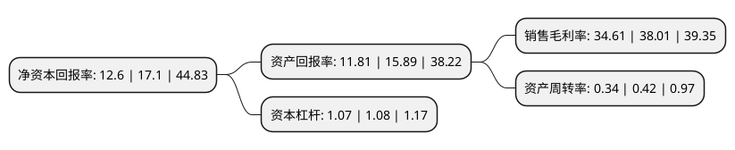

> 本页面由自动化程序生成于 2022年5月20日 01:40
> 内容可能存在错误，如有bug请提交issue至：https://github.com/Eroleice/doc-pi/issues
{.is-warning}

# 上市公司基本情况

## 基本资料

广东奥普特科技股份有限公司（以下简称“奥普特”）成立于2006年03月24日，东莞市。于2020年12月31日在上交所科创板上市。

奥普特注册资本8,247.567万元，主要生产和销售的产品包括光源，光源控制器，镜头，相机，视觉控制系统等机器视觉核心软硬件，并通过向下游客户提供专业的机器视觉解决方案带动产品的销售。从事机器视觉核心软硬件产品的研发，生产和销售。以下是详细信息：

- 公司名称: 广东奥普特科技股份有限公司
- 股票代码: 688686.SH
- 所在地: 广东 - 东莞市
- 成立日期: 2006年03月24日
- 注册资本: 8,247.567万元
- 法定代表人: 卢治临
- 主营业务: 主要生产和销售的产品包括光源，光源控制器，镜头，相机，视觉控制系统等机器视觉核心软硬件，并通过向下游客户提供专业的机器视觉解决方案带动产品的销售从事机器视觉核心软硬件产品的研发，生产和销售
- 公司官网: www.optmv.com
- 公司介绍: 公司是我国国内较早进入机器视觉领域的企业之一。在成立之初，以机器视觉核心部件中的光源产品为突破口，奥普特进入了当时主要为国际品牌所垄断的机器视觉市场。在十几年的发展过程中，公司坚持“深耕优势、以点带面、以面促点、逐个突破”的发展路径，将产品线逐步拓展至其他机器视觉部件，现已经形成覆盖机器视觉系统主要部件的产品体系。同时，奥普特以产品核心技术为基础，建立了成像和视觉分析两大技术平台，结合多年积累的机器视觉在各下游行业应用的专有技术(Know-How)，形成了多层次的技术体系。以此为基础，公司能够向下游客户提供各种机器视觉解决方案，协助客户在智能装备中实现视觉功能，提高机器视觉系统的准确性、稳定性和可靠性，从而带动公司产品的销售。公司提供的机器视觉产品已广泛应用于各类高端装备中，服务于3C电子、新能源、半导体、汽车、医药及食品加工等多个行业及一些科研教学等领域，并得到苹果、富士康、欧姆龙、安世半导体、安费诺、博世、大族激光等世界500强、中国500强和行业龙头企业的认可。

## 股东及高管情况

上市公司第一大股东为卢治临，持股24,570,000股，占比29.79%，**疑似为**上市公司实际控制人。

截至2022年03月31日，上市公司的前十大股东中，共有3名自然人股东，3名机构股东，2个产品账户，2个海外主体，其中5%以上大股东共有4名。上市公司前十大股东明细如下：

> 未能通过持股比例判定出上市公司实际控制人（持股30%以上）
> 可能存在通过间接持股、联合持股、协议控制等方式拥有实际控制权的主体，具体请参考上市公司定期公告！
{.is-warning}

> 截至2022年03月31日，上市公司前十大股东信息如下：

| 股东名称 | 持股数量（股） | 持股比例 |
| --- | --- | --- |
| 卢治临 | 24,570,000 | 29.79% |
| 卢盛林 | 24,024,000 | 29.13% |
| 许学亮 | 6,006,000 | 7.28% |
| 东莞千智股权投资合伙企业(有限合伙) | 4,800,000 | 5.82% |
| MORGAN STANLEY & CO. INTERNATIONAL PLC. | 2,327,369 | 2.82% |
| 国信证券-招商银行-国信证券鼎信10号科创板战略配售集合资产管理计划 | 1,718,939 | 2.08% |
| 宁波梅山保税港区晨道投资合伙企业(有限合伙)-长江晨道(湖北)新能源产业投资合伙企业(有限合伙) | 1,687,113 | 2.05% |
| 铭基国际投资公司-MATTHEWS ASIA FUNDS(US) | 1,570,794 | 1.9% |
| 摩根资产管理(新加坡)有限公司-摩根中国A股市场机会基金 | 1,489,898 | 1.81% |
| 高华-汇丰-GOLDMAN, SACHS & CO.LLC | 1,205,213 | 1.46% |

## 利润表分析

上市公司2021年总收入为8.75亿元，净利润为3.02亿元，实现盈利。

## 杜邦分析

> 数据列示周期：2021年 | 2020年 | 2019年
{.is-info}

上市公司的净资产收益率在近一年有所下降，下降幅度为-26.32%，其变化情况分解如下：
- 上市公司的销售毛利率在近一年下降了-8.95%，可能是生产效率的下降、商品原材料价格上涨或商品价格的下跌所致。
- 上市公司的资产周转率在近一年下降了-19.05%，可能是源自于更慢的销售回款或库存管理效果下降。
- 上市公司的财务杠杆比率在近一年下降了-0.93%，可能是减少负债降低财务费用。

