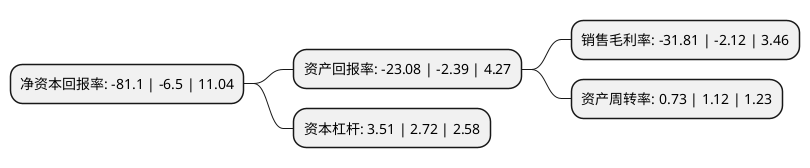

> 本页面由自动化程序生成于 2022年5月20日 01:05
> 内容可能存在错误，如有bug请提交issue至：https://github.com/Eroleice/doc-pi/issues
{.is-warning}

# 上市公司基本情况

## 基本资料

苏宁易购集团股份有限公司（以下简称“ST易购”）成立于1996年05月15日，南京市。于2004年07月21日在深交所中小板上市。

ST易购注册资本931,003.966万元，主要业务:综合电器的连锁销售和服务。主要产品:空调器，通讯，数码，IT，黑色电器，白色电器，安装维修。以下是详细信息：

- 公司名称: 苏宁易购集团股份有限公司
- 股票代码: 002024.SZ
- 所在地: 江苏 - 南京市
- 成立日期: 1996年05月15日
- 注册资本: 931,003.966万元
- 法定代表人: 任峻
- 主营业务: 综合电器的连锁销售和服务主要产品:空调器，通讯，数码，IT，黑色电器，白色电器，安装维修
- 公司官网: www.suning.cn/www.suning.com
- 公司介绍: 公司是中国领先的O2O智慧零售商，面对互联网、物联网、大数据时代，持续推进智慧零售和线上线下融合战略，全品类经营、全渠道运营、全球化拓展，开放物流云、数据云和金融云，通过门店端、PC端、移动端和家庭端的四端协同，实现无处不在的一站式服务体验。苏宁物流专业从事仓储、配送等供应链全流程服务，致力于打造中国商业领域最具效率的消费品仓储服务和智慧物流服务平台。目前已经拥有高标准的自建仓库群。面向家电3C、快消品、家居家装等2000多家社会伙伴全面开放物流云资源，以技术和服务驱动，提供供应链解决方案，专注从效率、体验、管控、创新四大维度提升客户体验。

## 股东及高管情况

上市公司第一大股东为淘宝(中国)软件有限公司，持股1,861,076,927股，占比19.99%，**疑似为**上市公司实际控制人。

截至2022年03月31日，上市公司的前十大股东中，共有4名自然人股东，3名机构股东，2个产品账户，1个海外主体，其中5%以上大股东共有4名。上市公司前十大股东明细如下：

> 未能通过持股比例判定出上市公司实际控制人（持股30%以上）
> 可能存在通过间接持股、联合持股、协议控制等方式拥有实际控制权的主体，具体请参考上市公司定期公告！
{.is-warning}

> 截至2022年03月31日，上市公司前十大股东信息如下：

| 股东名称 | 持股数量（股） | 持股比例 |
| --- | --- | --- |
| 淘宝(中国)软件有限公司 | 1,861,076,927 | 19.99% |
| 张近东 | 1,640,181,431 | 17.62% |
| 江苏新新零售创新基金二期(有限合伙) | 1,578,696,146 | 16.96% |
| 江苏新新零售创新基金(有限合伙) | 520,000,000 | 5.59% |
| 李松强 | 281,526,374 | 3.02% |
| 苏宁控股集团有限公司 | 254,411,429 | 2.73% |
| 香港中央结算有限公司(陆股通) | 205,216,022 | 2.2% |
| 苏宁电器集团有限公司 | 129,448,134 | 1.39% |
| 金明 | 125,001,165 | 1.34% |
| 陈金凤 | 73,039,097 | 0.78% |

## 利润表分析

上市公司2021年总收入为1,389.04亿元，净利润为-441.8亿元，**未实现盈利**。

## 杜邦分析

> 数据列示周期：2021年 | 2020年 | 2019年
{.is-info}

上市公司的净资产收益率在近一年有所上升，上升幅度为1147.69%，其变化情况分解如下：
- 上市公司的销售毛利率在近一年上升了1400.47%，可能是生产效率的提升、商品原材料价格下跌或商品价格的上涨所致。
- 上市公司的资产周转率在近一年下降了-34.82%，可能是源自于更慢的销售回款或库存管理效果下降。
- 上市公司的财务杠杆比率在近一年上升了29.04%，可能是增加负债扩大生产规模。

