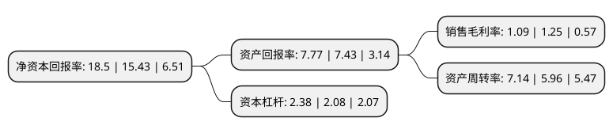

> 本页面由自动化程序生成于 2022年5月20日 01:09
> 内容可能存在错误，如有bug请提交issue至：https://github.com/Eroleice/doc-pi/issues
{.is-warning}

# 上市公司基本情况

## 基本资料

深圳市爱施德股份有限公司（以下简称“爱施德”）成立于1998年06月08日，深圳市。于2010年05月28日在深交所中小板上市。

爱施德注册资本123,928.181万元，本公司主要提供手机及数码电子产品销售渠道综合服务。本公司通过增值分销服务为三星，索尼爱立信，宇龙酷派，摩托罗拉等手机品牌厂商大规模分销产品;通过连锁零售服务销售富有个性化，功能化的以苹果产品为代表的数码电子产品;并为中国移动，中国电信，中国联通，苏宁，国美等关键客户提供手机销售渠道综合服务。以下是详细信息：

- 公司名称: 深圳市爱施德股份有限公司
- 股票代码: 002416.SZ
- 所在地: 广东 - 深圳市
- 成立日期: 1998年06月08日
- 注册资本: 123,928.181万元
- 法定代表人: 黄文辉
- 主营业务: 本公司主要提供手机及数码电子产品销售渠道综合服务本公司通过增值分销服务为三星，索尼爱立信，宇龙酷派，摩托罗拉等手机品牌厂商大规模分销产品;通过连锁零售服务销售富有个性化，功能化的以苹果产品为代表的数码电子产品;并为中国移动，中国电信，中国联通，苏宁，国美等关键客户提供手机销售渠道综合服务
- 公司官网: www.aisidi.com
- 公司介绍: 公司成立于1998年6月，于2010年5月28日在深圳证券交易所挂牌上市。经过多年的发展，公司已发展成为以智能终端为基础金融互联网服务的最具价值供应链服务商。公司围绕移动通讯终端产品、数码电子消费产品、通信服务、移动互联网、金融等领域，形成了智能终端分销、智慧零售、通信服务、金融及供应链服务业务四大业务板块。为顺应5G通信技术和万物互联的时代趋势，充分挖掘智能终端万亿级的市场红利，拥抱新零售带来的变革与机遇，发挥行业领先的爱施德IT支撑能力和品牌价值，公司将逐步发展智慧供应链、智慧零售、智慧连接三大平台，加强对大数据、云计算、人工智能、物联网等技术的投入和应用。

## 股东及高管情况

上市公司第一大股东为深圳市神州通投资集团有限公司，持股489,464,303股，占比39.5%，为上市公司实际控制人。

截至2022年03月31日，上市公司的前十大股东中，共有5名自然人股东，4名机构股东，1个海外主体，其中5%以上大股东共有1名。上市公司前十大股东明细如下：

> 截至2022年03月31日，上市公司前十大股东信息如下：

| 股东名称 | 持股数量（股） | 持股比例 |
| --- | --- | --- |
| 深圳市神州通投资集团有限公司 | 489,464,303 | 39.5% |
| 周玲 | 55,710,000 | 4.5% |
| 赣江新区全球星投资管理有限公司 | 54,000,000 | 4.36% |
| 新余全球星投资管理有限公司 | 52,128,000 | 4.21% |
| 戴诚 | 51,908,400 | 4.19% |
| 黄绍武 | 14,362,431 | 1.16% |
| 管晓华 | 12,225,900 | 0.99% |
| 香港中央结算有限公司(陆股通) | 11,152,344 | 0.9% |
| 鬲晓鸿 | 6,592,000 | 0.53% |
| 新余爱乐投资管理中心(有限合伙) | 5,400,000 | 0.44% |

## 利润表分析

上市公司2021年总收入为951.65亿元，净利润为10.33亿元，实现盈利。

## 杜邦分析

> 数据列示周期：2021年 | 2020年 | 2019年
{.is-info}

上市公司的净资产收益率在近一年有所上升，上升幅度为19.9%，其变化情况分解如下：
- 上市公司的销售毛利率在近一年下降了-12.8%，可能是生产效率的下降、商品原材料价格上涨或商品价格的下跌所致。
- 上市公司的资产周转率在近一年上升了19.8%，可能是源自于更快的销售回款或库存管理效果提升。
- 上市公司的财务杠杆比率在近一年上升了14.42%，可能是增加负债扩大生产规模。

