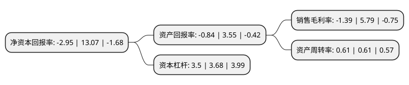

> 本页面由自动化程序生成于 2022年5月20日 01:02
> 内容可能存在错误，如有bug请提交issue至：https://github.com/Eroleice/doc-pi/issues
{.is-warning}

# 上市公司基本情况

## 基本资料

广东顺钠电气股份有限公司（以下简称“顺钠股份”）成立于1992年10月28日，佛山市。于1994年01月03日在深交所主板上市。

顺钠股份注册资本69,081.6万元，主要产品:干式变压器，箱式变电站，燃气热水器。以下是详细信息：

- 公司名称: 广东顺钠电气股份有限公司
- 股票代码: 000533.SZ
- 所在地: 广东 - 佛山市
- 成立日期: 1992年10月28日
- 注册资本: 69,081.6万元
- 法定代表人: 黄志雄
- 主营业务: 主要产品:干式变压器，箱式变电站，燃气热水器
- 公司官网: www.shunna.com.cn
- 公司介绍: 公司以市场需求、国家产业政策和高新技术为导向，努力发展输配电设备产业，并向大宗商品贸易及供应链管理等多元化方向发展，构建聚集品牌效应、凝合技术优势、集成优质资产，以高新技术产业为主体、供应链管理为平台，形成产业资本与贸易供应链管理相结合的产业格局。成员企业顺特电气设备有限公司是世界最大的干式变压器制造企业之一，专业制造干式变压器、预装式变电站、组合式变压器、中低压开关柜、干式电抗器等高品质的电气设备，是由顺特电气有限公司与法国施耐德电气共同设立的中外合资企业，目前已成为享誉全球的输配电设备供应商，中国干式变压器行业翘楚。其产品广泛应用于国内外多个城市的轨道交通、水利发电站、风力发电站、火力发电站、光伏能源发电站、工矿企业、商业民用建筑配电站、国家电网及南方电网等电力和配电系统。成员企业浙江翰晟携创实业有限公司是一家从事大宗商品贸易和供应链管理服务相结合的企业，主营石油化工、能源化工、农产品、金属等大宗商品贸易和围绕大宗商品贸易的供应链管理服务。

## 股东及高管情况

上市公司第一大股东为广州蕙富博衍投资合伙企业(有限合伙)，持股120,000,000股，占比17.37%，**疑似为**上市公司实际控制人。

截至2022年03月31日，上市公司的前十大股东中，共有6名自然人股东，2名机构股东，2个产品账户，其中5%以上大股东共有3名。上市公司前十大股东明细如下：

> 未能通过持股比例判定出上市公司实际控制人（持股30%以上）
> 可能存在通过间接持股、联合持股、协议控制等方式拥有实际控制权的主体，具体请参考上市公司定期公告！
{.is-warning}

> 截至2022年03月31日，上市公司前十大股东信息如下：

| 股东名称 | 持股数量（股） | 持股比例 |
| --- | --- | --- |
| 广州蕙富博衍投资合伙企业(有限合伙) | 120,000,000 | 17.37% |
| 邵伟华 | 92,902,059 | 13.45% |
| 张明园 | 54,472,109 | 7.89% |
| 陕西省国际信托股份有限公司-陕国投·聚宝盆20号证券投资集合资金信托计划 | 19,123,505 | 2.77% |
| 刘芳 | 6,690,000 | 0.97% |
| 中国银行股份有限公司广东省分行 | 5,913,600 | 0.86% |
| 戚永强 | 4,300,200 | 0.62% |
| 深圳市前海建泓时代资产管理有限公司-建泓亨通一号私募证券投资基金 | 2,822,300 | 0.41% |
| 姜永平 | 2,067,500 | 0.3% |
| 戚永贵 | 1,860,200 | 0.27% |

## 利润表分析

上市公司2021年总收入为14.58亿元，净利润为-0.21亿元，**未实现盈利**。

## 杜邦分析

> 数据列示周期：2021年 | 2020年 | 2019年
{.is-info}

上市公司的净资产收益率在近一年有所下降，下降幅度为-122.57%，其变化情况分解如下：
- 上市公司的销售毛利率在近一年下降了-124.01%，可能是生产效率的下降、商品原材料价格上涨或商品价格的下跌所致。
- 上市公司的资产周转率在近一年下降了0%，可能是源自于更慢的销售回款或库存管理效果下降。
- 上市公司的财务杠杆比率在近一年下降了-4.89%，可能是减少负债降低财务费用。

