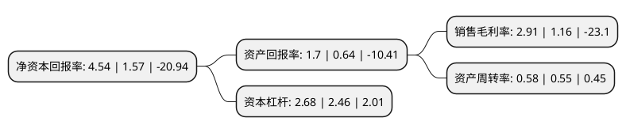

> 本页面由自动化程序生成于 2022年5月20日 01:03
> 内容可能存在错误，如有bug请提交issue至：https://github.com/Eroleice/doc-pi/issues
{.is-warning}

# 上市公司基本情况

## 基本资料

湖北京山轻工机械股份有限公司（以下简称“京山轻机”）成立于1993年03月30日，荆门市。于1998年06月26日在深交所主板上市。

京山轻机注册资本62,287.478万元，主要产品:包装机械，汽车零部件制造，人工智能和工业自动化行业等多项业务。以下是详细信息：

- 公司名称: 湖北京山轻工机械股份有限公司
- 股票代码: 000821.SZ
- 所在地: 湖北 - 荆门市
- 成立日期: 1993年03月30日
- 注册资本: 62,287.478万元
- 法定代表人: 李健
- 主营业务: 主要产品:包装机械，汽车零部件制造，人工智能和工业自动化行业等多项业务
- 公司官网: www.jspackmach.com
- 公司介绍: 公司是中国领先的纸箱、纸盒包装机械研发、制造和出口基地，瓦楞机械设备和后续加工设备制造商。公司主业从纸制品包装机械发展到目前涵盖包装机械、汽车零部件制造、人工智能和工业自动化行业等多项业务。公司通过对人工智能在工业领域的研究和运用，为客户提供个性化、多样化、智能化、自动化生产整体解决方案。工业自动化生产业务主要为制造业生产用于替代人工生产的自动化生产线，涵盖3C电子、食品和建材家居等行业。公司通过重大资产重组收购苏州晟成100%股权,新增光伏组件自动化生产线设备产品，营业收入规模有较大提升，有利于上市公司加快实现高端智能制造的战略发展目标，保障并提高自身持续盈利能力。

## 股东及高管情况

上市公司第一大股东为京山京源科技投资有限公司，持股129,932,166股，占比20.86%，**疑似为**上市公司实际控制人。

截至2022年05月14日，上市公司的前十大股东中，共有3名自然人股东，4名机构股东，2个产品账户，1个海外主体，其中5%以上大股东共有5名。上市公司前十大股东明细如下：

> 未能通过持股比例判定出上市公司实际控制人（持股30%以上）
> 可能存在通过间接持股、联合持股、协议控制等方式拥有实际控制权的主体，具体请参考上市公司定期公告！
{.is-warning}

> 截至2022年05月14日，上市公司前十大股东信息如下：

| 股东名称 | 持股数量（股） | 持股比例 |
| --- | --- | --- |
| 京山京源科技投资有限公司 | 129,932,166 | 20.86% |
| 京山京源科技投资有限公司 | 70,932,166 | 11.39% |
| 京山京源-华创证券-19京源E1担保及信托财产专户 | 59,000,000 | 9.47% |
| 祖国良 | 40,914,285 | 6.57% |
| 祖国良 | 40,914,285 | 6.57% |
| 京山轻机控股有限公司 | 9,982,900 | 1.6% |
| 中科沃土基金-云南信托-辰光1号单一资金信托-中科沃土沃众2号单一资产管理计划 | 9,404,389 | 1.51% |
| 京山市京诚投资开发有限公司 | 8,435,858 | 1.35% |
| 上海宁泉资产管理有限公司-宁泉致远56号私募证券投资基金 | 7,136,493 | 1.15% |
| 刘燕 | 6,468,900 | 1.04% |

## 利润表分析

上市公司2021年总收入为40.85亿元，净利润为1.18亿元，实现盈利。

## 杜邦分析

> 数据列示周期：2021年 | 2020年 | 2019年
{.is-info}

上市公司的净资产收益率在近一年有所上升，上升幅度为189.17%，其变化情况分解如下：
- 上市公司的销售毛利率在近一年上升了150.86%，可能是生产效率的提升、商品原材料价格下跌或商品价格的上涨所致。
- 上市公司的资产周转率在近一年上升了5.45%，可能是源自于更快的销售回款或库存管理效果提升。
- 上市公司的财务杠杆比率在近一年上升了8.94%，可能是增加负债扩大生产规模。

