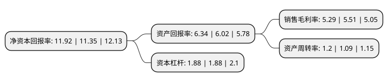

> 本页面由自动化程序生成于 2022年5月20日 01:05
> 内容可能存在错误，如有bug请提交issue至：https://github.com/Eroleice/doc-pi/issues
{.is-warning}

# 上市公司基本情况

## 基本资料

湖南华菱线缆股份有限公司（以下简称“华菱线缆”）成立于2003年07月01日，湘潭市。于2021年06月24日在深交所主板上市。

华菱线缆注册资本53,442.4万元，主要从事电线电缆的研发，生产及销售，主要产品包括特种电缆，电力电缆，电气装备用电缆，裸导线等。以下是详细信息：

- 公司名称: 湖南华菱线缆股份有限公司
- 股票代码: 001208.SZ
- 所在地: 湖南 - 湘潭市
- 成立日期: 2003年07月01日
- 注册资本: 53,442.4万元
- 法定代表人: 熊硕
- 主营业务: 主要从事电线电缆的研发，生产及销售，主要产品包括特种电缆，电力电缆，电气装备用电缆，裸导线等
- 公司官网: www.hlxl.com
- 公司介绍: 公司主要从事电线电缆的研发、生产及销售，主要产品包括特种电缆、电力电缆、电气装备用电缆、裸导线等。公司是国内领先的特种专用电缆生产企业之一，产品广泛应用于航空航天、武器装备、轨道交通及高速机车、矿山、新能源、工程装备、数据通信等多个领域。公司系国家高新技术企业、国家电线电缆标准化技术委员会成员单位、国家创新型试点企业、湖南省制造业信息化试点单位、湖南省省长质量奖获奖单位。公司研发实力突出，拥有国家企业技术中心、湖南省特种线缆工程技术研究中心。公司自成立以来，始终如一地推行“精品立企，高端致胜；诚信国企，品行天下”的经营理念，凭借高质量的产品和服务，在行业内拥有较强的竞争优势和品牌影响力。

## 股东及高管情况

上市公司第一大股东为湖南湘钢资产经营有限公司，持股223,363,200股，占比41.8%，为上市公司实际控制人。

截至2022年03月31日，上市公司的前十大股东中，共有1名自然人股东，7名机构股东，2个产品账户，其中5%以上大股东共有4名。上市公司前十大股东明细如下：

> 截至2022年03月31日，上市公司前十大股东信息如下：

| 股东名称 | 持股数量（股） | 持股比例 |
| --- | --- | --- |
| 湖南湘钢资产经营有限公司 | 223,363,200 | 41.8% |
| 湖南省国企并购重组基金管理有限公司-长沙新湘先进设备制造投资基金合伙企业(有限合伙) | 42,180,000 | 7.89% |
| 湖南钢铁集团有限公司 | 35,616,000 | 6.66% |
| 湖南兴湘投资控股集团有限公司 | 30,400,800 | 5.69% |
| 湖南宇纳私募股权基金管理有限公司-杭州富阳宇纳衡富投资合伙企业(有限合伙) | 24,150,000 | 4.52% |
| 湘潭凤翼众赢企业管理咨询合伙企业(有限合伙) | 22,000,000 | 4.12% |
| 湘潭市经济建设投资有限公司 | 10,812,000 | 2.02% |
| 深圳华菱锐士一号投资合伙企业(有限合伙) | 8,480,000 | 1.59% |
| 湖南迪策投资有限公司 | 3,816,000 | 0.71% |
| 顾兴男 | 455,000 | 0.09% |

## 利润表分析

上市公司2021年总收入为25.43亿元，净利润为1.34亿元，实现盈利。

## 杜邦分析

> 数据列示周期：2021年 | 2020年 | 2019年
{.is-info}

上市公司的净资产收益率在近一年有所上升，上升幅度为5.02%，其变化情况分解如下：
- 上市公司的销售毛利率在近一年下降了-3.99%，可能是生产效率的下降、商品原材料价格上涨或商品价格的下跌所致。
- 上市公司的资产周转率在近一年上升了10.09%，可能是源自于更快的销售回款或库存管理效果提升。
- 上市公司的财务杠杆比率在近一年下降了0%，可能是减少负债降低财务费用。

