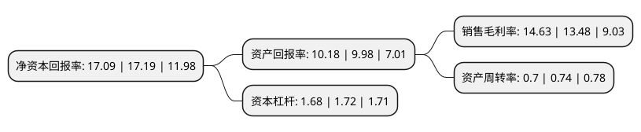

> 本页面由自动化程序生成于 2022年5月20日 01:05
> 内容可能存在错误，如有bug请提交issue至：https://github.com/Eroleice/doc-pi/issues
{.is-warning}

# 上市公司基本情况

## 基本资料

思源电气股份有限公司（以下简称“思源电气”）成立于1993年12月02日，上海市。于2004年08月05日在深交所中小板上市。

思源电气注册资本76,572.038万元，主要产品为电力自动化保护设备，高压开关，高压互感器，电力电容器及电抗器，电力电子成套设备等。以下是详细信息：

- 公司名称: 思源电气股份有限公司
- 股票代码: 002028.SZ
- 所在地: 上海 - 上海市
- 成立日期: 1993年12月02日
- 注册资本: 76,572.038万元
- 法定代表人: 董增平
- 主营业务: 主要产品为电力自动化保护设备，高压开关，高压互感器，电力电容器及电抗器，电力电子成套设备等
- 公司官网: www.sieyuan.com
- 公司介绍: 公司是国内知名专业从事电力技术研发、设备制造、工程服务的上市公司，荣膺国家重点火炬计划高新技术企业、中国能源装备十佳民企、上海市创新型企业等荣誉称号。公司致力于向全球客户提供一流的电气设备与服务，帮助客户安全、可靠、高效地使用和维护电力，产品线覆盖输配电一次、二次设备专业领域，公司主导产品及核心技术处于世界先进水平。公司业务涉及电力、冶金、铁路、石化、煤炭、港口等多个行业，为上海磁悬浮、上海世博会、秦山核电站、云广800千伏特高压直流输电工程、溪浙±800千伏特高压直流输电工程、晋东南-南阳-荆门1000千伏特高压扩建工程、北京奥运会、巴西世界杯、中石油新疆独山子千万吨炼油工程等国内外重大工程提供了优质的电力设备和可靠的技术保障。

## 股东及高管情况

上市公司第一大股东为董增平，持股131,444,820股，占比17.16%，**疑似为**上市公司实际控制人。

截至2022年03月31日，上市公司的前十大股东中，共有3名自然人股东，6个产品账户，1个海外主体，其中5%以上大股东共有2名。上市公司前十大股东明细如下：

> 未能通过持股比例判定出上市公司实际控制人（持股30%以上）
> 可能存在通过间接持股、联合持股、协议控制等方式拥有实际控制权的主体，具体请参考上市公司定期公告！
{.is-warning}

> 截至2022年03月31日，上市公司前十大股东信息如下：

| 股东名称 | 持股数量（股） | 持股比例 |
| --- | --- | --- |
| 董增平 | 131,444,820 | 17.16% |
| 陈邦栋 | 96,383,042 | 12.58% |
| 香港中央结算有限公司(陆股通) | 36,630,314 | 4.78% |
| 杨小强 | 25,463,791 | 3.32% |
| 兴业银行股份有限公司-兴全新视野灵活配置定期开放混合型发起式证券投资基金 | 16,218,487 | 2.12% |
| 中国光大银行股份有限公司-兴全商业模式优选混合型证券投资基金(LOF) | 14,324,788 | 1.87% |
| 中国建设银行股份有限公司-东方红启东三年持有期混合型证券投资基金 | 14,302,736 | 1.87% |
| 招商银行股份有限公司-兴全合润混合型证券投资基金 | 13,331,682 | 1.74% |
| 全国社保基金一一一组合 | 11,885,280 | 1.55% |
| 招商银行股份有限公司-睿远均衡价值三年持有期混合型证券投资基金 | 11,599,923 | 1.51% |

## 利润表分析

上市公司2021年总收入为86.95亿元，净利润为12.72亿元，实现盈利。

## 杜邦分析

> 数据列示周期：2021年 | 2020年 | 2019年
{.is-info}

上市公司的净资产收益率在近一年有所下降，下降幅度为-0.58%，其变化情况分解如下：
- 上市公司的销售毛利率在近一年上升了8.53%，可能是生产效率的提升、商品原材料价格下跌或商品价格的上涨所致。
- 上市公司的资产周转率在近一年下降了-5.41%，可能是源自于更慢的销售回款或库存管理效果下降。
- 上市公司的财务杠杆比率在近一年下降了-2.33%，可能是减少负债降低财务费用。

