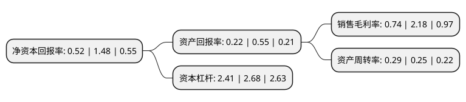

> 本页面由自动化程序生成于 2022年5月20日 01:05
> 内容可能存在错误，如有bug请提交issue至：https://github.com/Eroleice/doc-pi/issues
{.is-warning}

# 上市公司基本情况

## 基本资料

国轩高科股份有限公司（以下简称“国轩高科”）成立于1995年01月23日，合肥市。于2006年10月18日在深交所中小板上市。

国轩高科注册资本166,470.784万元，主要产品:本公司的产品包括12kV系列开关柜，40。5kV系列开关柜，126kV系列开关(含GIS组合电器)，12kV系列开关，40。5kV系列开关，低压开关设备和轻钢结构等七大系列二十多个品种。以下是详细信息：

- 公司名称: 国轩高科股份有限公司
- 股票代码: 002074.SZ
- 所在地: 安徽 - 合肥市
- 成立日期: 1995年01月23日
- 注册资本: 166,470.784万元
- 法定代表人: 李缜
- 主营业务: 主要产品:本公司的产品包括12kV系列开关柜，405kV系列开关柜，126kV系列开关(含GIS组合电器)，12kV系列开关，405kV系列开关，低压开关设备和轻钢结构等七大系列二十多个品种
- 公司官网: www.gotion.com.cn
- 公司介绍: 公司是国内最早从事新能源汽车用动力锂离子电池(组)自主研发、生产和销售的企业之一。公司产品包括动力锂离子电池组产品、单体锂离子电池(电芯)、动力锂电池正极材料等；其中正极材料作为关键原材料在制造单体锂离子电池时使用。公司动力锂离子电池(组)产品是新能源汽车的关键零部件，产品应用于纯电动、混合动力等新能源汽车领域，公司已与国内主要新能源整车企业建立了长期战略合作关系。此外，公司产品还可广泛应用于储能电站、通讯基站、风光互补、移动电源等领域。公司先后被评为国家火炬计划项目单位、高新技术企业、安徽省环境保护创新试点单位等。公司拥有国家认定企业技术中心，国家博士后科研工作站，国家级CNAS认可实验室，安徽省院士工作站，安徽省工程实验室等。

## 股东及高管情况

上市公司第一大股东为大众汽车(中国)投资有限公司，持股440,630,983股，占比26.47%，**疑似为**上市公司实际控制人。

截至2022年05月05日，上市公司的前十大股东中，共有3名自然人股东，3名机构股东，3个产品账户，1个海外主体，其中5%以上大股东共有4名。上市公司前十大股东明细如下：

> 未能通过持股比例判定出上市公司实际控制人（持股30%以上）
> 可能存在通过间接持股、联合持股、协议控制等方式拥有实际控制权的主体，具体请参考上市公司定期公告！
{.is-warning}

> 截至2022年05月05日，上市公司前十大股东信息如下：

| 股东名称 | 持股数量（股） | 持股比例 |
| --- | --- | --- |
| 大众汽车(中国)投资有限公司 | 440,630,983 | 26.47% |
| 南京国轩控股集团有限公司 | 170,751,887 | 10.26% |
| 李缜 | 103,276,150 | 6.2% |
| 香港中央结算有限公司(陆股通) | 89,420,091 | 5.37% |
| 李晨 | 28,472,398 | 1.71% |
| 佛山电器照明股份有限公司 | 17,133,791 | 1.03% |
| 国轩高科股份有限公司-第二期员工持股计划 | 7,570,800 | 0.45% |
| 中国工商银行股份有限公司-汇添富中证新能源汽车产业指数型发起式证券投资基金(LOF) | 7,539,643 | 0.45% |
| 中国工商银行股份有限公司-前海开源新经济灵活配置混合型证券投资基金 | 6,936,736 | 0.42% |
| 金国新 | 5,527,648 | 0.33% |

## 利润表分析

上市公司2021年总收入为103.56亿元，净利润为0.76亿元，实现盈利。

## 杜邦分析

> 数据列示周期：2021年 | 2020年 | 2019年
{.is-info}

上市公司的净资产收益率在近一年有所下降，下降幅度为-64.86%，其变化情况分解如下：
- 上市公司的销售毛利率在近一年下降了-66.06%，可能是生产效率的下降、商品原材料价格上涨或商品价格的下跌所致。
- 上市公司的资产周转率在近一年上升了16%，可能是源自于更快的销售回款或库存管理效果提升。
- 上市公司的财务杠杆比率在近一年下降了-10.07%，可能是减少负债降低财务费用。

