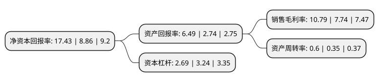

> 本页面由自动化程序生成于 2022年5月20日 01:06
> 内容可能存在错误，如有bug请提交issue至：https://github.com/Eroleice/doc-pi/issues
{.is-warning}

# 上市公司基本情况

## 基本资料

天津中环半导体股份有限公司（以下简称“中环股份”）成立于1988年12月21日，天津市。于2007年04月20日在深交所中小板上市。

中环股份注册资本323,173.37万元，主要产品为太阳能硅材料，半导体硅材料，高压硅堆，硅整流二极管，硅桥式整流器，功率6寸芯片，抛光片等。以下是详细信息：

- 公司名称: 天津中环半导体股份有限公司
- 股票代码: 002129.SZ
- 所在地: 天津 - 天津市
- 成立日期: 1988年12月21日
- 注册资本: 323,173.37万元
- 法定代表人: 沈浩平
- 主营业务: 主要产品为太阳能硅材料，半导体硅材料，高压硅堆，硅整流二极管，硅桥式整流器，功率6寸芯片，抛光片等
- 公司官网: www.tjsemi.com
- 公司介绍: 公司是天津中环电子信息集团有限公司控股的公众公司。公司致力于半导体节能产业和新能源产业，是一家集科研、生产、经营、创投于一体的国有控股高新技术企业。公司围绕“绿色低碳、可持续发展”，致力于半导体节能和新能源两大产业，制造管理上推行自动化、产品创新上实现差异化，在自身快速发展的前提下推动行业的整体发展，实现回报股东、奉献社会。公司产品广泛应用于智能电网传输、新能源汽车、高铁、风能发电逆变器、集成电路、消费类电子、航天航空、光伏发电等多个领域。2018年公司收购国电光伏90%股权，有利于充分发挥公司主营业务综合优势，增强上市公司持续经营能力。

## 股东及高管情况

上市公司第一大股东为TCL科技集团(天津)有限公司，持股885,022,614股，占比27.3854%，**疑似为**上市公司实际控制人。

截至2022年05月05日，上市公司的前十大股东中，共有5名机构股东，4个产品账户，1个海外主体，其中5%以上大股东共有3名。上市公司前十大股东明细如下：

> 未能通过持股比例判定出上市公司实际控制人（持股30%以上）
> 可能存在通过间接持股、联合持股、协议控制等方式拥有实际控制权的主体，具体请参考上市公司定期公告！
{.is-warning}

> 截至2022年05月05日，上市公司前十大股东信息如下：

| 股东名称 | 持股数量（股） | 持股比例 |
| --- | --- | --- |
| TCL科技集团(天津)有限公司 | 885,022,614 | 27.3854% |
| TCL科技集团(天津)有限公司 | 860,804,662 | 26.636% |
| TCL科技集团(天津)有限公司 | 852,219,094 | 26.37% |
| 香港中央结算有限公司(陆股通) | 104,601,102 | 3.24% |
| TCL科技集团股份有限公司 | 78,035,348 | 2.41% |
| 国电科技环保集团股份有限公司 | 45,938,300 | 1.42% |
| 中国建设银行股份有限公司-华夏国证半导体芯片交易型开放式指数证券投资基金 | 34,337,370 | 1.06% |
| 大家人寿保险股份有限公司-万能产品 | 25,426,936 | 0.79% |
| 中国银行股份有限公司-华泰柏瑞中证光伏产业交易型开放式指数证券投资基金 | 25,278,186 | 0.78% |
| 中国人寿保险股份有限公司-传统-普通保险产品-005L-CT001深 | 21,047,738 | 0.65% |

## 利润表分析

上市公司2021年总收入为411.04亿元，净利润为44.35亿元，实现盈利。

## 杜邦分析

> 数据列示周期：2021年 | 2020年 | 2019年
{.is-info}

上市公司的净资产收益率在近一年有所上升，上升幅度为96.73%，其变化情况分解如下：
- 上市公司的销售毛利率在近一年上升了39.41%，可能是生产效率的提升、商品原材料价格下跌或商品价格的上涨所致。
- 上市公司的资产周转率在近一年上升了71.43%，可能是源自于更快的销售回款或库存管理效果提升。
- 上市公司的财务杠杆比率在近一年下降了-16.98%，可能是减少负债降低财务费用。

