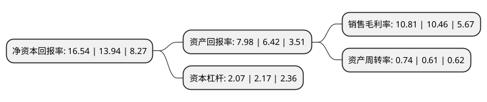

> 本页面由自动化程序生成于 2022年5月20日 01:06
> 内容可能存在错误，如有bug请提交issue至：https://github.com/Eroleice/doc-pi/issues
{.is-warning}

# 上市公司基本情况

## 基本资料

深圳市沃尔核材股份有限公司（以下简称“沃尔核材”）成立于1998年06月19日，深圳市。于2007年04月20日在深交所中小板上市。

沃尔核材注册资本125,989.856万元，主营业务:热缩材料，冷缩材料，阻燃材料，绝缘材料，耐高温耐腐蚀新型材料，套管，电缆附件，电缆分支箱，热缩材料新型电线和电源连接线的技术开发，生产和购销;化工产品，电子元器件的购销;经营进出口业务以下是详细信息：

- 公司名称: 深圳市沃尔核材股份有限公司
- 股票代码: 002130.SZ
- 所在地: 广东 - 深圳市
- 成立日期: 1998年06月19日
- 注册资本: 125,989.856万元
- 法定代表人: 周文河
- 主营业务: 主营业务:热缩材料，冷缩材料，阻燃材料，绝缘材料，耐高温耐腐蚀新型材料，套管，电缆附件，电缆分支箱，热缩材料新型电线和电源连接线的技术开发，生产和购销;化工产品，电子元器件的购销;经营进出口业务
- 公司官网: www.woer.com
- 公司介绍: 公司是国家重点支持发展的高新技术企业，专业从事高分子核辐射改性新材料及系列电子、电力新产品和新设备的研发、制造和销售。公司产品包括：热缩套管、热缩母排、热缩电缆附件、冷缩电缆附件、电缆分支箱、环网柜、高低压开关柜、WQFB全绝缘封闭母线、环保高温硅胶电线、耐高温聚四氟乙烯套管、导体连接管、热缩复合双壁管、硅橡胶管、聚四氟乙烯套管、民用防滑花纹管、无卤环保PE交联电线等多种产品，广泛应用于电子、电力、冶金、石化、汽车、高铁、煤矿及航天航空等领域，销售分公司遍及全国多个大中城市，产品远销欧美、东南亚等多个国家和地区，其质量稳定、性能可靠，已形成沃尔品牌效应。公司将秉持“企业成功、员工幸福、保护环境、回报社会”的核心文化理念，凭借品牌、技术、人才、市场、服务等强大实力，恪守“诚信、尊重、高效、合作、创新”的核心价值观，全力打造一个行业地位领先、竞争优势显著、企业特色鲜明、受社会尊重、引员工自豪的优质企业。

## 股东及高管情况

上市公司第一大股东为周和平，持股139,563,801股，占比11.08%，**疑似为**上市公司实际控制人。

截至2022年03月31日，上市公司的前十大股东中，共有5名自然人股东，5个产品账户，其中5%以上大股东共有2名。上市公司前十大股东明细如下：

> 未能通过持股比例判定出上市公司实际控制人（持股30%以上）
> 可能存在通过间接持股、联合持股、协议控制等方式拥有实际控制权的主体，具体请参考上市公司定期公告！
{.is-warning}

> 截至2022年03月31日，上市公司前十大股东信息如下：

| 股东名称 | 持股数量（股） | 持股比例 |
| --- | --- | --- |
| 周和平 | 139,563,801 | 11.08% |
| 邱丽敏 | 92,189,027 | 7.32% |
| 张跃军 | 46,600,000 | 3.7% |
| 广州市玄元投资管理有限公司-玄元科新109号私募证券投资基金 | 17,598,300 | 1.4% |
| 余军 | 14,675,800 | 1.16% |
| 周文河 | 12,956,908 | 1.03% |
| 上海通怡投资管理有限公司-通怡芙蓉17号私募证券投资基金 | 12,500,000 | 0.99% |
| 上海通怡投资管理有限公司-通怡青桐3号私募证券投资基金 | 12,500,000 | 0.99% |
| 上海通怡投资管理有限公司-通怡青桐6号私募证券投资基金 | 12,500,000 | 0.99% |
| 上海通怡投资管理有限公司-通怡青桐1号私募证券投资基金 | 12,500,000 | 0.99% |

## 利润表分析

上市公司2021年总收入为54.06亿元，净利润为5.84亿元，实现盈利。

## 杜邦分析

> 数据列示周期：2021年 | 2020年 | 2019年
{.is-info}

上市公司的净资产收益率在近一年有所上升，上升幅度为18.65%，其变化情况分解如下：
- 上市公司的销售毛利率在近一年上升了3.35%，可能是生产效率的提升、商品原材料价格下跌或商品价格的上涨所致。
- 上市公司的资产周转率在近一年上升了21.31%，可能是源自于更快的销售回款或库存管理效果提升。
- 上市公司的财务杠杆比率在近一年下降了-4.61%，可能是减少负债降低财务费用。

