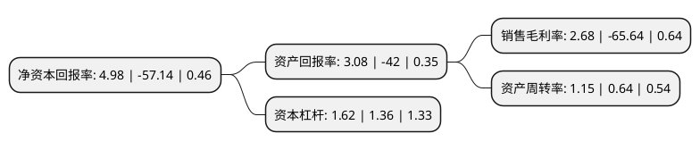

> 本页面由自动化程序生成于 2022年5月20日 01:06
> 内容可能存在错误，如有bug请提交issue至：https://github.com/Eroleice/doc-pi/issues
{.is-warning}

# 上市公司基本情况

## 基本资料

贤丰控股股份有限公司（以下简称“贤丰控股”）成立于2002年10月10日，珠海市。于2007年07月20日在深交所中小板上市。

贤丰控股注册资本113,465.652万元，主营业务:微细漆包线的制造和销售。以下是详细信息：

- 公司名称: 贤丰控股股份有限公司
- 股票代码: 002141.SZ
- 所在地: 广东 - 珠海市
- 成立日期: 2002年10月10日
- 注册资本: 113,465.652万元
- 法定代表人: 韩桃子
- 主营业务: 主营业务:微细漆包线的制造和销售
- 公司官网: www.sz002141.com
- 公司介绍: 公司专业研制、生产与电子信息、家用电器和国防科技配套的微细及特种漆包线。公司主导产品微细及特种漆包线还曾荣获“广东省科技进步三等奖”，“155级聚氨酯漆包铜圆线”获广东省优秀新产品二等奖。公司已相继通过QS9000、ISO9001质量管理体系认证、ISO14001环境体系认证、美国UL安全认证、TS16949质量管理体系认证及索尼GP认证。

## 股东及高管情况

上市公司第一大股东为广东贤丰控股有限公司，持股295,358,647股，占比26.03%，**疑似为**上市公司实际控制人。

截至2022年03月31日，上市公司的前十大股东中，共有2名自然人股东，4名机构股东，3个产品账户，1名其他股东，其中5%以上大股东共有3名。上市公司前十大股东明细如下：

> 未能通过持股比例判定出上市公司实际控制人（持股30%以上）
> 可能存在通过间接持股、联合持股、协议控制等方式拥有实际控制权的主体，具体请参考上市公司定期公告！
{.is-warning}

> 截至2022年03月31日，上市公司前十大股东信息如下：

| 股东名称 | 持股数量（股） | 持股比例 |
| --- | --- | --- |
| 广东贤丰控股有限公司 | 295,358,647 | 26.03% |
| 贤丰控股集团有限公司 | 159,152,000 | 14.03% |
| 大成创新资本-招商银行-博源恒丰资产管理计划 | 73,812,783 | 6.51% |
| 南方资本-宁波银行-蓉胜超微定向增发2号专项资产管理计划 | 49,876,632 | 4.4% |
| 南方资本-宁波银行-梁雄健 | 27,084,228 | 2.39% |
| 萧巧当 | 10,011,300 | 0.88% |
| 深圳市云图资产管理服务有限公司-云图优选12号私募证券投资基金 | 10,000,000 | 0.88% |
| 黄国良 | 8,140,100 | 0.72% |
| 广州微分生物科技有限公司 | 7,558,300 | 0.67% |
| 广州启沃商贸发展有限公司 | 7,000,000 | 0.62% |

## 利润表分析

上市公司2021年总收入为14.69亿元，净利润为0.39亿元，实现盈利。

## 杜邦分析

> 数据列示周期：2021年 | 2020年 | 2019年
{.is-info}

上市公司的净资产收益率在近一年有所下降，下降幅度为-108.72%，其变化情况分解如下：
- 上市公司的销售毛利率在近一年下降了-104.08%，可能是生产效率的下降、商品原材料价格上涨或商品价格的下跌所致。
- 上市公司的资产周转率在近一年上升了79.69%，可能是源自于更快的销售回款或库存管理效果提升。
- 上市公司的财务杠杆比率在近一年上升了19.12%，可能是增加负债扩大生产规模。

