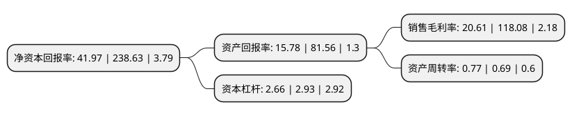

> 本页面由自动化程序生成于 2022年5月20日 01:06
> 内容可能存在错误，如有bug请提交issue至：https://github.com/Eroleice/doc-pi/issues
{.is-warning}

# 上市公司基本情况

## 基本资料

宁波东力股份有限公司（以下简称“宁波东力”）成立于1998年06月08日，宁波市。于2007年08月23日在深交所中小板上市。

宁波东力注册资本53,217.369万元，主要业务:装备制造业，供应链管理服务业以下是详细信息：

- 公司名称: 宁波东力股份有限公司
- 股票代码: 002164.SZ
- 所在地: 浙江 - 宁波市
- 成立日期: 1998年06月08日
- 注册资本: 53,217.369万元
- 法定代表人: 宋济隆
- 主营业务: 装备制造业，供应链管理服务业
- 公司官网: www.donly.com.cn
- 公司介绍: 公司是中国齿轮行业首家A股上市公司。经过多年的发展，逐步确立了以传动设备、供应链综合服务、门控系统、工程技术服务四大产业为主体，多元并进、专业化发展的经营格局。子公司东力传动，为一家专注于齿轮箱、电机及传动装置的研发、制造和销售的高新技术企业。建有省级高新技术研发中心，负责起草了《中国齿轮行业中小功率工业通用减速箱》、《高频率三相异步电动机技术条件》、《YCJ系列齿轮减速三相异步电动机技术条件》、《电动机系列节能改造规范》等行业标准。子公司欧尼克，为一家从事自动化控制装置、自动感应门研发、制造和销售的高新技术企业，是国内自动门业的先驱者，国家住建部行业标准《医用推拉式自动门》的唯一主编单位。公司秉承“忠信笃敬，止于至善”的价值观，以价值创造为核心，强化品牌，开拓创新，致力于成为制造业、产业经营与资本经营相融合的价值领先的上市公司。

## 股东及高管情况

上市公司第一大股东为东力控股集团有限公司，持股138,500,000股，占比26.03%，**疑似为**上市公司实际控制人。

截至2022年03月31日，上市公司的前十大股东中，共有7名自然人股东，3名机构股东，其中5%以上大股东共有2名。上市公司前十大股东明细如下：

> 未能通过持股比例判定出上市公司实际控制人（持股30%以上）
> 可能存在通过间接持股、联合持股、协议控制等方式拥有实际控制权的主体，具体请参考上市公司定期公告！
{.is-warning}

> 截至2022年03月31日，上市公司前十大股东信息如下：

| 股东名称 | 持股数量（股） | 持股比例 |
| --- | --- | --- |
| 东力控股集团有限公司 | 138,500,000 | 26.03% |
| 宋济隆 | 68,364,628 | 12.85% |
| 许丽萍 | 20,250,300 | 3.81% |
| 深圳市创新投资集团有限公司 | 8,798,842 | 1.65% |
| 母刚 | 6,968,762 | 1.31% |
| 卢新杰 | 3,736,000 | 0.7% |
| 宁波德斯瑞投资有限公司 | 3,648,695 | 0.69% |
| 刘志新 | 3,151,150 | 0.59% |
| 刘学梅 | 2,890,400 | 0.54% |
| 钱静光 | 2,753,600 | 0.52% |

## 利润表分析

上市公司2021年总收入为16.14亿元，净利润为3.32亿元，实现盈利。

## 杜邦分析

> 数据列示周期：2021年 | 2020年 | 2019年
{.is-info}

上市公司的净资产收益率在近一年有所下降，下降幅度为-82.41%，其变化情况分解如下：
- 上市公司的销售毛利率在近一年下降了-82.55%，可能是生产效率的下降、商品原材料价格上涨或商品价格的下跌所致。
- 上市公司的资产周转率在近一年上升了11.59%，可能是源自于更快的销售回款或库存管理效果提升。
- 上市公司的财务杠杆比率在近一年下降了-9.22%，可能是减少负债降低财务费用。

