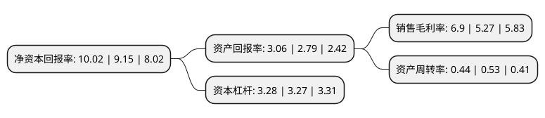

> 本页面由自动化程序生成于 2022年5月20日 01:07
> 内容可能存在错误，如有bug请提交issue至：https://github.com/Eroleice/doc-pi/issues
{.is-warning}

# 上市公司基本情况

## 基本资料

新疆金风科技股份有限公司（以下简称“金风科技”）成立于2001年03月26日，乌鲁木齐市。于2007年12月26日在深交所中小板上市。

金风科技注册资本422,506.765万元，主营业务为大型风力发电机组的开发研制，生产及销售，中试型风力发电场的建设及运营。主要产品为大型并网型风力发电机组设备。以下是详细信息：

- 公司名称: 新疆金风科技股份有限公司
- 股票代码: 002202.SZ
- 所在地: 新疆 - 乌鲁木齐市
- 成立日期: 2001年03月26日
- 注册资本: 422,506.765万元
- 法定代表人: 武钢
- 主营业务: 主营业务为大型风力发电机组的开发研制，生产及销售，中试型风力发电场的建设及运营主要产品为大型并网型风力发电机组设备
- 公司官网: www.goldwind.com.cn
- 公司介绍: 公司成立于1998年，致力于成为国际化的清洁能源和节能环保整体解决方案提供商，多次入选“全球最具创新能力企业50强”，荣登2016年度“全球挑战者”百强榜，被《知识产权资产管理IAM》组织授予“中国知识产权倡导者”殊荣。公司目前专注于风电系统解决方案、可再生能源、新业务投资孵化。公司在全球范围拥有7大研发中心，与7所全球顶级院校合作，拥有强大的自主研发能力，承担国家重点科研项目近30项，掌握专利技术超过2,800项，获得超过33种机型的设计与型式认证。

## 股东及高管情况

上市公司第一大股东为香港中央结算(代理人)有限公司，持股772,139,113股，占比18.28%，**疑似为**上市公司实际控制人。

截至2022年03月31日，上市公司的前十大股东中，共有2名自然人股东，3名机构股东，3个产品账户，2个海外主体，其中5%以上大股东共有4名。上市公司前十大股东明细如下：

> 未能通过持股比例判定出上市公司实际控制人（持股30%以上）
> 可能存在通过间接持股、联合持股、协议控制等方式拥有实际控制权的主体，具体请参考上市公司定期公告！
{.is-warning}

> 截至2022年03月31日，上市公司前十大股东信息如下：

| 股东名称 | 持股数量（股） | 持股比例 |
| --- | --- | --- |
| 香港中央结算(代理人)有限公司 | 772,139,113 | 18.28% |
| 和谐健康保险股份有限公司-万能产品 | 528,335,542 | 12.5% |
| 新疆风能有限责任公司 | 497,510,186 | 11.78% |
| 中国三峡新能源(集团)股份有限公司 | 352,723,945 | 8.35% |
| 香港中央结算有限公司(陆股通) | 163,846,579 | 3.88% |
| 武钢 | 62,138,411 | 1.47% |
| 中国证券金融股份有限公司 | 29,862,704 | 0.71% |
| 中国银行-易方达稳健收益债券型证券投资基金 | 13,742,298 | 0.33% |
| 曹志刚 | 12,343,283 | 0.29% |
| 中国建设银行股份有限公司-华夏能源革新股票型证券投资基金 | 12,227,900 | 0.29% |

## 利润表分析

上市公司2021年总收入为505.7亿元，净利润为34.91亿元，实现盈利。

## 杜邦分析

> 数据列示周期：2021年 | 2020年 | 2019年
{.is-info}

上市公司的净资产收益率在近一年有所上升，上升幅度为9.51%，其变化情况分解如下：
- 上市公司的销售毛利率在近一年上升了30.93%，可能是生产效率的提升、商品原材料价格下跌或商品价格的上涨所致。
- 上市公司的资产周转率在近一年下降了-16.98%，可能是源自于更慢的销售回款或库存管理效果下降。
- 上市公司的财务杠杆比率在近一年上升了0.31%，可能是增加负债扩大生产规模。

