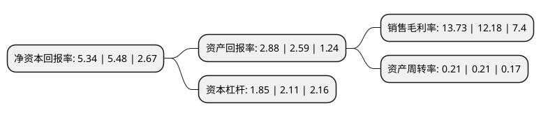

> 本页面由自动化程序生成于 2022年5月20日 01:07
> 内容可能存在错误，如有bug请提交issue至：https://github.com/Eroleice/doc-pi/issues
{.is-warning}

# 上市公司基本情况

## 基本资料

深圳市拓日新能源科技股份有限公司（以下简称“拓日新能”）成立于2002年08月15日，深圳市。于2008年02月28日在深交所中小板上市。

拓日新能注册资本141,302.055万元，研发，生产，销售非晶硅，单晶硅，多晶硅太阳能电池芯片，太阳能电池组件以及太阳能电池应用产品。主要产品包括太阳能电池芯片，太阳能电池组件，太阳能灯具，太阳能充电器，太阳能供电系统等。以下是详细信息：

- 公司名称: 深圳市拓日新能源科技股份有限公司
- 股票代码: 002218.SZ
- 所在地: 广东 - 深圳市
- 成立日期: 2002年08月15日
- 注册资本: 141,302.055万元
- 法定代表人: 陈五奎
- 主营业务: 研发，生产，销售非晶硅，单晶硅，多晶硅太阳能电池芯片，太阳能电池组件以及太阳能电池应用产品主要产品包括太阳能电池芯片，太阳能电池组件，太阳能灯具，太阳能充电器，太阳能供电系统等
- 公司官网: www.topraysolar.cn/www.topraysolar.com
- 公司介绍: 公司是首家登陆国内资本市场的纯太阳能企业。拓日新能主营业务为研发、生产及销售太阳电池芯片、组件、太阳能应用产品、太阳能发电系统、太阳能集热板及热水器系统。公司是国家级高新技术企业、工信部认可的符合“光伏制造行业规范条件”的光伏企业、广东省战略性新兴产业骨干企业、广东省守合同重信用企业、深圳市质量百强企业、深圳市民营领军骨干企业；拓日新能是国家级高技术产业化示范工程和深圳市高技术产业化示范工程承担者，是建设部和深圳市“太阳能电池产业化基地”，拥有广东省工程技术研究中心——广东省太阳能电池及应用产品工程技术研究中心、深圳市市级工业设计中心——深圳市拓日新能源科技股份有限公司工业设计中心。公司产品通过了德国TUV、美国ITS、瑞士SGS、中国香港STC四大国际认证公司的产品出货检验，通过了IEC61215和IEC61730认证，通过了TUV关于抗PID及盐雾氨气测试认证、ISO9001质量管理体系认证、ISO14001环境管理体系认证、OHSAS18001职业健康安全管理体系认证以及ISO14064温室气体排放认证。

## 股东及高管情况

上市公司第一大股东为深圳市奥欣投资发展有限公司，持股397,590,714股，占比28.14%，**疑似为**上市公司实际控制人。

截至2022年03月31日，上市公司的前十大股东中，共有3名自然人股东，6名机构股东，1个产品账户，其中5%以上大股东共有2名。上市公司前十大股东明细如下：

> 未能通过持股比例判定出上市公司实际控制人（持股30%以上）
> 可能存在通过间接持股、联合持股、协议控制等方式拥有实际控制权的主体，具体请参考上市公司定期公告！
{.is-warning}

> 截至2022年03月31日，上市公司前十大股东信息如下：

| 股东名称 | 持股数量（股） | 持股比例 |
| --- | --- | --- |
| 深圳市奥欣投资发展有限公司 | 397,590,714 | 28.14% |
| 喀什东方股权投资有限公司 | 134,497,418 | 9.52% |
| 长治市南烨实业集团有限公司 | 35,335,689 | 2.5% |
| 陈五奎 | 27,086,400 | 1.92% |
| 银河资本-浙商银行-银河资本-鑫鑫一号集合资产管理计划 | 26,501,766 | 1.88% |
| 陈传兴 | 12,897,526 | 0.91% |
| 秦皇岛宏兴钢铁有限公司 | 12,378,700 | 0.88% |
| 一重集团融创科技发展有限公司 | 10,600,706 | 0.75% |
| 郭伟松 | 10,424,028 | 0.74% |
| 国泰君安证券股份有限公司 | 9,010,600 | 0.64% |

## 利润表分析

上市公司2021年总收入为14.23亿元，净利润为1.95亿元，实现盈利。

## 杜邦分析

> 数据列示周期：2021年 | 2020年 | 2019年
{.is-info}

上市公司的净资产收益率在近一年有所下降，下降幅度为-2.55%，其变化情况分解如下：
- 上市公司的销售毛利率在近一年上升了12.73%，可能是生产效率的提升、商品原材料价格下跌或商品价格的上涨所致。
- 上市公司的资产周转率在近一年下降了0%，可能是源自于更慢的销售回款或库存管理效果下降。
- 上市公司的财务杠杆比率在近一年下降了-12.32%，可能是减少负债降低财务费用。

