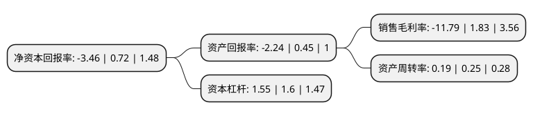

> 本页面由自动化程序生成于 2022年5月20日 01:07
> 内容可能存在错误，如有bug请提交issue至：https://github.com/Eroleice/doc-pi/issues
{.is-warning}

# 上市公司基本情况

## 基本资料

深圳奥特迅电力设备股份有限公司（以下简称“奥特迅”）成立于1998年02月20日，深圳市。于2008年05月06日在深交所中小板上市。

奥特迅注册资本24,780.617万元，主营业务为电力自动化电源设备及其智能单元的研发，制造，销售和服务。以下是详细信息：

- 公司名称: 深圳奥特迅电力设备股份有限公司
- 股票代码: 002227.SZ
- 所在地: 广东 - 深圳市
- 成立日期: 1998年02月20日
- 注册资本: 24,780.617万元
- 法定代表人: 廖晓霞
- 主营业务: 主营业务为电力自动化电源设备及其智能单元的研发，制造，销售和服务
- 公司官网: www.atc-a.com
- 公司介绍: 公司是大功率直流设备整体方案解决商，是直流操作电源细分行业的龙头企业。国家级高新技术企业，公司销售额连续多年位居同业榜首并负责起草或参与制定了多项国家及电力行业标准。奥特迅秉持“拥有自主知识产权，独创行业换代产品”之理念，致力于新型安全、节能电源技术的研发，创新新型电源技术在多领域的应用，研究开发的多项技术填补国内空白，产品有直流操作电源系列，核电安全电源系列，电动汽车充电站完整解决方案，通信高压直流电源系列。主要应用在电动汽车、通信、核电、智能电网、太阳能储能、水电、风能等新能源领域。先后荣获“国家火炬计划项目”、“中国优秀民营科技企业”、“深圳市市级研究开发中心”、“深圳市优秀民营企业”、“深圳市高新技术十佳创业企业”、“深圳市守合同重信用企业”、“深圳市工业500强企业”、“国家重点新产品”、“广东省重点新产品”、“深圳市科技进步奖”等一系列荣誉。

## 股东及高管情况

上市公司第一大股东为欧华实业有限公司，持股127,003,614股，占比51.25%，为上市公司实际控制人。

截至2022年03月31日，上市公司的前十大股东中，共有3名自然人股东，3名机构股东，3个产品账户，1个海外主体，其中5%以上大股东共有1名。上市公司前十大股东明细如下：

> 截至2022年03月31日，上市公司前十大股东信息如下：

| 股东名称 | 持股数量（股） | 持股比例 |
| --- | --- | --- |
| 欧华实业有限公司 | 127,003,614 | 51.25% |
| 深圳久游私募证券基金管理有限公司-久游投资4号私募证券投资基金 | 5,295,007 | 2.14% |
| 深圳久游私募证券基金管理有限公司-久游投资3号私募证券投资基金 | 5,295,007 | 2.14% |
| JPMORGAN CHASE BANK,NATIONAL ASSOCIATION | 2,528,183 | 1.02% |
| 深圳市欧立电子有限公司 | 2,313,370 | 0.93% |
| 廖晓霞 | 2,269,289 | 0.92% |
| 姜红 | 1,512,859 | 0.61% |
| 林金涛 | 1,512,859 | 0.61% |
| 财通基金-华泰证券股份有限公司-财通基金君享永熙单一资产管理计划 | 1,134,644 | 0.46% |
| 深圳市宁泰科技投资有限公司 | 1,132,661 | 0.46% |

## 利润表分析

上市公司2021年总收入为2.87亿元，净利润为-0.34亿元，**未实现盈利**。

## 杜邦分析

> 数据列示周期：2021年 | 2020年 | 2019年
{.is-info}

上市公司的净资产收益率在近一年有所下降，下降幅度为-580.56%，其变化情况分解如下：
- 上市公司的销售毛利率在近一年下降了-744.26%，可能是生产效率的下降、商品原材料价格上涨或商品价格的下跌所致。
- 上市公司的资产周转率在近一年下降了-24%，可能是源自于更慢的销售回款或库存管理效果下降。
- 上市公司的财务杠杆比率在近一年下降了-3.12%，可能是减少负债降低财务费用。

