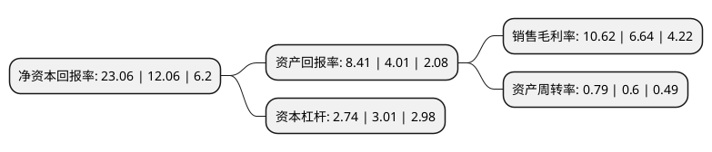

> 本页面由自动化程序生成于 2022年5月20日 01:07
> 内容可能存在错误，如有bug请提交issue至：https://github.com/Eroleice/doc-pi/issues
{.is-warning}

# 上市公司基本情况

## 基本资料

江苏蔚蓝锂芯股份有限公司（以下简称“蔚蓝锂芯”）成立于2002年09月30日，苏州市。于2008年06月05日在深交所中小板上市。

蔚蓝锂芯注册资本103,582.153万元，主要业务:LED芯片业务，锂电池及金属物流配送三大业务。以下是详细信息：

- 公司名称: 江苏蔚蓝锂芯股份有限公司
- 股票代码: 002245.SZ
- 所在地: 江苏 - 苏州市
- 成立日期: 2002年09月30日
- 注册资本: 103,582.153万元
- 法定代表人: CHEN KAI
- 主营业务: LED芯片业务，锂电池及金属物流配送三大业务
- 公司官网: www.aucksun.com
- 公司介绍: 公司是金属物流配送行业的领导者，为超过1000家知名企业提供金属材料的仓储、分拣、套裁、包装、配送以及来料加工等完整供应链服务。公司主要从事LED芯片业务、锂电池及金属物流配送三大业务，拥有10多家控股子公司,遍布于长三角及珠三角的苏州、上海、淮安、扬州、东莞等地区。公司下属的江苏天鹏电源有限公司是专业从事锂离子电池研发、生产、销售的高新技术企业，作为国内较早选定三元体系用于电动工具用锂离子电池的企业，在三元材料动力型圆柱电池领域具有将近10年的研发和制造经验的积累，拥有先进的圆柱型锂电池生产线，具有较大规模的圆柱型动力锂离子电池生产能力，在工具型动力锂电池领域处于领先地位。公司凭借着规模化的运营、精细化的管理体制及专业的服务，在金属物流行业得到客户的普遍认可，作为规模化企业在金属物流配送市场中具有领先优势与竞争力。公司以先进成熟的技术工艺为基础，结合业内领先的核心装备和公司优秀的管理理念，成为LED外延芯片行业技术水平、营运效率、盈利最好的企业之一，LED芯片凭借稳定的性能和高性价比获得市场的高度认可。

## 股东及高管情况

上市公司第一大股东为绿伟有限公司，持股147,725,928股，占比14.26%，**疑似为**上市公司实际控制人。

截至2022年03月31日，上市公司的前十大股东中，共有1名自然人股东，3名机构股东，5个产品账户，1个海外主体，其中5%以上大股东共有2名。上市公司前十大股东明细如下：

> 未能通过持股比例判定出上市公司实际控制人（持股30%以上）
> 可能存在通过间接持股、联合持股、协议控制等方式拥有实际控制权的主体，具体请参考上市公司定期公告！
{.is-warning}

> 截至2022年03月31日，上市公司前十大股东信息如下：

| 股东名称 | 持股数量（股） | 持股比例 |
| --- | --- | --- |
| 绿伟有限公司 | 147,725,928 | 14.26% |
| 昌正有限公司 | 69,669,800 | 6.73% |
| 吴建勇 | 28,041,789 | 2.71% |
| 中国农业银行股份有限公司-国泰智能汽车股票型证券投资基金 | 23,459,014 | 2.26% |
| 中国建设银行股份有限公司-东方红启东三年持有期混合型证券投资基金 | 20,066,400 | 1.94% |
| 深圳毕升私募证券基金管理有限公司-必胜年年升1号私募基金 | 18,767,581 | 1.81% |
| 澳洋集团有限公司 | 14,018,500 | 1.35% |
| 中国工商银行股份有限公司-海富通改革驱动灵活配置混合型证券投资基金 | 13,704,472 | 1.32% |
| 全国社保基金四一八组合 | 12,517,600 | 1.21% |
| 香港中央结算有限公司(陆股通) | 12,451,590 | 1.2% |

## 利润表分析

上市公司2021年总收入为66.8亿元，净利润为7.09亿元，实现盈利。

## 杜邦分析

> 数据列示周期：2021年 | 2020年 | 2019年
{.is-info}

上市公司的净资产收益率在近一年有所上升，上升幅度为91.21%，其变化情况分解如下：
- 上市公司的销售毛利率在近一年上升了59.94%，可能是生产效率的提升、商品原材料价格下跌或商品价格的上涨所致。
- 上市公司的资产周转率在近一年上升了31.67%，可能是源自于更快的销售回款或库存管理效果提升。
- 上市公司的财务杠杆比率在近一年下降了-8.97%，可能是减少负债降低财务费用。

