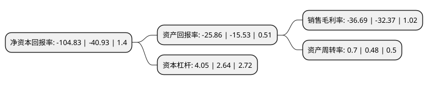

> 本页面由自动化程序生成于 2022年5月20日 01:08
> 内容可能存在错误，如有bug请提交issue至：https://github.com/Eroleice/doc-pi/issues
{.is-warning}

# 上市公司基本情况

## 基本资料

江苏中利集团股份有限公司（以下简称“中利集团”）成立于1988年09月05日，苏州市。于2009年11月27日在深交所中小板上市。

中利集团注册资本87,178.707万元，主营业务:特种电缆业务以下是详细信息：

- 公司名称: 江苏中利集团股份有限公司
- 股票代码: 002309.SZ
- 所在地: 江苏 - 苏州市
- 成立日期: 1988年09月05日
- 注册资本: 87,178.707万元
- 法定代表人: 王柏兴
- 主营业务: 主营业务:特种电缆业务
- 公司官网: www.zhongli.com
- 公司介绍: 公司是一家生产阻燃耐火软电缆的国家高新技术企业，在该领域处于绝对领先地位，主要产品包括阻燃耐火软电缆、铜导体、电缆料等。公司以“阻燃耐火软电缆”单品为突破，顺应市场的发展，产品经营范围已扩大至通信电缆、船用电缆、矿用电缆、铁路及轨道交通用电缆、电力电缆、新能源电缆、光缆、太阳能电池片及其组件、太阳能光伏发电站投资建设及运营、电子信息产品系列等多区域市场；并拥有江苏总部、东北、华南、西部四大区域生产基地，以及新加坡、德国、美国、中国香港等研发和销售基地，服务体系已遍布全球，产品销往多个国家，并与客户建立了良好和稳定的战略合作关系，为全球的通信行业、设备制造行业、轨道交通行业、船用及海洋工程行业、电力行业、矿业行业、太阳能行业和新能源行业等市场提供优质的产品和服务。

## 股东及高管情况

上市公司第一大股东为王柏兴，持股159,527,637股，占比18.3%，**疑似为**上市公司实际控制人。

截至2022年03月31日，上市公司的前十大股东中，共有1名自然人股东，7名机构股东，2个产品账户，其中5%以上大股东共有2名。上市公司前十大股东明细如下：

> 未能通过持股比例判定出上市公司实际控制人（持股30%以上）
> 可能存在通过间接持股、联合持股、协议控制等方式拥有实际控制权的主体，具体请参考上市公司定期公告！
{.is-warning}

> 截至2022年03月31日，上市公司前十大股东信息如下：

| 股东名称 | 持股数量（股） | 持股比例 |
| --- | --- | --- |
| 王柏兴 | 159,527,637 | 18.3% |
| 江苏新扬子造船有限公司 | 43,780,203 | 5.02% |
| 国开金融有限责任公司 | 36,679,116 | 4.21% |
| 常熟市发展投资有限公司 | 26,966,292 | 3.09% |
| 苏州沙家浜旅游发展有限公司 | 22,800,000 | 2.62% |
| 上海通怡投资管理有限公司-通怡麒麟2号私募证券投资基金 | 17,435,741 | 2% |
| 上海通怡投资管理有限公司-通怡海川15号私募证券投资基金 | 17,435,741 | 2% |
| 堆龙德庆中立创业投资管理有限公司 | 11,543,000 | 1.32% |
| 长安国际信托股份有限公司-长安信托·晨星(中利集团)定增单一资金信托 | 11,287,600 | 1.29% |
| 中国国际金融股份有限公司 | 8,499,337 | 0.97% |

## 利润表分析

上市公司2021年总收入为105.58亿元，净利润为-38.75亿元，**未实现盈利**。

## 杜邦分析

> 数据列示周期：2021年 | 2020年 | 2019年
{.is-info}

上市公司的净资产收益率在近一年有所上升，上升幅度为156.12%，其变化情况分解如下：
- 上市公司的销售毛利率在近一年上升了13.35%，可能是生产效率的提升、商品原材料价格下跌或商品价格的上涨所致。
- 上市公司的资产周转率在近一年上升了45.83%，可能是源自于更快的销售回款或库存管理效果提升。
- 上市公司的财务杠杆比率在近一年上升了53.41%，可能是增加负债扩大生产规模。

