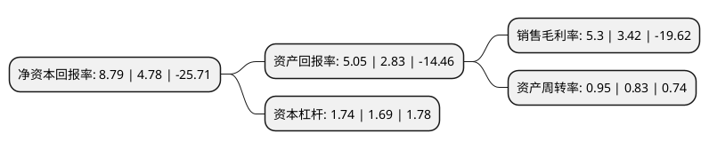

> 本页面由自动化程序生成于 2022年5月20日 01:08
> 内容可能存在错误，如有bug请提交issue至：https://github.com/Eroleice/doc-pi/issues
{.is-warning}

# 上市公司基本情况

## 基本资料

深圳市英威腾电气股份有限公司（以下简称“英威腾”）成立于2002年04月15日，深圳市。于2010年01月13日在深交所中小板上市。

英威腾注册资本75,346.521万元，主要产品:中低压变频器。主营业务:中低压变频器研发，制造和销售。以下是详细信息：

- 公司名称: 深圳市英威腾电气股份有限公司
- 股票代码: 002334.SZ
- 所在地: 广东 - 深圳市
- 成立日期: 2002年04月15日
- 注册资本: 75,346.521万元
- 法定代表人: 黄申力
- 主营业务: 主要产品:中低压变频器主营业务:中低压变频器研发，制造和销售
- 公司官网: www.invt.com.cn
- 公司介绍: 公司是国家火炬计划重点高新技术企业，依托于电力电子、自动控制、信息技术，业务覆盖工业自动化、新能源汽车、网络能源及轨道交通。全国共有多处研发中心，拥有各类专利多件，实验室拥有国内工控行业首家TUV SUD颁发的ACT资质，并通过UL目击实验室及CNAS国家实验室认证。深圳公明科技产业园和苏州工业产业园，能为客户提供先进的集成产品开发设计管理、全面的产品研发测试与自动化信息化的作业生产。分布在全球各地的分支机构和联保中心为用户提供解决方案、技术培训与服务支持的专业后勤保障，可以更加便捷快速地服务客户。公司秉承“众诚德厚、业精志远”的经营理念，立足于工业自动化和能源电力领域，以三大技术为基础，做大做强工业自动化、新能源汽车、网络能源、轨道交通等核心业务。

## 股东及高管情况

上市公司第一大股东为黄申力，持股79,299,588股，占比10.32%，**疑似为**上市公司实际控制人。

截至2022年03月31日，上市公司的前十大股东中，共有8名自然人股东，1名机构股东，1个产品账户，其中5%以上大股东共有1名。上市公司前十大股东明细如下：

> 未能通过持股比例判定出上市公司实际控制人（持股30%以上）
> 可能存在通过间接持股、联合持股、协议控制等方式拥有实际控制权的主体，具体请参考上市公司定期公告！
{.is-warning}

> 截至2022年03月31日，上市公司前十大股东信息如下：

| 股东名称 | 持股数量（股） | 持股比例 |
| --- | --- | --- |
| 黄申力 | 79,299,588 | 10.32% |
| 深圳巴士集团股份有限公司 | 28,632,716 | 3.73% |
| 杨林 | 18,462,135 | 2.4% |
| 陆民 | 12,957,400 | 1.69% |
| 周海霞 | 12,000,000 | 1.56% |
| 张科孟 | 10,310,056 | 1.34% |
| 张清 | 9,708,357 | 1.26% |
| 欧丽兴 | 7,935,000 | 1.03% |
| 梁兆朗 | 5,296,600 | 0.69% |
| 深圳固禾私募证券基金管理有限公司-固禾珍珠一号私募基金 | 4,960,000 | 0.65% |

## 利润表分析

上市公司2021年总收入为30.08亿元，净利润为1.59亿元，实现盈利。

## 杜邦分析

> 数据列示周期：2021年 | 2020年 | 2019年
{.is-info}

上市公司的净资产收益率在近一年有所上升，上升幅度为83.89%，其变化情况分解如下：
- 上市公司的销售毛利率在近一年上升了54.97%，可能是生产效率的提升、商品原材料价格下跌或商品价格的上涨所致。
- 上市公司的资产周转率在近一年上升了14.46%，可能是源自于更快的销售回款或库存管理效果提升。
- 上市公司的财务杠杆比率在近一年上升了2.96%，可能是增加负债扩大生产规模。

