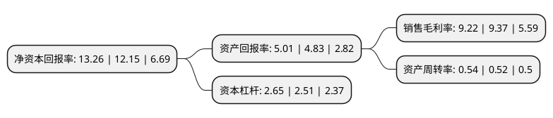

> 本页面由自动化程序生成于 2022年5月20日 01:08
> 内容可能存在错误，如有bug请提交issue至：https://github.com/Eroleice/doc-pi/issues
{.is-warning}

# 上市公司基本情况

## 基本资料

科华数据股份有限公司（以下简称“科华数据”）成立于1999年03月26日，厦门市。于2010年01月13日在深交所中小板上市。

科华数据注册资本46,156.739万元，主营业务:信息设备用不间断电源产品和工业动力用不间断电源产品的研发，生产，销售和服务，主要产品包括信息设备用UPS电源和工业动力用UPS电源两大类。以下是详细信息：

- 公司名称: 科华数据股份有限公司
- 股票代码: 002335.SZ
- 所在地: 福建 - 厦门市
- 成立日期: 1999年03月26日
- 注册资本: 46,156.739万元
- 法定代表人: 陈成辉
- 主营业务: 主营业务:信息设备用不间断电源产品和工业动力用不间断电源产品的研发，生产，销售和服务，主要产品包括信息设备用UPS电源和工业动力用UPS电源两大类
- 公司官网: www.kehua.com.cn
- 公司介绍: 公司多年来专注电力电子技术研发与设备制造，公司拥有智慧电能、云服务、新能源三大业务体系，产品方案广泛应用于金融、工业、交通、通信、政府、国防、军工、核电、教育、医疗、电力、新能源、云计算中心、电动汽车充电等行业，服务于全球多个国家和地区的用户。公司电源产品及解决方案成功入围人行、中行、建行、农行、中国人寿、国税总局、中国电信、中国联通、中国铁通、中央国家机关等UPS设备选型，获军队装备物资采购、中国石油天然气管道、蓝星化工集团等供应商资格，并与国内外知名企业建立了战略合作伙伴关系。公司先后获得“用户满意方案/品牌奖”“中国高效能数据中心优秀品牌奖”“最佳服务承诺兑现奖”“UPS服务满意金奖”“中国光伏行业最佳服务商”等殊荣。

## 股东及高管情况

上市公司第一大股东为厦门科华伟业股份有限公司，持股91,055,442股，占比19.73%，**疑似为**上市公司实际控制人。

截至2022年03月31日，上市公司的前十大股东中，共有6名自然人股东，2名机构股东，1个产品账户，1个海外主体，其中5%以上大股东共有2名。上市公司前十大股东明细如下：

> 未能通过持股比例判定出上市公司实际控制人（持股30%以上）
> 可能存在通过间接持股、联合持股、协议控制等方式拥有实际控制权的主体，具体请参考上市公司定期公告！
{.is-warning}

> 截至2022年03月31日，上市公司前十大股东信息如下：

| 股东名称 | 持股数量（股） | 持股比例 |
| --- | --- | --- |
| 厦门科华伟业股份有限公司 | 91,055,442 | 19.73% |
| 陈成辉 | 78,723,124 | 17.06% |
| 黄婉玲 | 18,757,300 | 4.06% |
| 石军 | 7,974,235 | 1.73% |
| 王孝安 | 5,100,000 | 1.1% |
| 香港中央结算有限公司(陆股通) | 4,808,219 | 1.04% |
| 中信证券股份有限公司 | 4,629,090 | 1% |
| 吴有香 | 4,231,780 | 0.92% |
| 林仪 | 3,977,857 | 0.86% |
| 全国社保基金四一四组合 | 3,638,400 | 0.79% |

## 利润表分析

上市公司2021年总收入为48.65亿元，净利润为4.48亿元，实现盈利。

## 杜邦分析

> 数据列示周期：2021年 | 2020年 | 2019年
{.is-info}

上市公司的净资产收益率在近一年有所上升，上升幅度为9.14%，其变化情况分解如下：
- 上市公司的销售毛利率在近一年下降了-1.6%，可能是生产效率的下降、商品原材料价格上涨或商品价格的下跌所致。
- 上市公司的资产周转率在近一年上升了3.85%，可能是源自于更快的销售回款或库存管理效果提升。
- 上市公司的财务杠杆比率在近一年上升了5.58%，可能是增加负债扩大生产规模。

