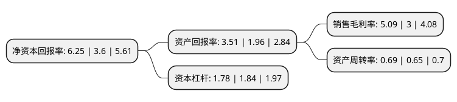

> 本页面由自动化程序生成于 2022年5月20日 01:08
> 内容可能存在错误，如有bug请提交issue至：https://github.com/Eroleice/doc-pi/issues
{.is-warning}

# 上市公司基本情况

## 基本资料

北京科锐配电自动化股份有限公司（以下简称“北京科锐”）成立于1993年07月17日，北京市。于2010年02月03日在深交所中小板上市。

北京科锐注册资本54,236.901万元，主营业务:12kV配电及控制设备的研发，生产和销售。公司主要产品有环网柜，箱式变电站，永磁机构真空开关设备，故障指示器，重合器及其他配电自动化产品。以下是详细信息：

- 公司名称: 北京科锐配电自动化股份有限公司
- 股票代码: 002350.SZ
- 所在地: 北京 - 北京市
- 成立日期: 1993年07月17日
- 注册资本: 54,236.901万元
- 法定代表人: 付小东
- 主营业务: 主营业务:12kV配电及控制设备的研发，生产和销售公司主要产品有环网柜，箱式变电站，永磁机构真空开关设备，故障指示器，重合器及其他配电自动化产品
- 公司官网: www.creat-da.com.cn
- 公司介绍: 公司是技术导向型配电设备制造企业，是国家火炬计划重点高新技术企业、北京市高新技术企业、海淀区优秀新技术企业、中关村科技园区海淀园百强企业。公司从事配电设备研发与制造、电力物业服务、分布式光伏、能源综合利用及配售电业务，主要产品有故障指示器、故障定位系统、配电网自愈、模块化站、永磁开关、GRC环保箱体、SVG、高过载变压器。公司致力多年的配送式变电站解决方案，通过对变电站的模块化设计制造和厂内装配调试，可实现35～110kV变电站的配送式安装，缩短建设周期，缩小占地面积，提高运行可靠性。在多年技术研发的基础上，形成了中低压开关、配电变压器、配电自动化、电缆附件、静态无功补偿等五个产品系列，应用遍及全国各个省区的配电网，及铁路、冶金、石化、煤炭等领域和风电、光伏等新能源建设。

## 股东及高管情况

上市公司第一大股东为北京科锐北方科技发展有限公司，持股147,045,953股，占比27.11%，**疑似为**上市公司实际控制人。

截至2022年03月31日，上市公司的前十大股东中，共有7名自然人股东，2名机构股东，1个产品账户，其中5%以上大股东共有2名。上市公司前十大股东明细如下：

> 未能通过持股比例判定出上市公司实际控制人（持股30%以上）
> 可能存在通过间接持股、联合持股、协议控制等方式拥有实际控制权的主体，具体请参考上市公司定期公告！
{.is-warning}

> 截至2022年03月31日，上市公司前十大股东信息如下：

| 股东名称 | 持股数量（股） | 持股比例 |
| --- | --- | --- |
| 北京科锐北方科技发展有限公司 | 147,045,953 | 27.11% |
| 中国电力科学研究院有限公司 | 53,550,068 | 9.87% |
| 付小东 | 15,536,813 | 2.86% |
| 北京科锐配电自动化股份有限公司-第一期员工持股计划 | 10,285,060 | 1.9% |
| 李立军 | 5,718,006 | 1.05% |
| 张新育 | 5,270,104 | 0.97% |
| 贾颀 | 5,110,050 | 0.94% |
| 吉红娜 | 3,100,000 | 0.57% |
| 韦军成 | 2,565,200 | 0.47% |
| 刘怀宇 | 2,364,814 | 0.44% |

## 利润表分析

上市公司2021年总收入为23.33亿元，净利润为1.18亿元，实现盈利。

## 杜邦分析

> 数据列示周期：2021年 | 2020年 | 2019年
{.is-info}

上市公司的净资产收益率在近一年有所上升，上升幅度为73.61%，其变化情况分解如下：
- 上市公司的销售毛利率在近一年上升了69.67%，可能是生产效率的提升、商品原材料价格下跌或商品价格的上涨所致。
- 上市公司的资产周转率在近一年上升了6.15%，可能是源自于更快的销售回款或库存管理效果提升。
- 上市公司的财务杠杆比率在近一年下降了-3.26%，可能是减少负债降低财务费用。

