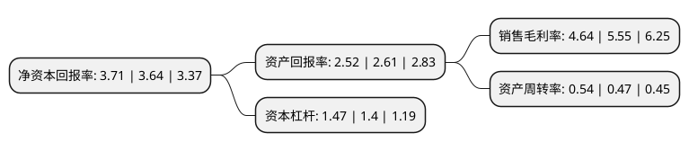

> 本页面由自动化程序生成于 2022年5月20日 01:08
> 内容可能存在错误，如有bug请提交issue至：https://github.com/Eroleice/doc-pi/issues
{.is-warning}

# 上市公司基本情况

## 基本资料

杭州中恒电气股份有限公司（以下简称“中恒电气”）成立于2001年07月11日，杭州市。于2010年03月05日在深交所中小板上市。

中恒电气注册资本56,356.496万元，主要产品:公司的主要产品为高频开关电源系统(包括通信电源系统和电力操作电源系统)。主营业务:本公司从事高频开关电源系统的研发，生产，销售和服务，以下是详细信息：

- 公司名称: 杭州中恒电气股份有限公司
- 股票代码: 002364.SZ
- 所在地: 浙江 - 杭州市
- 成立日期: 2001年07月11日
- 注册资本: 56,356.496万元
- 法定代表人: 包晓茹
- 主营业务: 主要产品:公司的主要产品为高频开关电源系统(包括通信电源系统和电力操作电源系统)主营业务:本公司从事高频开关电源系统的研发，生产，销售和服务，
- 公司官网: www.hzzh.com
- 公司介绍: 公司是国内市场电力电子设备及电力软件与咨询服务的主流供应商。公司一直专注于主营业务，一方面持续为电网、发电(含新能源)与工业企业的“自动化、信息化、智能化”建设与运营提供整体性解决方案；另一方面专注为客户提供通信电源、高压直流电源(HVDC)、电力操作电源、新能源电动汽车充换电系统、智慧照明、储能等产品及电源一体化解决方案。公司始终以市场为导向，不断发掘客户的需求，坚持技术驱动，持续创新，以专业定制产品与服务，为客户创造新的价值，已成为行业的领军企业。产品畅销海外至亚洲、非洲、欧美、大洋洲等多个国家和地区；在国内各省市拥有多个销售中心，是目前国内市场电力电子设备及电力软件与咨询服务的主流供应商。国家电网、南方电网、中国移动、中国电信、中国铁塔、腾讯、阿里巴巴、百度、戴尔等都是公司长期合作的核心客户。

## 股东及高管情况

上市公司第一大股东为杭州中恒科技投资有限公司，持股200,389,724股，占比35.56%，为上市公司实际控制人。

截至2022年03月31日，上市公司的前十大股东中，共有6名自然人股东，2名机构股东，2个产品账户，其中5%以上大股东共有1名。上市公司前十大股东明细如下：

> 截至2022年03月31日，上市公司前十大股东信息如下：

| 股东名称 | 持股数量（股） | 持股比例 |
| --- | --- | --- |
| 杭州中恒科技投资有限公司 | 200,389,724 | 35.56% |
| 朱国锭 | 25,696,305 | 4.56% |
| 杭州中恒电气股份有限公司-第二期员工持股计划 | 13,111,100 | 2.33% |
| 周庆捷 | 11,971,412 | 2.12% |
| 包晓茹 | 7,210,700 | 1.28% |
| 张永浩 | 6,320,000 | 1.12% |
| 杭州中恒电气股份有限公司-第一期员工持股计划 | 5,403,881 | 0.96% |
| 王薇淇 | 4,400,000 | 0.78% |
| 浙商汇融投资管理有限公司 | 4,032,258 | 0.72% |
| 邓启莉 | 3,583,465 | 0.64% |

## 利润表分析

上市公司2021年总收入为18.18亿元，净利润为0.84亿元，实现盈利。

## 杜邦分析

> 数据列示周期：2021年 | 2020年 | 2019年
{.is-info}

上市公司的净资产收益率在近一年有所上升，上升幅度为1.92%，其变化情况分解如下：
- 上市公司的销售毛利率在近一年下降了-16.4%，可能是生产效率的下降、商品原材料价格上涨或商品价格的下跌所致。
- 上市公司的资产周转率在近一年上升了14.89%，可能是源自于更快的销售回款或库存管理效果提升。
- 上市公司的财务杠杆比率在近一年上升了5%，可能是增加负债扩大生产规模。

